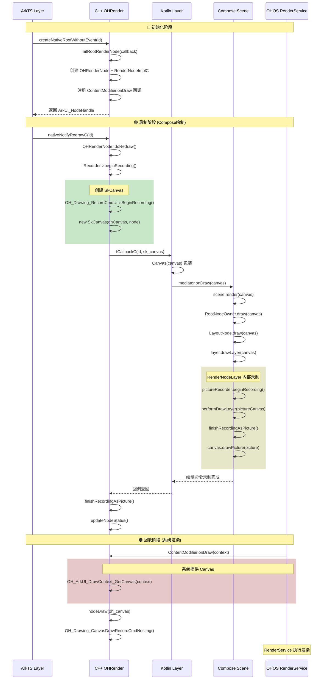

## 🎯 Canvas 的完整生命周期

在 CMP 对接 OHRender 架构中，Canvas 存在于三个层次，每个层次有不同的创建方式和生命周期：

### 📊 Canvas 类型总览

| 层次       | Canvas 类型                       | 创建者             | 生命周期      | 用途          |
| :--------- | :-------------------------------- | :----------------- | :------------ | :------------ |
| C++ 录制层 | SkCanvas (包装 OH_Drawing_Canvas) | SkPictureRecorder  | 录制期间      | 录制绘制命令  |
| Kotlin 层  | org.jetbrains.skia.Canvas         | JNI 包装           | 由 C++ 层管理 | 上层 API 调用 |
| 系统回放层 | OH_Drawing_Canvas                 | OHOS RenderService | 回调期间      | 执行绘制命令  |

------

## 🔵 阶段一：Canvas 创建 - C++ 层 (SkPictureRecorder)

### 1.1 创建入口

文件: kmptpc_OHRender/OHRender/src/core/SkPictureRecorder.cpp

```CPP
SkCanvas* SkPictureRecorder::beginRecording(const SkRect& userCullRect, sk_sp<SkBBoxHierarchy> bbh) {
  const SkRect cullRect = userCullRect.isEmpty() ? SkRect::MakeEmpty() : userCullRect;
  if (fRecordCanvas) {
    return nullptr; // 已有录制中的 Canvas
  }
  OH_Drawing_Canvas *ohCanvas = nullptr;

  // 🎯 步骤1: 创建 OH_Drawing 录制器的 Canvas
  OH_Drawing_RecordCmdUtilsBeginRecording(fOHRecorder, cullRect.width(), cullRect.height(), &ohCanvas);
  if (!ohCanvas) {
    return nullptr;
  }
  
  // 🎯 步骤2: 创建或复用 OHRenderNode
  if (fNowOHNode == nullptr || fNowOHNode->getPicture() != nullptr) {
    fNowOHNode = OHRenderNode::CreateNormalNode();
  }

  // 🎯 步骤3: 创建 SkCanvas 包装 OH_Drawing_Canvas
  fRecordCanvas = new SkCanvas(ohCanvas, fNowOHNode.get());
  fRecordCanvas->setRecordCull(cullRect);
  fActivelyRecording = true;
  return fRecordCanvas;
}
```


### 1.2 SkCanvas 构造函数

文件: kmptpc_OHRender/OHRender/src/core/SkCanvas.cpp

```cpp
SkCanvas::SkCanvas(OH_Drawing_Canvas *drawing_canvas, OHRenderNode *drawing_node) {
  fDrawingCanvas = drawing_canvas;   // 🎯 包装原生 OH_Drawing_Canvas
  fIsRecordCanvas = true;        // 标记为录制用 Canvas
  fSaveCount = OH_Drawing_CanvasGetSaveCount(fDrawingCanvas);
  fInitSaveCount = fSaveCount;
  fDrawingNode = drawing_node;     // 关联渲染节点
  fStateStack.push_back(CanvasState()); // 初始化状态栈
}

SkCanvas::~SkCanvas() {
  if (!fIsRecordCanvas) {
     OH_Drawing_CanvasDestroy(fDrawingCanvas); // 非录制 Canvas 需要销毁
  }
  // 录制 Canvas 的 OH_Drawing_Canvas 由 RecordCmdUtils 管理
}
```

------

## 🟢 阶段二：Canvas 传递 - Native ↔ Kotlin 桥接

### 2.1 回调函数定义

文件: kmptpc_OHRender/OHRender/include/oh/OHRenderNode.h

```cpp
// 回调函数类型定义

typedef void (*NodeDrawCallback)(void *context, void *canvas);

typedef void (*NodeDrawCallbackC)(int32_t id, void* canvas);
```

### 2.2 Kotlin 层注册回调

文件: ```kmptpc_compose_multiplatform_core/compose/export/export/src/ohosMain/kotlin/androidx/compose/export/ui/arkui/ArkUIViewController.kt```

```cpp
// 静态回调函数 - 接收 Native 层传递的 Canvas 指针

val NodeDrawCallback = staticCFunction { id: Int, canvas: COpaquePointer ->
  println("ArkUIViewController id：$id")
  // 🎯 将 C++ 指针包装为 Kotlin Canvas 对象
  val skCanvas = Canvas(canvas)

  // 根据 id 获取对应的 ViewController 并触发绘制
  BasicArkUIViewController.getController("oh_canvas_$id")?.onDraw(
     skCanvas, 0, kotlin.system.getTimeNanos()
  )
  return@staticCFunction Unit
}

// 创建根渲染节点并注册回调
@CName("createNativeRootWithoutEvent")
fun createNativeRootWithoutEvent(env: napi_env, id: Int): napi_value {
  // 🎯 创建 Native 渲染节点，注册 Kotlin 回调
  val node = Canvas.createNativeRootWithoutEvent(env, id, NodeDrawCallback)
  return node
}
```


### 2.3 ArkTS 层触发创建

文件: ```kmptpc_compose_multiplatform_core/compose/ui/ui-arkui/src/ohosArm64Main/cpp/compose/src/main/ets/compose/CanvasNode.ets```

```cpp
import { createNativeRootWithoutEvent, nativeNotifyRedrawC } from 'libentry.so';
export class CanvasNodeController extends NodeController {
  makeNode(uiContext: UIContext): FrameNode | null {
     if (this.rootNode === null) {
       // 🎯 调用 Native 创建根渲染节点
       createNativeRootWithoutEvent(this.id, this.rootSlot);
       this.rootNode = new BuilderNode(uiContext);
       this.rootNode.build(this.wrapBuilder, this.rootSlot);
     }
     return this.rootNode.getFrameNode();
  }
  notifyRedraw() {
     if (!this.nodeIsDrawing) {
       this.nodeIsDrawing = true;
       // 🎯 通知 Native 层触发重绘
       nativeNotifyRedrawC(this.id);
       this.context.postFrameCallback(new RenderFrameCallback(this));
     }
  }
}
```


------

## 🟠 阶段三：Canvas 使用 - 根节点重绘流程

### 3.1 Native 层触发回调

文件: ```kmptpc_OHRender/OHRender/src/oh/OHRenderNode.cpp```

```cpp
void OHRenderNode::doRedraw() {
  if (fCallback || fCallbackC) {
    TRACE_EVENT0("skia", "doRedraw with callback");
    
    // 🎯 步骤1: 确保 SkPictureRecorder 存在
    if (fRecorder == nullptr) {
      fRecorder = new SkPictureRecorder;
      auto root_node = fRecorder->getCachedRenderNode();
      root_node->fDrawInPicture = false; // 根节点不在 Picture 模式
      if (root_node && fNodeImpl) {
        fNodeImpl->appendRootNode(root_node);
      }
    }
    
    fRecorderPicture.reset();
    
    // 🎯 步骤2: 获取节点尺寸
    auto root_frame = SkRect::MakeEmpty();
    if (fNodeImpl) {
      root_frame = fNodeImpl->getNodeSize();
    }
    auto root_real_size = SkRect::MakeWH(root_frame.width(), root_frame.height());
    
    // 🎯 步骤3: 开始录制，创建 SkCanvas
    SkCanvas *sk_canvas = fRecorder->beginRecording(root_real_size);
    
    if (sk_canvas && sk_canvas->getRenderNode()) {
      auto render_node = sk_canvas->getRenderNode();
      render_node->setFixedFrame(root_real_size);
      // 🎯 步骤4: 调用回调，将 SkCanvas 传递给 Kotlin 层
      if (fCallback) {
        fCallback(fCallbackContext, sk_canvas); // Kotlin 层接收
      } else if (fCallbackC) {
        fCallbackC(fRootNodeId, sk_canvas);   // C API 回调
      }
      
      // 🎯 步骤5: 完成录制，生成 Picture
      fRecorderPicture = fRecorder->finishRecordingAsPicture();
      
      render_node->setParent(this);
      render_node->updateNodeStatus();
    }
    
    NodeStatusModify::GetInstance()->doModify();
  }
}
```

### 3.2 Kotlin 层接收 Canvas 并渲染

```kotlin
// BasicArkUIViewController 的 onDraw 实现
override fun onDraw(canvas: Canvas?, timestamp: Long, targetTimestamp: Long) {
  if (!nativeSurfaceHasBeenDestroyed) {
    // 🎯 将 Canvas 传递给 ComposeSceneMediator
    mediator?.onDraw(canvas!!, id, timestamp, targetTimestamp)
  }
}
// ComposeSceneMediator 处理绘制
fun onDraw(canvas: Canvas, id: String, timestamp: Long, targetTimestamp: Long) {
  render.draw(canvas, targetTimestamp) // 调用场景渲染
  processInteropActions()
}
// ComposeSceneRender 执行实际绘制
fun draw(canvas: org.jetbrains.skia.Canvas, timestamp: Long) {
  // 🎯 将 Skia Canvas 转换为 Compose Canvas 并调用场景渲染
  onDraw(canvas.asComposeCanvas(), timestamp) // onDraw = scene::render
}
```


### 3.3 Compose Scene 渲染到 RenderNodeLayer

```
// ComposeScene.render 最终调用链
scene.render(canvas, nanoTime)
 → RootNodeOwner.draw(canvas)
  → LayoutNode.draw(canvas)    // owner.root.draw(canvas)
   → NodeCoordinator.draw(canvas)
     → layer.drawLayer(canvas)  // 🎯 到达 RenderNodeLayer
```


------

## 🔴 阶段四：系统回放 - ContentModifier 回调

### 4.1 系统提供 Canvas

文件: kmptpc_OHRender/OHRender/src/oh/RenderNodeImplC.cpp

```CPP
RenderNodeImplC::RenderNodeImplC(OHRenderNode *selfNode, ArkUI_RenderNodeHandle UINode) {
  // 创建 RenderNode
  fNodeHandle = OHDrawingAPI::OH_ArkUI_RenderNodeUtils_CreateNode();

  // 🎯 设置 ContentModifier 的 onDraw 回调
  auto onDrawCallBack = [](ArkUI_DrawContext* context, void* userData) {
     // 🎯 从系统上下文获取 Canvas - 这是系统提供的!
     auto *canvas1 = OH_ArkUI_DrawContext_GetCanvas(context);
     OH_Drawing_Canvas *canvas = reinterpret_cast<OH_Drawing_Canvas *>(canvas1);
     
     if (userData) {
       OHRenderNode* node = (OHRenderNode*)userData;
       node->nodeDraw(canvas); // 使用系统 Canvas 执行绘制
     }
  };
 
  fModiferHandle = OHDrawingAPI::OH_ArkUI_RenderNodeUtils_CreateContentModifier();
  OHDrawingAPI::OH_ArkUI_RenderNodeUtils_AttachContentModifier(fNodeHandle, fModiferHandle);
  OHDrawingAPI::OH_ArkUI_RenderNodeUtils_SetContentModifierOnDraw(
     fModiferHandle, selfNode, onDrawCallBack // 注册回调
  );
}
```


### 4.2 执行录制的绘制命令

```cpp
void RenderNodeImplC::nodeDraw(OH_Drawing_Canvas *oh_canvas, OHRenderNode *selfNode) {
  if (selfNode->fPictureCmd) {
     OH_Drawing_CanvasSave(oh_canvas);
     
     // 获取节点尺寸并裁剪
     int32_t width, height;
     OHDrawingAPI::OH_ArkUI_RenderNodeUtils_GetSize(fNodeHandle, &width, &height);
     SkRect rect = SkRect::MakeWH(width, height);
     OH_Drawing_CanvasClipRect(oh_canvas, (OH_Drawing_Rect *)&rect, INTERSECT, false);
     
     // 应用偏移
     OH_Drawing_CanvasTranslate(oh_canvas, selfNode->fOffsetX, selfNode->fOffsetY);
     
     // 🎯 执行录制的绘制命令
     OHDrawingAPI::OH_Drawing_CanvasDrawRecordCmdNesting(oh_canvas, selfNode->fPictureCmd.get());
     
     OH_Drawing_CanvasRestore(oh_canvas);
     selfNode->fNodeNeedRedraw = false;
  }
}
```

------

## 📈 完整时序图




------

## 💡 关键理解点总结

### Canvas 的三种创建场景

| 场景        | 创建方法                                                     | 管理者            | 销毁时机                      |
| :---------- | :----------------------------------------------------------- | :---------------- | :---------------------------- |
| 1. 录制阶段 | SkPictureRecorder::beginRecording() → new SkCanvas(ohCanvas, node) | SkPictureRecorder | finishRecordingAsPicture() 后 |
| 2. 嵌套录制 | RenderNodeLayer.pictureRecorder.beginRecording()             | RenderNodeLayer   | finishRecordingAsPicture() 后 |
| 3. 系统回放 | OH_ArkUI_DrawContext_GetCanvas(context)                      | OHOS System       | 回调结束后                    |

### 核心代码位置

| 功能        | 文件路径               | 关键方法                                    |
| :---------- | :--------------------- | :------------------------------------------ |
| Canvas 创建 | SkPictureRecorder.cpp  | beginRecording()                            |
| Canvas 构造 | SkCanvas.cpp           | SkCanvas(OH_Drawing_Canvas*, OHRenderNode*) |
| Kotlin 回调 | ArkUIViewController.kt | NodeDrawCallback                            |
| 系统回放    | RenderNodeImplC.cpp    | nodeDraw()                                  |
| 根节点触发  | OHRenderNode.cpp       | doRedraw()                                  |