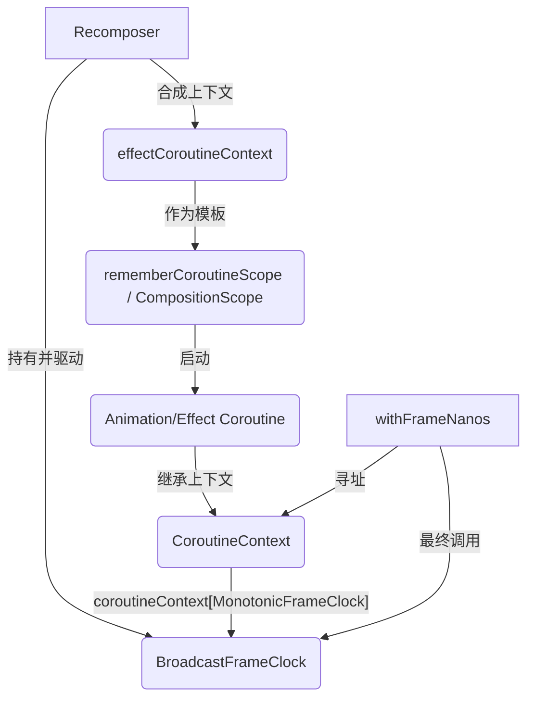

# MonotonicFrameClock 与 BroadcastFrameClock 的注入链分析

## 核心结论
在 Compose 环境下调用的 `withFrameNanos` 最终执行的是由 `Recomposer` 内部维护并注入的 `MonotonicFrameClock` 实现（通常是 `BroadcastFrameClock`）。这一过程利用了 Kotlin 协程上下文（CoroutineContext）的继承与依赖注入机制。

## 注入链路详解

### 1. 底层信号源 (Recomposer.kt)
`Recomposer` 是整个 Compose Runtime 的调度中枢，它负责协调组合、应用变化和分发帧信号。它内部持有一个 `broadcastFrameClock` 实例。
```kotlin
// Recomposer.kt
private val broadcastFrameClock = BroadcastFrameClock { ... }
```

### 2. 上下文合成 (Recomposer.kt)
`Recomposer` 会将其拥有的时钟实例合成到 `effectCoroutineContext` 中。这个上下文是 Compose 内部所有副作用（Effects）和作用域的基础。
```kotlin
// Recomposer.kt
override val effectCoroutineContext: CoroutineContext =
    effectCoroutineContext + broadcastFrameClock + effectJob
```

### 3. 作用域传播 (Composition / rememberCoroutineScope)
当在 Composable 函数中使用 `rememberCoroutineScope()` 时，系统会从当前 `CompositionContext`（通常就是 `Recomposer`）中提取上述注入了时钟的上下文。
- 返回的 `CoroutineScope` 及其派生的所有协程都会继承这个包含 `BroadcastFrameClock` 的上下文。

### 4. 消费者调用 (如 Transition.kt 或 LaunchedEffect)
任何在 Compose 作用域内启动的协程，如果调用了 `withFrameNanos`，都会触发寻址逻辑。
```kotlin
// 示例：Transition.kt
coroutineScope.launch {
    while (isActive) {
        withFrameNanos { frameTime -> 
            // 这里的调用会查找当前协程上下文中的 MonotonicFrameClock
        }
    }
}
```

### 5. 寻址与转发 (MonotonicFrameClock.kt)
`withFrameNanos` 是一个顶层挂起函数，它本质上是一个“路由器”：
```kotlin
// MonotonicFrameClock.kt
public suspend fun <R> withFrameNanos(onFrame: (Long) -> R): R =
    coroutineContext.monotonicFrameClock.withFrameNanos(onFrame)
```
1. 它访问当前协程的 `coroutineContext`。
2. 查找键为 `MonotonicFrameClock` 的元素。
3. 命中的就是最初由 `Recomposer` 注入的 `broadcastFrameClock`。

## 逻辑架构图


## 总结
Compose 的帧分发机制是一套解耦的**发布/订阅系统**：
- **发布者**：`Recomposer` 负责在合适的时机（如平台 VSync 信号到达）调用 `broadcastFrameClock.sendFrame(time)`。
- **订阅者**：动画或 UI 逻辑通过 `withFrameNanos` 挂起等待。
- **纽带**：`CoroutineContext` 充当了依赖注入的容器，确保订阅者总能找到正确的发布者时钟，而无需显式传递引用。
