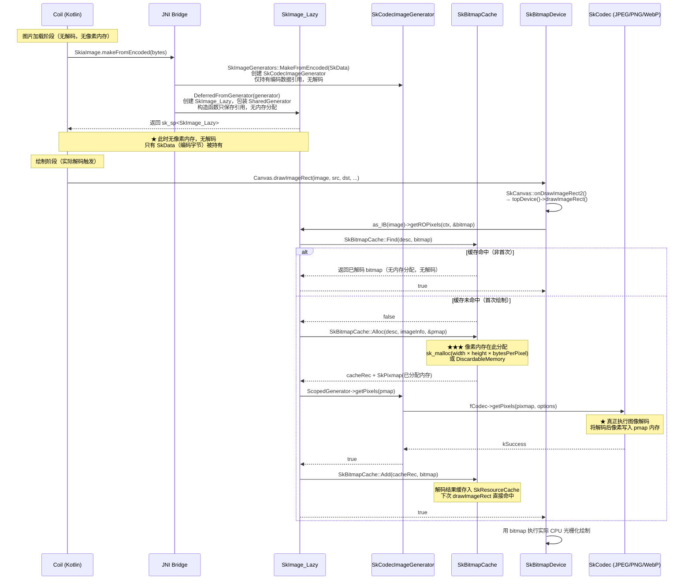

# Coil + Skia 自渲染下延迟解码分析

> 分析基于路径：`self_render_1.9.2_develop/third_party/skiko/skiko/skia-pack/skia`

---

## 1. 结论摘要

| 阶段 | 操作 | 是否分配图像内存 |
|------|------|----------------|
| `SkiaImage.makeFromEncoded(bytes)` | 创建 `SkImage_Lazy` + `SkCodecImageGenerator`，仅持有编码数据引用 | ❌ 否 |
| `canvas.drawImageRect(image, ...)` | 触发 `SkBitmapDevice::drawImageRect` → `getROPixels` | ✅ **是（像素内存在此分配）** |

---

## 2. 延迟解码的证据

### 2.1 `DeferredFromEncodedData` — 只创建生成器，不解码

```
src/codec/SkImageGenerator_FromEncoded.cpp
```

```cpp
sk_sp<SkImage> DeferredFromEncodedData(sk_sp<SkData> encoded,
                                       std::optional<SkAlphaType> alphaType) {
    // ① 仅包装编码数据为 generator，无任何像素分配
    return DeferredFromGenerator(
        SkImageGenerators::MakeFromEncoded(std::move(encoded), alphaType)
    );
}
```

`MakeFromEncoded` 内部：

```cpp
// src/codec/SkImageGenerator_FromEncoded.cpp
std::unique_ptr<SkImageGenerator> MakeFromEncoded(sk_sp<SkData> data, ...) {
    // ② 创建 SkCodecImageGenerator，只持有 SkData 引用，不调用任何解码
    return SkCodecImageGenerator::MakeFromEncodedCodec(std::move(data), at);
}
```

### 2.2 `DeferredFromGenerator` — 只创建 `SkImage_Lazy`

```
src/image/SkImage_Lazy.cpp:292
```

```cpp
sk_sp<SkImage> DeferredFromGenerator(std::unique_ptr<SkImageGenerator> generator) {
    // ③ 将 generator 包装进 SharedGenerator（带 mutex），创建 SkImage_Lazy
    // SkImage_Lazy 构造函数只保存 fSharedGenerator 引用，不触发解码
    SkImage_Lazy::Validator validator(
            SharedGenerator::Make(std::move(generator)), nullptr, nullptr);
    return validator ? sk_make_sp<SkImage_Lazy>(&validator) : nullptr;
}
```

`SkImage_Lazy` 构造函数（`src/image/SkImage_Lazy.cpp:103`）：

```cpp
SkImage_Lazy::SkImage_Lazy(Validator* validator)
    : SkImage_Base(validator->fInfo, validator->fUniqueID)
    , fSharedGenerator(std::move(validator->fSharedGenerator))
{
    // ④ 仅存储 generator 引用，无内存分配，无解码
    SkASSERT(fSharedGenerator);
}
```

---

## 3. 实际解码发生的地方

### 3.1 触发入口：`SkBitmapDevice::drawImageRect`

```
src/core/SkBitmapDevice.cpp:414
```

```cpp
void SkBitmapDevice::drawImageRect(const SkImage* image, ...) {
    SkBitmap bitmap;
    auto dContext = as_IB(image)->directContext();
    // ⑤ 这里触发解码：如果是 SkImage_Lazy，则走到 getROPixels
    if (!as_IB(image)->getROPixels(dContext, &bitmap)) {
        return;
    }
    // ... 后续用 bitmap 进行实际绘制
}
```

### 3.2 `SkImage_Lazy::getROPixels` — 像素内存分配 + 解码

```
src/image/SkImage_Lazy.cpp:110
```

```cpp
bool SkImage_Lazy::getROPixels(GrDirectContext* ctx, SkBitmap* bitmap,
                               SkImage::CachingHint chint) const {
    auto desc = SkBitmapCacheDesc::Make(this);

    // ⑥ 先查 SkBitmapCache，命中则直接返回缓存的 bitmap（无解码）
    if (SkBitmapCache::Find(desc, bitmap)) {
        return true;
    }

    if (SkImage::kAllow_CachingHint == chint) {
        SkPixmap pmap;
        // ⑦ ★ 分配像素内存（sk_malloc / DiscardableMemory）
        SkBitmapCache::RecPtr cacheRec = SkBitmapCache::Alloc(desc, this->imageInfo(), &pmap);
        if (!cacheRec) { return false; }

        // ⑧ ★ 真正解码：调用 generator->getPixels() 将像素写入 pmap
        bool success = ScopedGenerator(fSharedGenerator)->getPixels(pmap);

        // ⑨ 写入 SkBitmapCache，后续命中走缓存
        SkBitmapCache::Add(std::move(cacheRec), bitmap);
        this->notifyAddedToRasterCache();
    } else {
        // 不缓存：直接 tryAllocPixels + getPixels
        if (!bitmap->tryAllocPixels(this->imageInfo())) { return false; }
        ScopedGenerator(fSharedGenerator)->getPixels(bitmap->pixmap());
        bitmap->setImmutable();
    }
    return true;
}
```

### 3.3 `SkBitmapCache::Alloc` — 像素内存实际分配点

```
src/core/SkBitmapCache.cpp:188
```

```cpp
SkBitmapCache::RecPtr SkBitmapCache::Alloc(...) {
    const size_t rb = info.minRowBytes();
    size_t size = info.computeByteSize(rb);   // width * height * bytesPerPixel

    auto factory = SkResourceCache::GetDiscardableFactory();
    if (factory) {
        dm.reset(factory(size));   // DiscardableMemory（可被系统回收）
    } else {
        block = sk_malloc_canfail(size);  // ★ 普通 malloc，实际图像内存在此分配
    }
    *pmap = SkPixmap(info, dm ? dm->data() : block, rb);
    return RecPtr(new Rec(desc, info, rb, std::move(dm), block));
}
```

### 3.4 `SkCodecImageGenerator::onGetPixels` — 调用 SkCodec 解码

```
src/codec/SkCodecImageGenerator.cpp:89
```

```cpp
bool SkCodecImageGenerator::onGetPixels(...) {
    return this->getPixels(requestInfo, requestPixels, requestRowBytes, nullptr);
}

bool SkCodecImageGenerator::getPixels(...) {
    auto decode = [this, options](const SkPixmap& pm) {
        // ★ 真正调用 SkCodec（JPEG/PNG/WebP 等解码器）解码图像
        SkCodec::Result result = fCodec->getPixels(pm, options);
        ...
    };
    return SkPixmapUtils::Orient(dst, fCodec->getOrigin(), decode);
}
```

---

## 4. 完整时序图



---

## 5. 关键节点汇总

| 步骤 | 调用位置 | 说明 | 内存分配 |
|------|---------|------|---------|
| ① `DeferredFromEncodedData` | `src/codec/SkImageGenerator_FromEncoded.cpp:52` | 入口，仅包装 SkData | ❌ |
| ② `MakeFromEncoded` | `src/codec/SkImageGenerator_FromEncoded.cpp:36` | 创建 `SkCodecImageGenerator` | ❌ |
| ③ `DeferredFromGenerator` | `src/image/SkImage_Lazy.cpp:292` | 创建 `SkImage_Lazy` | ❌ |
| ④ `SkImage_Lazy` 构造函数 | `src/image/SkImage_Lazy.cpp:103` | 仅保存 generator 引用 | ❌ |
| ⑤ `SkBitmapDevice::drawImageRect` | `src/core/SkBitmapDevice.cpp:414` | **首次 draw 触发解码链** | ❌ |
| ⑥ `SkBitmapCache::Find` | `src/core/SkBitmapCache.cpp:220` | 查缓存，命中则跳过解码 | ❌ |
| ⑦ **`SkBitmapCache::Alloc`** | `src/core/SkBitmapCache.cpp:188` | **★ 像素内存在此分配** | ✅ **sk_malloc** |
| ⑧ **`SkCodecImageGenerator::onGetPixels`** | `src/codec/SkCodecImageGenerator.cpp:89` | **★ 真正解码** | ✅（写入 ⑦ 的内存） |
| ⑨ `SkBitmapCache::Add` | `src/core/SkBitmapCache.cpp:215` | 结果写入缓存 | ❌ |

---

## 6. 重要备注

### 缓存行为
- **第一次** `drawImageRect`：走完整解码链，分配内存 + 解码
- **后续** `drawImageRect`：`SkBitmapCache::Find` 命中，直接复用，无重复解码也无重复内存分配

### DiscardableMemory vs malloc
`SkBitmapCache::Alloc` 优先使用 `DiscardableFactory`（如果平台注册了的话），鸿蒙上默认路径是 `sk_malloc_canfail`（普通堆内存）。DiscardableMemory 的好处是内存压力大时可被系统回收，下次访问触发重新解码。

### 编码数据何时释放
`SkData`（原始编码字节）由 `SkCodecImageGenerator::fCachedData`（或外部 `SkData`）持有，只要 `SkImage_Lazy` 存活它就不会释放。解码后像素内存和编码内存**同时存在**，直到 `SkImage` 被销毁或缓存被 purge。
