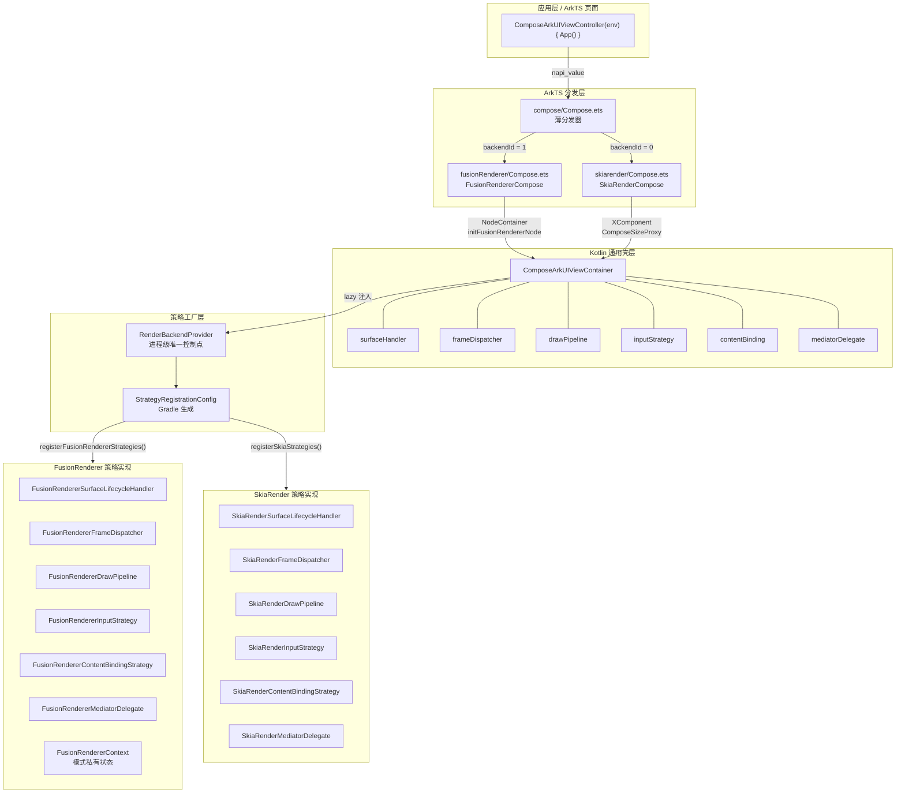
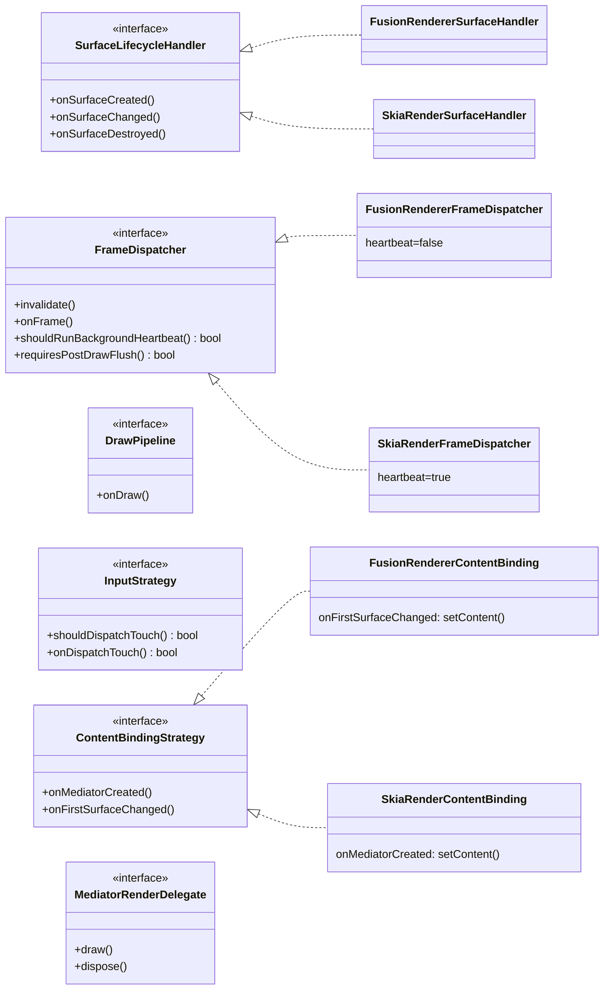
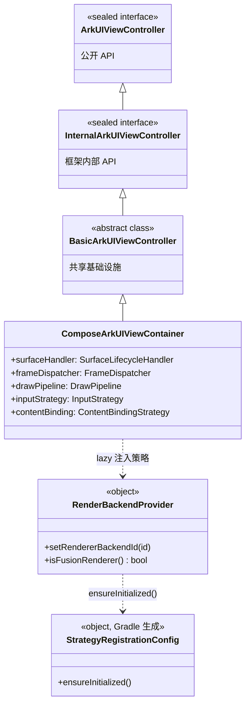
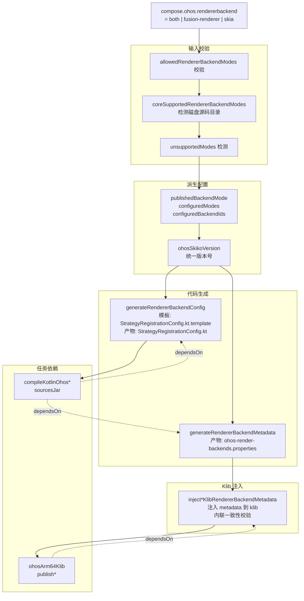

> 适用版本：Compose for HarmonyOS 当前主线实现（基于 fusion-renderer / skia 双路径）
>
> 适合读者：框架维护者、策略层扩展开发者、应用集成开发者

---

## 1. 概览

Compose for HarmonyOS 同时支持两条渲染路径：

| 渲染路径 | 技术栈 | backend 名称 | backendId |
|----------|--------|-------------|-----------|
| FusionRenderer（融合渲染） | OHOS RenderService + RenderNode | `fusion-renderer` | `1`（默认） |
| SkiaRender（自渲染） | Skia + XComponent + EGL | `skia` | `0` |

两条路径共享同一个 klib 产物，通过三层隔离机制实现模式切换：

1. **构建层**：`compose.ohos.rendererbackend` 控制哪些策略实现被编译进产物，产物内嵌 metadata 自描述支持集。
2. **运行时策略层**：`RenderBackendProvider` 在 Kotlin 侧根据 backendId 严格分发六类策略接口实现。
3. **ArkTS 分发层**：`compose/Compose.ets` 薄分发器根据 `getRenderBackendId()` 路由到对应模式专用 ArkTS 组件。

BackendId 的传递路径：Gradle 配置期 → 应用编译期生成 `kn_get_render_backend_id` 符号 → native 层运行时查询 → `ArkUIViewController` → Kotlin / ArkTS 层使用。

---

## 2. 顶层架构

### 2.1 整体分层

<details>
<summary>Mermaid 源码</summary>



### 2.2 BackendId 全链路传递

```mermaid
sequenceDiagram
    autonumber
    participant Gradle as Gradle 配置期<br/>compose-gradle-plugin
    participant Compiler as Kotlin/Native<br/>编译器
    participant SO as libcompose_arkui_utils.so<br/>Native 层
    participant KT as Kotlin 运行时<br/>RenderBackendProvider
    participant ETS as ArkTS 层<br/>Compose.ets

    rect rgb(30, 30, 40)
        Note over Gradle,Compiler: 构建期
        Gradle->>Gradle: resolveOhosBackendConfig()<br/>→ OhosBackendConfig{backend, backendId, ...}
        Gradle->>Gradle: loadOhosRenderBackendMetadata()<br/>读取 klib 内 ohos-render-backends.properties
        Gradle->>Gradle: validateOhosRenderBackendSelection()<br/>校验 backend ∈ supported
        Gradle->>Compiler: GenerateKnRenderBackendTask<br/>生成 KnRenderBackendNative.kt
        Note over Compiler: @CName("kn_get_render_backend_id")<br/>fun kn_get_render_backend_id() = 1
        Compiler->>SO: 导出 kn_get_render_backend_id 符号
    end

    rect
        Note over SO,ETS: 运行时
        SO->>SO: QueryRenderBackendIdUncached()<br/>weak symbol → dlsym(RTLD_DEFAULT)
        SO->>KT: ArkUIViewController_setRenderBackendId(1)
        KT->>KT: bootstrapStrategyRegistration()
        KT->>KT: StrategyRegistrationConfig.ensureInitialized()<br/>registerFusionRendererStrategies()<br/>registerSkiaStrategies()
        KT->>KT: rendererBackendId = 1
        ETS->>KT: ctrl.getRenderBackendId()
        KT-->>ETS: 1
        ETS->>ETS: backendId === 1<br/>→ FusionRendererCompose
    end
```

<details>
<summary>Mermaid 源码</summary>



---

## 3. 详细设计

### 3.1 策略接口层（`RenderBackend.kt`）

六个策略接口覆盖两种渲染路径的全部差异域：

```kotlin
// 表面生命周期差异
internal interface SurfaceLifecycleHandler {
    fun onSurfaceCreated(component: OHNativeXComponent, width: Int, height: Int)
    fun onSurfaceChanged(width: Int, height: Int)
    fun onSurfaceDestroyed()
}

// 帧驱动差异（两模式行为差异最大的接口）
internal interface FrameDispatcher {
    fun invalidate()
    fun onFrame(timestamp: Long, targetTimestamp: Long)
    fun onIdle(timeLeft: Long)
    fun dispose()
    fun shouldRunBackgroundHeartbeat(): Boolean = true  // SkiaRender=true, FusionRenderer=false
    fun requiresPostDrawFlush(): Boolean = true         // SkiaRender=true, FusionRenderer=false
}

// 绘制分发差异
internal interface DrawPipeline {
    fun onDraw(canvas: Canvas?, id: String, timestamp: Long, targetTimestamp: Long)
}

// 输入分发差异
internal interface InputStrategy {
    fun shouldDispatchTouch(): Boolean
    fun onDispatchTouch(nativeTouchEvent: napi_value): Boolean
}

// Content 绑定时机差异（两模式时序差异最大的接口）
internal interface ContentBindingStrategy {
    fun onMediatorCreated(mediator: ComposeSceneMediator, content: @Composable () -> Unit)
    fun onFirstSurfaceChanged(mediator: ComposeSceneMediator, content: @Composable () -> Unit)
}

// Mediator 渲染输出路由差异
internal interface MediatorRenderDelegate {
    fun setRenderSize(width: Int, height: Int)
    fun draw(canvas: Canvas?, id: String, timestamp: Long, targetTimestamp: Long)
    fun dispose()
    fun resetSurface()
    fun close()
}
```

接口按差异的**稳定类型**切分（表面生命周期 / 帧驱动 / 绘制 / 输入 / 内容绑定 / 渲染委托），这 6 个域覆盖了两种渲染路径的全部行为差异。

**策略接口与实现类图：**

<details>
<summary>Mermaid 源码</summary>



</details>

### 3.2 通用壳层（`ComposeArkUIViewContainer`）

继承 `BasicArkUIViewController`，负责持有共享状态并承接所有生命周期回调。通过 `lazy` 属性注入策略，**不包含任何模式分支**：

```kotlin
internal val surfaceHandler: SurfaceLifecycleHandler by lazy { createSurfaceLifecycleHandler(this) }
internal val frameDispatcher: FrameDispatcher       by lazy { createFrameDispatcher(this) }
internal val drawPipeline: DrawPipeline             by lazy { createDrawPipeline(this) }
internal val inputStrategy: InputStrategy           by lazy { createInputStrategy(this) }
internal val contentBinding: ContentBindingStrategy by lazy { createContentBindingStrategy() }
// MediatorRenderDelegate 在 createMediator() 时通过 createMediatorRenderDelegateFactory 注入
```

### 3.3 策略工厂与 BackendProvider（`RenderBackendProvider.kt`）

```kotlin
internal data class StrategyFactories(
    val surfaceHandler:   (ComposeArkUIViewContainer) -> SurfaceLifecycleHandler,
    val frameDispatcher:  (ComposeArkUIViewContainer) -> FrameDispatcher,
    val drawPipeline:     (ComposeArkUIViewContainer) -> DrawPipeline,
    val inputStrategy:    (ComposeArkUIViewContainer) -> InputStrategy,
    val contentBinding:   () -> ContentBindingStrategy,
    val mediatorDelegate: (InternalArkUIViewController) -> ((() -> ComposeScene) -> MediatorRenderDelegate),
)
```

`RenderBackendProvider` 是进程级唯一 backend 控制点：

- `registerFusionRendererFactories` / `registerSkiaRenderFactories` — 注册工厂
- `setRendererBackendId(id)` — 更新 backendId，触发合法性校验
- `isFusionRenderer()` — 供必要场所查询
- `createSurfaceLifecycleHandler(container)` 等工厂函数 — 根据当前 backendId 分发

### 3.4 策略注册配置（`StrategyRegistrationConfig`，Gradle 生成）

由 `generateRendererBackendConfig` 任务基于 **模板文件** 生成：

- 模板源文件：`compose/ui/ui/src/ohosMain/templates/StrategyRegistrationConfig.kt.template`
- 使用 `@PLACEHOLDER@` 占位符语法，由 Gradle 任务在构建时替换为实际值
- 占位符列表：`@CONFIGURED_MODE@`、`@DEFAULT_BACKEND_ID@`、`@CONFIGURED_BACKEND_IDS@`、`@CORE_SUPPORTED_BACKEND_IDS@`、`@REGISTER_BODY@`

生成产物示例（`both` 构建）：

```kotlin
// 生成路径: build/generated/rendererBackendConfig/ohosArm64Main/kotlin/.../StrategyRegistrationConfig.kt
// 模板路径: src/ohosMain/templates/StrategyRegistrationConfig.kt.template
internal object StrategyRegistrationConfig {
    internal const val CONFIGURED_BACKEND_MODE: String = "both"
    internal const val DEFAULT_RENDER_BACKEND_ID: Int = 1
    internal val CONFIGURED_BACKEND_IDS: IntArray = intArrayOf(1, 0)  // 1=fusion-renderer, 0=skia
    internal val CORE_SUPPORTED_BACKEND_IDS: IntArray = intArrayOf(1, 0)

    private var initialized = false
    internal fun ensureInitialized() {
        if (initialized) return
        registerFusionRendererStrategies()   // 生成内容取决于 compose.ohos.rendererbackend
        registerSkiaStrategies()
        initialized = true
    }
}
```

> 模板文件作为 `generateRendererBackendConfig` 任务输入（`inputs.file`），模板内容变化会触发增量重新生成。

### 3.5 FusionRenderer 模式实现层（`ohosMain/fusionRenderer/`）

#### 3.5.1 策略实现类

| 策略实现类 | 关键行为 |
|-----------|---------|
| `FusionRendererSurfaceLifecycleHandler` | `onSurfaceChanged` 直接设置尺寸；首次调用触发 `onFirstSurfaceChanged`；`onSurfaceDestroyed` 释放 context 并 dispose mediator |
| `FusionRendererFrameDispatcher` | `shouldRunBackgroundHeartbeat=false`；`requiresPostDrawFlush=false`；`invalidate` 通过 `frameMgr.postFrameCallback()` 驱动 |
| `FusionRendererDrawPipeline` | `onDraw` 调用 `mediator.onDraw(canvas, ...)` |
| `FusionRendererInputStrategy` | 直接 `mediator.sendPointerEvent()` |
| `FusionRendererContentBindingStrategy` | `onMediatorCreated` 空实现；`onFirstSurfaceChanged` 调用 `mediator.setContent()` |
| `FusionRendererMediatorDelegate` | `draw` 调用 `scene.render(canvas, timestamp)` |

#### 3.5.2 FusionRendererContext（模式私有状态容器）

持有 `RenderNode`（`CRenderNode` 或 `JsRenderNode`）和 `FrameManager`，管理 `enableCApi`、`renderNodeId` 等状态。**不上浮到通用层**。

通用层通过 `FusionRendererBackend` 接口与之通信：

```kotlin
internal interface FusionRendererBackend {
    val enableCApi: Boolean
    val renderNodeId: Int?
    fun initNode(enableCApi: Boolean, rootContent: napi_value?, frameMgr: napi_value?)
    fun draw(canvas: napi_value)
    fun getJsNode(): napi_value?
    fun notifyRedraw()
    fun resize(width: Int, height: Int)
    fun postFrameCallback()
    fun enableFrameCallback(id: Int)
    fun disableFrameCallback(id: Int)
    fun onSurfaceDestroyed()
}
```

`ComposeArkUIContainerFactory.createFusionRendererBackend` 是注册点，FusionRenderer 模块未编译进产物时为 `null`。

#### 3.5.3 RenderNode 类型选择

| 类型 | NAPI 机制 | 选择条件 |
|------|----------|---------|
| `CRenderNode` | `napi_call_threadsafe_function_with_priority` 异步 | API ≥ 6.0.0.107（`capiRenderNodeFixed=true`） |
| `JsRenderNode` | ArkTS `invalidate()` 同步 | 旧设备回退（`capiRenderNodeFixed=false`） |

ArkTS 侧判断（`fusionRenderer/Compose.ets`）：

```typescript
const capiRenderNodeFixed: boolean = (
    deviceInfo.distributionOSApiVersion > 60000 ||
    (deviceInfo.distributionOSApiVersion == 60000 && deviceInfo.buildVersion >= 107)
);
const capiRenderNodeSupported: boolean = (
    deviceInfo.distributionOSApiVersion > 60000 ||
    (deviceInfo.distributionOSApiVersion == 60000 && deviceInfo.buildVersion >= 45)
);
```

#### 3.5.4 FusionRenderer 尺寸感知路径

```
NodeContainer.onAreaChange
  → composeNodeController.reSize({ width: vp2px(w), height: vp2px(h) })
  → ctrl.onSurfaceChanged(width, height)      // NAPI → Kotlin
  → FusionRendererSurfaceLifecycleHandler.onSurfaceChanged
  → mediator.setSize + context.resize
```

不使用 `ComposeSizeProxy`，尺寸直接从 ArkTS `onAreaChange` 传递。

#### 3.5.5 FusionRenderer Content 绑定时序

```
aboutToAppear()
  → ctrl.initFusionRendererNode(...)   // 初始化 RenderNode / FrameManager
  // mediator 尚未创建

onSurfaceChanged(width, height) [首次]
  → FusionRendererSurfaceLifecycleHandler
  → createMediatorIfNeeded()
  → contentBinding.onFirstSurfaceChanged(mediator, wrappedContent)
  → mediator.setContent(content)       // setContent 在尺寸就绪后调用
```

### 3.6 SkiaRender 模式实现层（`ohosMain/skia/`）

#### 3.6.1 与 FusionRenderer 的关键差异

| 策略实现类 | 关键差异 |
|-----------|---------|
| `SkiaRenderSurfaceLifecycleHandler` | 依赖 XComponent / EGL `xcomponentPtr` |
| `SkiaRenderFrameDispatcher` | `shouldRunBackgroundHeartbeat=true`；`requiresPostDrawFlush=true` |
| `SkiaRenderContentBindingStrategy` | `onMediatorCreated` **立即**调用 `mediator.setContent()`（无需等待 surface） |
| `SkiaRenderMediatorDelegate` | 通过 `XComponentRender` / EGL 渲染，持有 `MessengerImpl` 用于尺寸迂回 |

#### 3.6.2 SkiaRender 尺寸感知路径（迂回路径）

```
EGL surface resize
  → sizeChangeDispatcher.onComposeSizeChange(width, height)
  → messenger → ComposeSizeProxy callback
  → SkiaRenderCompose.xComponentWidth / xComponentHeight (@State)
  → XComponent 尺寸变化 → onSurfaceChanged
```

迂回原因：ArkTS 侧无法直接感知 EGL surface 尺寸。

#### 3.6.3 SkiaRender Content 绑定时序

```
aboutToAppear()
  → host.onAppear() → createMediatorIfNeeded()
  → SkiaRenderContentBindingStrategy.onMediatorCreated(mediator, content)
  → mediator.setContent(content)       // 立即绑定，无需等待 surface
```

#### 3.6.4 Content 绑定时序对比（FusionRenderer vs SkiaRender）

```mermaid
sequenceDiagram
    autonumber
    participant ETS_F as FusionRendererCompose<br/>ArkTS
    participant KT_F as FusionRenderer<br/>策略实现
    participant Container as ComposeArkUI<br/>ViewContainer
    participant KT_S as SkiaRender<br/>策略实现
    participant ETS_S as SkiaRenderCompose<br/>ArkTS

    rect rgb(60, 40, 40)
        Note over ETS_F,KT_F: FusionRenderer 路径
        ETS_F->>Container: aboutToAppear() initFusionRendererNode()
        Note over Container: mediator 尚未创建
        ETS_F->>Container: onAreaChange → onSurfaceChanged(w, h)
        Container->>KT_F: onSurfaceChanged() [首次]
        KT_F->>Container: createMediatorIfNeeded()
        KT_F->>KT_F: contentBinding.onFirstSurfaceChanged()
        KT_F->>Container: mediator.setContent(content)
        Note over KT_F: setContent 在尺寸就绪后
    end

    rect rgb(40, 40, 60)
        Note over KT_S,ETS_S: SkiaRender 路径
        ETS_S->>Container: aboutToAppear() host.onAppear()
        Container->>KT_S: createMediatorIfNeeded()
        KT_S->>KT_S: contentBinding.onMediatorCreated()
        KT_S->>Container: mediator.setContent(content)
        Note over KT_S: setContent 立即绑定
    end
```

<details>
<summary>Mermaid 源码</summary>



</details>

### 3.7 ArkTS 分发层

三个 ArkTS 文件的边界：

```
compose/Compose.ets           ← 薄分发器，只做 getRenderBackendId() 路由
fusionRenderer/Compose.ets    ← FusionRendererCompose 专用组件
skiarender/Compose.ets        ← SkiaRenderCompose 专用组件
```

`compose/Compose.ets` 关键约束：
- 只转发 `componentId`、`controller`、`onBackPressed`、`bgColor` 给 `FusionRendererCompose`
- `libraryName` 只转发给 `SkiaRenderCompose`
- **不透传** `frameMgr`、`rootContent`（由 `FusionRendererCompose.aboutToAppear()` 内部自动创建）

### 3.8 Kotlin 类层级

<details>
<summary>Mermaid 源码</summary>



`InternalArkUIViewController` 包含的框架内部方法（ArkTS 通过 NAPI 调用）：
`init`、`initContext`、`initUIContext`、`initMessenger`、`getRenderBackend`、`getRenderBackendId`、`dispatchTouchEvent`、`onSurfaceCreated`、`onSurfaceChanged`、`onSurfaceDestroyed`、`initRenderNodeContext`、`initFusionRendererNode`、`draw`、`getJsNode`、`JsNodeDraw` 等。

### 3.9 构建产物 Metadata 自描述

`ui-ohosarm64.klib` 内嵌 metadata：

```
default/resources/META-INF/compose/ohos-render-backends.properties
```

内容示例（`both` 构建）：

```properties
supported=fusion-renderer,skia
default=fusion-renderer
mode=both
```

由 `generateRendererBackendMetadata` 任务生成，`injectOhosKlibRendererBackendMetadata` 任务注入 klib。

**消费方：** `compose_multiplatform/gradle-plugins` 中的 `OhosRenderBackendMetadataResolver.kt`（从 `ComposePlugin.kt` 中提取的独立文件，职责符合 SRP）。应用配置期调用 `loadOhosRenderBackendMetadata()` 下载 `ui-ohosarm64` klib，读取此文件，解析为 `OhosRenderBackendMetadata` 数据类；随后 `validateOhosRenderBackendSelection()` 将应用侧指定的 `rendererBackend` 与 `supported` 字段对比，不在支持集内则抛出 `GradleException`。

> 注意：metadata 校验仅对应用项目（`isApplicationProject`）生效。库模块（如 compose_multiplatform 内部组件）不执行 metadata 下载和校验。

**降级行为：** 若 klib 不含此文件（旧产物，`legacyOhosRenderBackendMetadata`），plugin 假设两种 backend 均支持并输出 warn——这意味着缺失不会让应用构建崩溃，但会丧失精确的兼容性校验（`skia-only` klib 也会被认为支持 `fusion-renderer`）。

---

## 4. 构建层设计

### 4.1 framework 侧 Gradle 任务链

<details>
<summary>Mermaid 源码</summary>



</details>

**任务详情：**

- **generateRendererBackendConfig**：模板 `src/ohosMain/templates/StrategyRegistrationConfig.kt.template`，输入 `publishedBackendMode, configuredModes, coreSupportedRendererBackendModes, 模板文件`，wiring: 所有 `compileKotlinOhos*` 及 `sourcesJar` 任务依赖此任务
- **generateRendererBackendMetadata + inject\*KlibRendererBackendMetadata**：输入 `publishedBackendMode, configuredModes, ohosSkikoVersion`，一致性校验内联在 inject 任务中，wiring: `ohosArm64Klib` / `publish*` 任务依赖

配置属性：`-Pcompose.ohos.rendererbackend`，允许值：`fusion-renderer`、`skia`、`both`（默认）。

注：ohosX64 在包含 fusion-renderer 的任何模式下始终跳过（FusionRenderer Skiko 尚未支持 x64）。

### 4.2 三种模式编译行为矩阵

`compose.ohos.rendererbackend` 的三个合法值对应不同的编译目标、源码目录和 Skiko 版本选择。**下表适用于 `compose/ui/ui` 模块**（其他模块的 OHOS 配置可能更简单，但 Skiko 版本解析逻辑相同）。

#### 4.2.1 编译目标与源码行为

| 维度 | `skia` | `fusion-renderer` | `both` |
|------|--------|------|------|
| **ohosArm64 编译** | ✅ | ✅ | ✅ |
| **ohosX64 编译** | ✅（需显式请求） | ✅（需显式请求） | ✅（需显式请求） |
| **`ohosX64Main.dependsOn(ohosArm64Main)`** | ✅（若 x64 被请求） | ✅（若 x64 被请求） | ✅（若 x64 被请求） |
| **`compileOhosArm64MainKotlinMetadata`** | ✅（若 x64 被请求） | ✅（若 x64 被请求） | ✅（若 x64 被请求） |
| **arm64 加入的 ohosMain 子目录** | `ohosMain/skia/kotlin` | `ohosMain/fusionRenderer/kotlin` | 两者均加入 |

> **x64 默认不参与编译**，需要通过以下方式显式启用：
> - `-Pcompose.platforms=ohosx64`（Gradle 属性），或 `-Pcompose.platforms=ohos`
> - 执行包含 `ohosx64` 的任务名（如 `compileKotlinOhosX64`）
>
> x64 与 arm64 共享源码：`ohosX64Main.dependsOn(ohosArm64Main)`，x64 没有独立源码目录。
>
> 当 x64 参与编译时，`ohosArm64Main` 成为共享源集，Kotlin 编译器会触发 `compileOhosArm64MainKotlinMetadata`。此编译需要 Skiko 对应架构的 klib（`skiko-ohosx64` 或 `skiko-ohosx64-fusionrenderer`）已在本地 Maven 中可用。

#### 4.2.2 生成的 `StrategyRegistrationConfig.kt`

> 由 `src/ohosMain/templates/StrategyRegistrationConfig.kt.template` 模板生成。`ensureInitialized()` 包含 `initialized` 防重入守卫。

| 常量 / 函数 | `skia` | `fusion-renderer` | `both` |
|-------------|--------|------|------|
| `CONFIGURED_BACKEND_MODE` | `"skia"` | `"fusion-renderer"` | `"both"` |
| `DEFAULT_RENDER_BACKEND_ID` | `0` | `1` | `1`（fusion-renderer 优先） |
| `CONFIGURED_BACKEND_IDS` | `[0]` | `[1]` | `[1, 0]` |
| `CORE_SUPPORTED_BACKEND_IDS` | 由磁盘源码目录决定 | 同左 | 同左 |
| `ensureInitialized()` 调用 | `registerSkiaStrategies()` | `registerFusionRendererStrategies()` | 两者均调用（顺序：fusion → skia） |

> `CORE_SUPPORTED_BACKEND_IDS` 由 `src/ohosMain/fusionRenderer/kotlin` 和 `src/ohosMain/skia/kotlin` 目录是否存在决定，与 `compose.ohos.rendererbackend` 无关。

#### 4.2.3 Skiko 版本决策

Skiko 版本现在采用**统一版本号**方案：同一个版本号，通过 artifactId 区分渲染路径。

**统一版本解析：**

```groovy
// ohosSkikoVersion 来源优先级：
// 1. -PohosSkikoVersion=<version>（显式覆盖）
// 2. libs.versions.skikoOhos（gradle/libs.versions.toml 中定义的默认版本）
def ohosSkikoVersion = rootProject.findProperty("ohosSkikoVersion")?.toString()?.trim()
    ?: libs.versions.skikoOhos.get()
```

**① `ui/build.gradle` 显式 klib 依赖（根据模式选择 artifactId）**

```groovy
// 优先使用 fusion-renderer 专用 klib（在 both 和 fusion-renderer 模式下）
def targetUsesFusion = ("fusion-renderer" in configuredModes)
if (targetUsesFusion) {
    add("ohosArm64CompileKlibraries", "org.jetbrains.skiko:skiko-ohosarm64-fusionrenderer:${ohosSkikoVersion}")
    add("ohosX64CompileKlibraries",   "org.jetbrains.skiko:skiko-ohosx64-fusionrenderer:${ohosSkikoVersion}")
} else if ("skia" in configuredModes) {
    add("ohosArm64CompileKlibraries", "org.jetbrains.skiko:skiko-ohosarm64:${ohosSkikoVersion}")
    add("ohosX64CompileKlibraries",   "org.jetbrains.skiko:skiko-ohosx64:${ohosSkikoVersion}")
}
```

**② 根项目 `build.gradle` 双向 artifact 替换策略**

| rendererBackend 值 | 替换方向 | 说明 |
|---------------------|---------|------|
| `fusion-renderer` 或 `both` | `skiko-ohosarm64` → `skiko-ohosarm64-fusionrenderer` | 将 skia klib 重定向到 fusion klib |
| `skia` | `skiko-ohosarm64-fusionrenderer` → `skiko-ohosarm64` | 将 fusion klib 重定向到 skia klib |

> 版本统一使用 `libs.versions.skikoOhos`。根项目拦截 `org.jetbrains.skiko:skiko`（通用 coordinate）的 `eachDependency` 进行版本 pin；同时通过 `dependencySubstitution` 按当前模式做 artifactId 双向替换。

**③ 应用侧 `ComposePlugin.kt` artifact 替换策略**

应用侧同样执行双向替换，逻辑与根项目对称：

| rendererBackend 值 | 替换方向 |
|---------------------|---------|
| `fusion-renderer` | `skiko-ohosarm64` → `skiko-ohosarm64-fusionrenderer`；`skiko-ohosx64` → `skiko-ohosx64-fusionrenderer` |
| `skia` | `skiko-ohosarm64-fusionrenderer` → `skiko-ohosarm64`；`skiko-ohosx64-fusionrenderer` → `skiko-ohosx64` |
| `both` | 不替换（不应出现在应用侧，应用只能选 skia 或 fusion-renderer） |

#### 4.2.4 参数速查

| Gradle 参数 | 含义 | 默认值 | 适用范围 |
|-------------|:-----|--------|----------|
| `-Pcompose.ohos.rendererbackend` | 选择编译哪些渲染后端 | `both` | core 侧 |
| `-Pcompose.platforms` | 指定目标平台（含 `ohosX64` 时触发 x64 编译） | 不含 ohosX64 | core 侧 |
| `-PohosSkikoVersion` | 统一 Skiko 版本（arm64 + x64 共享） | `libs.versions.skikoOhos` | core 侧 |
| `-PrendererBackend` | 应用侧选择渲染后端（只能选 `skia` 或 `fusion-renderer`） | `fusion-renderer` | 应用侧 |

> **x64 构建触发方式：** `-Pcompose.platforms=ohosx64` 或 `-Pcompose.platforms=ohosArm64,ohosX64`（逗号分隔多平台）。也可通过直接执行含 `ohosx64` 的任务名触发（如 `compileKotlinOhosX64`）。

#### 4.2.5 一致性校验机制

一致性校验**内联在 `inject*KlibRendererBackendMetadata` 任务中**（不再作为独立任务存在）。注入完成后，任务会比较已注入的 `ohos-render-backends.properties` 文件内容与生成的 metadata 文件内容是否一致。不一致时抛出 `GradleException`，阻止发布。

此外，`inject` 任务的 `upToDateWhen` 检查也确保：
- 遗留的 klib 根目录 `META-INF/` 被清理
- 已注入内容与已生成内容完全匹配

所有 `publishToMavenLocal` 和 `publish*Publication*` 任务均依赖 inject 任务，确保发布的产物内容与 Kotlin 配置一致。


```
应用工程 afterEvaluate
  │
  ├── 解析 backend 配置（OhosBackendConfig data class）：
  │     优先级：
  │     1. -PrendererBackend=<value>（命令行参数）
  │     2. compose { ohos { fusionRenderer(...) / skia(...) } }（DSL）
  │     3. 默认值：fusion-renderer
  │     产物: OhosBackendConfig(backend, skikoVersion, backendId, source)
  │
  ├── [仅应用项目] 读取 ui-ohosarm64.klib metadata
  │     调用 OhosRenderBackendMetadataResolver.loadOhosRenderBackendMetadata()
  │     → 下载 ui-ohosarm64 klib → 读取 ohos-render-backends.properties
  │     → 解析为 OhosRenderBackendMetadata(coordinate, supportedBackends, defaultBackend, publishedMode)
  │     调用 validateOhosRenderBackendSelection() 校验 backend 是否在 supported 中
  │     → 不支持则 GradleException
  │
  ├── 依赖替换：双向 artifact substitution（版本 pin + artifactId 重定向）
  │     所有 org.jetbrains.skiko:skiko* 统一 pin 到 skikoVersion
  │     按 rendererBackend 做 artifactId 双向替换（同根项目逻辑）
  │
  └── 注册 composeGenerateKnRenderBackend<TargetName> 任务（仅应用项目）
           生成: build/generated/knRenderBackend/src/ohosArm64Main/.../KnRenderBackendNative.kt
           内容: @CName("kn_get_render_backend_id") fun kn_get_render_backend_id() = KN_RENDER_BACKEND.id
           wiring: 所有 compileKotlinOhos* 任务依赖此任务
```

### 4.3 多仓库构建流水线（框架开发者完整指南）

框架开发涉及三个仓库的联动构建，产物通过本地 Maven 传递。**构建顺序必须严格遵循：Skiko → Core → Plugin → Sample**。

#### 4.3.0 前置条件：环境配置

```bash
# OHOS SDK（二选一）
export OHOS_SDK_HOME=/path/to/openharmony
# 或
export DEVECO_STUDIO_HOME=/path/to/DevEco-Studio
# macOS 默认路径：/Applications/DevEco-Studio.app/Contents/sdk/default/openharmony

# 可选
export ignoreOhosSdkVersionCheck=true   # 跳过 SDK 版本检查
export minimalOhosSdkVersion=15         # 最小 SDK 版本（默认 15）
```

> 环境变量只需配置一次（写入 `~/.zshrc` 或 `~/.bash_profile`），后续构建自动继承。

#### 4.3.1 Step 1：构建 Skiko（`third_party/skiko/skiko`）

Skiko 是最底层依赖，C++ Fusion Renderer 源码（`OHRender/`）以源码形式参与 Skiko 编译（通过 `-Pskia.dir` 指定），无需单独构建。

**① 双渲染模式（`both`）——独立运行两次**

同一 Skiko 版本号发布两套 Maven 产物，通过 artifactId 区分：

```bash
cd third_party/skiko/skiko

# (a) 构建 SkiaRender 产物（arm64）：skiko-ohosarm64
./gradlew publishToMavenLocal \
  -Pskiko.native.ohos.arm64.enabled=true \
  -Pskiko.awt.enabled=false \
  -Pskia.dir=../../compose_multiplatform_core/OHRender

# (b) 构建 FusionRenderer 产物（arm64）：skiko-ohosarm64-fusionrenderer
./gradlew publishToMavenLocal \
  -Pskiko.native.ohos.arm64.enabled=true \
  -Pskiko.native.ohos.fusionRendererArm64.enabled=true \
  -Pskiko.awt.enabled=false \
  -Pskia.dir=../../compose_multiplatform_core/OHRender
```

**包含 x64 的双渲染模式（arm64 + x64 全架构）：**

```bash
cd third_party/skiko/skiko

# (a) 构建 SkiaRender 产物（arm64 + x64）：skiko-ohosarm64 + skiko-ohosx64
./gradlew publishToMavenLocal \
  -Pskiko.native.ohos.enabled=true \
  -Pskiko.awt.enabled=false \
  -Pskia.dir=../../compose_multiplatform_core/OHRender

# (b) 构建 FusionRenderer 产物（arm64 + x64）：skiko-ohosarm64-fusionrenderer + skiko-ohosx64-fusionrenderer
./gradlew publishToMavenLocal \
  -Pskiko.native.ohos.enabled=true \
  -Pskiko.native.ohos.fusionRenderer.enabled=true \
  -Pskiko.awt.enabled=false \
  -Pskia.dir=../../compose_multiplatform_core/OHRender
```

**② 仅 FusionRenderer 模式**

```bash
cd third_party/skiko/skiko

# arm64 only
./gradlew publishToMavenLocal \
  -Pskiko.native.ohos.arm64.enabled=true \
  -Pskiko.native.ohos.fusionRendererArm64.enabled=true \
  -Pskiko.awt.enabled=false \
  -Pskia.dir=../../compose_multiplatform_core/OHRender

# arm64 + x64
./gradlew publishToMavenLocal \
  -Pskiko.native.ohos.enabled=true \
  -Pskiko.native.ohos.fusionRenderer.enabled=true \
  -Pskiko.awt.enabled=false \
  -Pskia.dir=../../compose_multiplatform_core/OHRender
```

**③ 仅 SkiaRender 模式**

```bash
cd third_party/skiko/skiko

# arm64 only
./gradlew publishToMavenLocal \
  -Pskiko.native.ohos.arm64.enabled=true \
  -Pskiko.awt.enabled=false \
  -Pskia.dir=../../compose_multiplatform_core/OHRender

# arm64 + x64
./gradlew publishToMavenLocal \
  -Pskiko.native.ohos.enabled=true \
  -Pskiko.awt.enabled=false \
  -Pskia.dir=../../compose_multiplatform_core/OHRender
```

**④ 快捷方式（使用封装脚本）**

```bash
cd third_party/skiko/skiko
./build-with-local-skia.sh -Pskia.dir=../../compose_multiplatform_core/OHRender
# 正式版本（无 -SNAPSHOT 后缀）
./build-with-local-skia.sh -Pskia.dir=../../compose_multiplatform_core/OHRender -Pdeploy.release=true
```

> 封装脚本不自动处理 OHOS target 开关，需确保 `gradle.properties` 中已配置或追加 `-Pskiko.native.ohos.arm64.enabled=true`。

**Skiko 构建目标开关速查：**

| Gradle 属性 | 效果 |
|-------------|------|
| `-Pskiko.native.ohos.enabled=true` | 启用全部 OHOS 架构（arm64 + x64） |
| `-Pskiko.native.ohos.arm64.enabled=true` | 仅启用 arm64 |
| `-Pskiko.native.ohos.x64.enabled=true` | 仅启用 x64 |
| `-Pskiko.native.ohos.fusionRenderer.enabled=true` | 所有已启用架构均路由到 FusionRenderer 源码 |
| `-Pskiko.native.ohos.fusionRendererArm64.enabled=true` | 仅 arm64 路由到 FusionRenderer |
| `-Pskiko.native.ohos.fusionRendererX64.enabled=true` | 仅 x64 路由到 FusionRenderer |
| `-Pskiko.awt.enabled=false` | 跳过桌面端 AWT 构建（OHOS 开发必加） |
| `-Pdeploy.release=true` | 正式版本号（不带 `-SNAPSHOT` 后缀） |

> **架构与渲染路径的组合关系**：`enabled` 属性控制**是否编译**该架构，`fusionRenderer*` 属性控制该架构**使用哪套源码**。两者可独立组合。例如可以 arm64 用 FusionRenderer、x64 用 SkiaRender（`-Pskiko.native.ohos.enabled=true -Pskiko.native.ohos.fusionRendererArm64.enabled=true`），但实际发布中通常不这样做。

**Skiko 产物命名约定：**

| 架构 | SkiaRender artifactId | FusionRenderer artifactId |
|------|----------------------|--------------------------|
| arm64 | `skiko-ohosarm64` | `skiko-ohosarm64-fusionrenderer` |
| x64 | `skiko-ohosx64` | `skiko-ohosx64-fusionrenderer` |

**版本号配置：** `third_party/skiko/skiko/gradle.properties` 中的 `deploy.version`。同一版本号跨所有架构和渲染路径共享。

**产物位置：** `~/.m2/repository/org/jetbrains/skiko/skiko-ohosarm64/<version>/`（x64 类推）

#### 4.3.2 Step 2：构建 Compose Core（`compose_multiplatform_core`）

Core 从本地 Maven 读取 Step 1 发布的 Skiko klib。

**① 双渲染模式完整发布（推荐，arm64 only）**

```bash
cd compose_multiplatform_core
./gradlew :mpp:publishComposeJbToMavenLocal \
  -Pcompose.platforms=ohos \
  -Pcompose.ohos.rendererbackend=both
```

此命令会自动触发所有 OHOS 相关模块（`ui`、`ui-arkui`、`foundation`、`runtime` 等）的编译和发布。

**包含 x64 的完整发布（arm64 + x64）：**

```bash
cd compose_multiplatform_core
./gradlew :mpp:publishComposeJbToMavenLocal \
  -Pcompose.platforms=ohosArm64,ohosX64 \
  -Pcompose.ohos.rendererbackend=both
```

> x64 编译需要对应架构的 Skiko klib（`skiko-ohosx64` 或 `skiko-ohosx64-fusionrenderer`）已在本地 Maven 中可用（参见 §4.3.1）。

**② 仅 FusionRenderer 模式发布**

```bash
cd compose_multiplatform_core

# arm64 only
./gradlew :mpp:publishComposeJbToMavenLocal \
  -Pcompose.platforms=ohos \
  -Pcompose.ohos.rendererbackend=fusion-renderer

# arm64 + x64
./gradlew :mpp:publishComposeJbToMavenLocal \
  -Pcompose.platforms=ohosArm64,ohosX64 \
  -Pcompose.ohos.rendererbackend=fusion-renderer
```

**③ 仅 SkiaRender 模式发布**

```bash
cd compose_multiplatform_core

# arm64 only
./gradlew :mpp:publishComposeJbToMavenLocal \
  -Pcompose.platforms=ohos \
  -Pcompose.ohos.rendererbackend=skia

# arm64 + x64
./gradlew :mpp:publishComposeJbToMavenLocal \
  -Pcompose.platforms=ohosArm64,ohosX64 \
  -Pcompose.ohos.rendererbackend=skia
```

**④ 仅编译 ui 模块（快速验证）**

```bash
cd compose_multiplatform_core

# 三种模式各跑一次，确保 arm64 编译通过
./gradlew :compose:ui:ui:compileKotlinOhosArm64 -Pcompose.ohos.rendererbackend=both
./gradlew :compose:ui:ui:compileKotlinOhosArm64 -Pcompose.ohos.rendererbackend=fusion-renderer
./gradlew :compose:ui:ui:compileKotlinOhosArm64 -Pcompose.ohos.rendererbackend=skia

# x64 编译验证（需要先构建 x64 Skiko klib）
./gradlew :compose:ui:ui:compileKotlinOhosX64 -Pcompose.ohos.rendererbackend=both
./gradlew :compose:ui:ui:compileKotlinOhosX64 -Pcompose.ohos.rendererbackend=fusion-renderer
./gradlew :compose:ui:ui:compileKotlinOhosX64 -Pcompose.ohos.rendererbackend=skia
```

> 直接执行 `compileKotlinOhosX64` 任务会自动触发 x64 编译（通过任务名检测），无需额外传 `-Pcompose.platforms=ohosX64`。

**⑤ 仅发布 ui 模块（增量开发）**

```bash
cd compose_multiplatform_core

# arm64 only
./gradlew \
  :compose:ui:ui:publishOhosArm64PublicationToMavenLocal \
  :compose:ui:ui:publishKotlinMultiplatformDecoratedPublicationToMavenLocal \
  -Pcompose.ohos.rendererbackend=both

# arm64 + x64
./gradlew \
  :compose:ui:ui:publishOhosArm64PublicationToMavenLocal \
  :compose:ui:ui:publishOhosX64PublicationToMavenLocal \
  :compose:ui:ui:publishKotlinMultiplatformDecoratedPublicationToMavenLocal \
  -Pcompose.ohos.rendererbackend=both \
  -Pcompose.platforms=ohosArm64,ohosX64
```

**⑥ 覆盖 Skiko 版本（临时使用不同版本）**

```bash
cd compose_multiplatform_core
./gradlew :mpp:publishComposeJbToMavenLocal \
  -Pcompose.platforms=ohos \
  -Pcompose.ohos.rendererbackend=both \
  -PohosSkikoVersion=0.9.22.2-OH.0.1.2-17
```

> Skiko 版本默认取自 `gradle/libs.versions.toml` 中的 `skikoOhos`，`-PohosSkikoVersion` 仅用于临时覆盖。

**产物位置：** `~/.m2/repository/org/jetbrains/compose/ui/ui-ohosarm64/<version>/`

#### 4.3.3 Step 3：构建 Gradle Plugin（`compose_multiplatform/gradle-plugins`）

Plugin 内嵌 Skiko/Compose 版本常量，Sample 通过 plugin 解析依赖。

```bash
cd compose_multiplatform/gradle-plugins
./gradlew publishToMavenLocal
```

> Plugin 内嵌的 Skiko 版本来自 `gradle-plugins/gradle.properties` 中的 `compose.ohos.skiko.version`。修改 Skiko 版本号后需同步更新此值并重新发布 plugin。

**版本同步检查点：** 以下三处 Skiko 版本号必须对齐：

| 位置 | 配置项 |
|------|--------|
| `third_party/skiko/skiko/gradle.properties` | `deploy.version` |
| `compose_multiplatform_core/gradle/libs.versions.toml` | `skikoOhos` |
| `compose_multiplatform/gradle-plugins/gradle.properties` | `compose.ohos.skiko.version` |

#### 4.3.4 Step 4：构建 Sample 应用并部署

```bash
cd compose_sample

# 使用 FusionRenderer（默认）
./gradlew :harmonyApp:entry:assembleHap

# 使用 SkiaRender
./gradlew :harmonyApp:entry:assembleHap -PrendererBackend=skia
```

或修改 `compose_sample/gradle.properties` 中的 `rendererBackend` 属性：

```properties
rendererBackend=fusion-renderer   # 切换为 skia 时改为 rendererBackend=skia
```

**部署到设备：**

```bash
hdc install <hap-path>
hdc shell aa start -a EntryAbility -b com.example.composesample
```

#### 4.3.5 端到端构建速查表

| 场景 | Skiko | Core | Plugin | Sample |
|------|-------|------|--------|--------|
| **修改 C++ 渲染库（OHRender/）** | ✅ 重新构建 | ✅ 重新发布 | ⚪ 无需 | ✅ 重新构建 |
| **修改 Kotlin 策略实现** | ⚪ 无需 | ✅ 重新发布（可仅发布 ui） | ⚪ 无需 | ✅ 重新构建 |
| **修改 ArkTS 组件（ets/）** | ⚪ 无需 | ✅ 重新发布 ui-arkui | ⚪ 无需 | ✅ 重新构建 |
| **修改 Gradle Plugin 逻辑** | ⚪ 无需 | ⚪ 无需 | ✅ 重新发布 | ✅ 重新构建 |
| **仅修改 Sample 页面代码** | ⚪ 无需 | ⚪ 无需 | ⚪ 无需 | ✅ 重新构建 |
| **切换渲染模式验证** | ⚪ 无需（两套产物已发布） | ⚪ 无需（both 已发布） | ⚪ 无需 | ✅ 切换 `rendererBackend` |

> ⚪ = 跳过，✅ = 需要执行

#### 4.3.6 架构 × 渲染模式构建矩阵

完整覆盖所有架构和渲染模式时需执行的 Skiko 构建次数：

| 目标 | Skiko 构建命令 | 产物 artifactId |
|------|---------------|----------------|
| arm64 SkiaRender | `-Pskiko.native.ohos.arm64.enabled=true` | `skiko-ohosarm64` |
| arm64 FusionRenderer | `-Pskiko.native.ohos.arm64.enabled=true -Pskiko.native.ohos.fusionRendererArm64.enabled=true` | `skiko-ohosarm64-fusionrenderer` |
| x64 SkiaRender | `-Pskiko.native.ohos.x64.enabled=true` | `skiko-ohosx64` |
| x64 FusionRenderer | `-Pskiko.native.ohos.x64.enabled=true -Pskiko.native.ohos.fusionRendererX64.enabled=true` | `skiko-ohosx64-fusionrenderer` |

> **快捷方式**：使用 `-Pskiko.native.ohos.enabled=true` 同时启用 arm64 + x64，使用 `-Pskiko.native.ohos.fusionRenderer.enabled=true` 同时路由两个架构到 FusionRenderer。
>
> **最少构建次数**：`both` 模式需要 2 次（一次 SkiaRender + 一次 FusionRenderer）；单渲染模式仅需 1 次。加入 x64 不增加构建次数，因为 `enabled=true` 同时覆盖两个架构。

---

## 5. 逃生通道（Escape Hatch）机制

### 5.1 问题背景

Fusion Renderer（融合渲染）和 SkiaRenderer（自渲染）两条路径由**不同团队并行开发**，但最终都编译进同一套 core 产物（klib）中。这带来一个协作风险：

> 如果 A 团队（如 fusion-renderer）的代码未 ready 或存在编译/运行时问题，将**阻塞** B 团队（如 skia-renderer）的自验证流程——因为 `both` 模式会将两个团队的源码同时编入产物，A 的编译错误会导致 B 无法构建。

### 5.2 逃生通道设计

`compose.ohos.rendererbackend` 属性就是逃生通道的核心：

```bash
# 正常发布（两种路径都包含）
./gradlew :compose:ui:ui:compileKotlinOhosArm64 -Pcompose.ohos.rendererbackend=both

# 逃生通道：A 团队的 fusion-renderer 代码有问题，B 团队用 skia-only 模式绕行
./gradlew :compose:ui:ui:compileKotlinOhosArm64 -Pcompose.ohos.rendererbackend=skia

# 逃生通道：B 团队的 skia 代码有问题，A 团队用 fusion-renderer-only 模式绕行
./gradlew :compose:ui:ui:compileKotlinOhosArm64 -Pcompose.ohos.rendererbackend=fusion-renderer
```

**机制原理**：构建层（§4）根据 `compose.ohos.rendererbackend` 值决定哪些源码目录被加入编译：

| 模式 | 加入编译的源码目录 | 排除的源码目录 |
|------|-------------------|-------------|
| `both` | `ohosMain/fusionRenderer/kotlin` + `ohosMain/skia/kotlin` | 无 |
| `fusion-renderer` | `ohosMain/fusionRenderer/kotlin` | `ohosMain/skia/kotlin` |
| `skia` | `ohosMain/skia/kotlin` | `ohosMain/fusionRenderer/kotlin` |

被排除的目录中的编译错误**不会**影响当前构建，从而实现团队间的**构建隔离**。

### 5.3 典型使用场景

| 场景 | 操作 |
|------|------|
| 两个团队代码均已 ready，正式发布 | `-Pcompose.ohos.rendererbackend=both`（默认值） |
| Fusion Renderer 代码有编译错误，SkiaRender 团队需要自验证 | `-Pcompose.ohos.rendererbackend=skia` |
| SkiaRender 代码有编译错误，Fusion Renderer 团队需要自验证 | `-Pcompose.ohos.rendererbackend=fusion-renderer` |
| 新策略接口初期只有一个团队实现，另一个尚在开发 | 使用对应的单模式编译，待两侧均完成后切回 `both` |

### 5.4 与运行时 backendId 查询的关系

逃生通道解决的是**构建期**问题（排除未 ready 的代码），而运行时 backendId 查询解决的是**运行期**问题（框架需要知道当前使用哪个 backend）。两者独立但互补：

- **构建期（逃生通道）**：`compose.ohos.rendererbackend` → 决定哪些策略源码被编译进 klib + 生成 `StrategyRegistrationConfig.kt`
- **运行期（backendId 查询）**：应用侧 `-PrendererBackend` → 生成 `kn_get_render_backend_id` 符号 → native 层 weak symbol / dlsym 查询 → `setRendererBackendId(id)` → 策略工厂按 id 分发

运行期 backendId 查询的实现：

`compose-gradle-plugin` 的 `GenerateKnRenderBackendTask` 在应用模块中生成（每个 OHOS target 各一份）：

```kotlin
// KnRenderBackendNative.kt（Gradle 生成）
package org.jetbrains.compose.ohos.internal

internal enum class KnRenderBackend(val id: Int) {
    SKIA(0),
    FUSION_RENDERER(1),
}

internal val KN_RENDER_BACKEND: KnRenderBackend = KnRenderBackend.FUSION_RENDERER  // 或 SKIA

@CName("kn_get_render_backend_id")
fun kn_get_render_backend_id(): Int {
    println("kn_get_render_backend_id backend=$KN_RENDER_BACKEND id=${KN_RENDER_BACKEND.id}")
    return KN_RENDER_BACKEND.id  // 1（fusion-renderer）或 0（skia）
}
```

> `GenerateKnRenderBackendTask` 仅在应用项目中注册（`project.plugins.hasPlugin("com.android.application")`），且为每个 OHOS target 各注册一个独立任务。所有 `compileKotlinOhos*` 任务依赖所有 OHOS generate 任务。

native 层查询（`arkui_view_controller_wrapper.cpp` 中 `QueryRenderBackendIdUncached`）：

```cpp
// 0 -> skia, 1 -> fusion-renderer (default)
extern "C" int kn_get_render_backend_id(void) __attribute__((weak));

static int QueryRenderBackendIdUncached(int *fnModeOut) {
    // 优先 weak symbol，fallback dlsym(RTLD_DEFAULT, "kn_get_render_backend_id")
    // 找不到符号时默认返回 1（fusion-renderer）
}
```

### 5.5 约束

| 约束 | 说明 |
|------|------|
| `both` 模式是发布标准 | 正式发布产物必须使用 `both` 模式，确保两种 backend 均可用 |
| 单模式产物不应发布到公共仓库 | `skia` 或 `fusion-renderer` 模式仅用于本地开发自验证 |
| metadata 如实记录 | klib 内嵌的 `ohos-render-backends.properties` 始终反映实际编入的 backend 集合 |
| 应用侧校验兜底 | 若应用请求了未被编入产物的 backend，Gradle 配置期直接报错（而非运行时白屏） |

---

## 6. 框架开发者指导

### 6.1 新增模式差异代码的决策流程

```
新增需求 / 差异
  │
  ├─ 差异只在 ArkTS 组件装配层？
  │    → 修改 fusionRenderer/Compose.ets 或 skiarender/Compose.ets
  │    → 不要修改 compose/Compose.ets
  │
  ├─ 差异属于现有六个职责域之一？
  │    SurfaceLifecycleHandler → Fusion/Skia*SurfaceLifecycleHandler
  │    FrameDispatcher        → Fusion/Skia*FrameDispatcher
  │    DrawPipeline           → Fusion/Skia*DrawPipeline
  │    InputStrategy          → Fusion/Skia*InputStrategy
  │    ContentBindingStrategy → Fusion/Skia*ContentBindingStrategy
  │    MediatorRenderDelegate → Fusion/Skia*MediatorDelegate
  │    → 不要在 ComposeArkUIViewContainer 里直接加 if 分支
  │
  ├─ 差异是某模式私有的运行时状态？
  │    → 留在该模式实现文件内（如 FusionRendererContext）
  │    → 不要上浮到通用壳层
  │
  └─ 差异不属于任何现有职责域？
       → 评估是否新增第七个策略接口
       → 新增条件：差异类型长期稳定 + 不属于现有 6 类 + 未来还会继续承载需求
```

### 6.2 具体编码规则

**规则 1：`ComposeArkUIViewContainer` 不含 `isFusionRenderer()` 分支**

模式差异只通过策略接口体现。唯一例外：通过 `ComposeArkUIContainerFactory.createFusionRendererBackend` 初始化 FusionRendererContext，这是"仅 FusionRenderer 存在的资源"，没有对应的通用接口。

**规则 2：`compose/Compose.ets` 只做路由**

禁止新增：对 `FusionRendererCompose` 内部参数（`frameMgr`、`rootContent`）的透传；任何 `if (backendId === 1)` 模式专用逻辑块。

**规则 3：模式私有状态容器保留在模式实现文件内**

`FusionRendererContext`、`FrameManager` 等保留在 `ohosMain/fusionRenderer/`，通用层通过 `FusionRendererBackend` 接口通信。

**规则 4：禁止 silent fallback**

不允许：请求的 backend 不支持时自动切换；`kn_get_render_backend_id` 查不到时绕过校验；`validateRequestedBackendId` 失败后不抛异常。

**规则 5：修改 ArkTS 接口（`Index.d.ts`）必须全链路同步**

新增 ArkTS 接口方法需同步修改：

1. `Index.d.ts` — TypeScript 类型声明
2. `arkui_view_controller_wrapper.cpp` — NAPI `bindFunction` 绑定
3. `arkui_view_controller.cpp/.h` — C++ 实现函数
4. `libkn_api.h` — extern 声明
5. `compose/ui/ui/.../ArkUIViewController.kt` — Kotlin 实现函数（`_ArkUIViewController_xxx`）
6. `compose/export/.../ArkUIViewController.kt` — Kotlin export `@CName` 函数（`_Export_ArkUIViewController_xxx`）

### 6.3 最小验证清单

每次修改渲染模式相关代码后验证：

**arm64 编译验证（必须）：**

1. `compileKotlinOhosArm64 -Pcompose.ohos.rendererbackend=both` 成功
2. `compileKotlinOhosArm64 -Pcompose.ohos.rendererbackend=fusion-renderer` 成功
3. `compileKotlinOhosArm64 -Pcompose.ohos.rendererbackend=skia` 成功

**x64 编译验证（发布前推荐）：**

4. `compileKotlinOhosX64 -Pcompose.ohos.rendererbackend=both` 成功
5. `compileKotlinOhosX64 -Pcompose.ohos.rendererbackend=fusion-renderer` 成功
6. `compileKotlinOhosX64 -Pcompose.ohos.rendererbackend=skia` 成功

> x64 与 arm64 共享源码（`ohosX64Main.dependsOn(ohosArm64Main)`），仅在 Skiko klib 依赖解析上有差异。如 arm64 三种模式均通过且 Skiko x64 klib 已正确发布，x64 编译失败概率极低。日常开发可仅验证 arm64，发布前完整验证 x64。

**产物验证（发布前必须）：**

7. 发布后 klib 内含 `default/resources/META-INF/compose/ohos-render-backends.properties`
8. 应用工程选择不被支持的 backend 时，Gradle 配置期直接报错
9. 应用运行时 `kn_get_render_backend_id` 返回值与 Gradle 配置一致

### 6.4 框架开发日常构建工作流

#### 6.4.1 场景 A：修改 Kotlin 策略实现（最常见）

修改 `ohosMain/fusionRenderer/kotlin/` 或 `ohosMain/skia/kotlin/` 中的策略类后：

```bash
# ① 快速编译验证（三种模式各一次）
cd compose_multiplatform_core
./gradlew :compose:ui:ui:compileKotlinOhosArm64 -Pcompose.ohos.rendererbackend=both
./gradlew :compose:ui:ui:compileKotlinOhosArm64 -Pcompose.ohos.rendererbackend=fusion-renderer
./gradlew :compose:ui:ui:compileKotlinOhosArm64 -Pcompose.ohos.rendererbackend=skia

# ② 增量发布 ui 模块到本地 Maven
./gradlew \
  :compose:ui:ui:publishOhosArm64PublicationToMavenLocal \
  :compose:ui:ui:publishKotlinMultiplatformDecoratedPublicationToMavenLocal \
  -Pcompose.ohos.rendererbackend=both

# ③ 在 Sample 中验证
cd ../compose_sample
./gradlew :harmonyApp:entry:assembleHap -PrendererBackend=fusion-renderer
# 和 / 或
./gradlew :harmonyApp:entry:assembleHap -PrendererBackend=skia
```

> 仅修改单个模式（如 fusion-renderer）的代码时，可先用对应单模式快速验证，最后再用 `both` 做完整回归。

#### 6.4.2 场景 B：修改 C++ 渲染库（OHRender/）

C++ 代码改动需要从 Skiko 开始重新构建：

```bash
# ① 重新构建 Skiko（C++ 变更会触发完整重编译）
cd third_party/skiko/skiko

# FusionRenderer 产物
./gradlew publishToMavenLocal \
  -Pskiko.native.ohos.arm64.enabled=true \
  -Pskiko.native.ohos.fusionRendererArm64.enabled=true \
  -Pskiko.awt.enabled=false \
  -Pskia.dir=../../compose_multiplatform_core/OHRender

# SkiaRender 产物（如需 both 模式）
./gradlew publishToMavenLocal \
  -Pskiko.native.ohos.arm64.enabled=true \
  -Pskiko.awt.enabled=false \
  -Pskia.dir=../../compose_multiplatform_core/OHRender

# ② 重新发布 Core
cd ../../compose_multiplatform_core
./gradlew :mpp:publishComposeJbToMavenLocal \
  -Pcompose.platforms=ohos \
  -Pcompose.ohos.rendererbackend=both

# ③ 重新构建 Sample
cd ../compose_sample
./gradlew :harmonyApp:entry:assembleHap
```

#### 6.4.3 场景 C：修改 ArkTS 组件（ets/）

ArkTS 文件打包在 `ui-arkui` 模块中：

```bash
cd compose_multiplatform_core

# 编译 + 发布 ui-arkui
./gradlew :compose:ui:ui-arkui:compileKotlinOhosarm64
./gradlew :compose:ui:ui-arkui:publishOhosArm64PublicationToMavenLocal

# Sample 中验证
cd ../compose_sample
./gradlew :harmonyApp:entry:assembleHap
```

#### 6.4.4 场景 D：逃生通道——绕过另一团队的编译错误

```bash
# Fusion Renderer 代码有编译错误，SkiaRender 团队自验证：
cd compose_multiplatform_core
./gradlew :mpp:publishComposeJbToMavenLocal \
  -Pcompose.platforms=ohos \
  -Pcompose.ohos.rendererbackend=skia

# 对应 Sample 验证（必须使用 skia 模式）
cd ../compose_sample
./gradlew :harmonyApp:entry:assembleHap -PrendererBackend=skia
```

> 注意：逃生通道模式产物**仅用于本地自验证**，不应发布到公共仓库。正式发布必须使用 `both`。

#### 6.4.5 清理与疑难排解

```bash
# 清理 Core 构建缓存
cd compose_multiplatform_core
./gradlew clean
# 或使用项目提供的脚本
./cleanBuild.sh

# 清理本地 Maven 中的 Skiko 缓存（版本号不变但内容变更时）
rm -rf ~/.m2/repository/org/jetbrains/skiko/skiko-ohosarm64/
rm -rf ~/.m2/repository/org/jetbrains/skiko/skiko-ohosarm64-fusionrenderer/

# 清理 Gradle klib 缓存
rm -rf ~/.gradle/caches/modules-2/files-2.1/org.jetbrains.skiko/

# 验证 klib 中 metadata 正确
cd compose_multiplatform_core
unzip -p build/.../ui-ohosarm64-*.klib \
  default/resources/META-INF/compose/ohos-render-backends.properties
```

---

## 7. 应用开发者使用指导

### 7.1 最简集成方式

**Kotlin 侧（napi 模块入口）**：

```kotlin
// 统一 API：框架自动管理 RenderNode、FrameManager、backendId
@CName("createComposeViewController")
fun createComposeViewController(env: napi_env): napi_value =
    ComposeArkUIViewController(env) {
        App()   // 你的 Composable 根组件
    }
```

**ArkTS 页面**：

```typescript
import { Compose } from 'compose'
import { createComposeViewController } from 'libentry.so'

@Entry
@Component
struct Index {
  private controller = createComposeViewController()

  build() {
    Column() {
      Compose({ controller: this.controller })
        .width('100%')
        .height('100%')
    }
  }
}
```

应用不需要：传递 `frameMgr`、`rootContent` 等内部参数；手动调用 `setRenderBackendId` 类 API；关心 FusionRendererCompose 内部如何初始化。

### 7.2 配置渲染后端

**方式一：`gradle.properties`**（推荐，团队统一配置）

在**项目根目录**的 `gradle.properties`（不是 `harmonyApp/gradle.properties`）中设置：

```properties
# FusionRenderer（默认，推荐）
rendererBackend=fusion-renderer

# 切换为 SkiaRender
# rendererBackend=skia
```

**方式二：命令行参数**（推荐用于 CI / 临时切换）

```bash
./gradlew :harmonyApp:entry:assembleHap                              # 使用 gradle.properties 中的默认值
./gradlew :harmonyApp:entry:assembleHap -PrendererBackend=fusion-renderer  # 显式指定
./gradlew :harmonyApp:entry:assembleHap -PrendererBackend=skia             # 覆盖为 skia
```

命令行 `-PrendererBackend` 优先级高于 `gradle.properties` 中的值。

**方式三：Gradle DSL**（适合多变体工程或需指定 Skiko 版本）

```kotlin
// build.gradle.kts
compose {
    ohos {
        fusionRenderer()   // 使用 plugin 内嵌的默认 Skiko 版本
    }
}

// 指定 Skiko 版本：
compose {
    ohos {
        fusionRenderer("0.9.22.2-OH.0.1.2-17")
    }
}

// 切换为 SkiaRender：
compose {
    ohos {
        skia("0.9.22.2-OH.0.1.2-17")
    }
}
```

**优先级：** `-PrendererBackend`（命令行） > compose DSL > `gradle.properties` > 默认值（`fusion-renderer`）

> 应用只能选择 `fusion-renderer` 或 `skia`，**不允许** `both`（`both` 仅用于 core 发布）。

### 7.3 应用构建与部署

#### 7.3.1 前置条件

```bash
# OHOS SDK 环境（二选一）
export OHOS_SDK_HOME=/path/to/openharmony
# 或
export DEVECO_STUDIO_HOME=/path/to/DevEco-Studio
```

确认 `compose` 框架产物已在本地 Maven（`~/.m2/repository/`）或远程仓库中可用。

#### 7.3.2 构建 HAP 包

```bash
cd compose_sample

# FusionRenderer 模式（默认）
./gradlew :harmonyApp:entry:assembleHap

# SkiaRender 模式
./gradlew :harmonyApp:entry:assembleHap -PrendererBackend=skia

# 清理重建
./gradlew :harmonyApp:entry:clean :harmonyApp:entry:assembleHap
```

#### 7.3.3 原生库配置（CMakeLists.txt）

应用的 `entry/src/main/cpp/CMakeLists.txt` 需正确链接 Compose 原生库：

```cmake
cmake_minimum_required(VERSION 3.5.0)
project(myApp)

# 导入 compose CMake 命名空间
find_package(compose)

add_library(entry SHARED napi_init.cpp)

# 链接 libkn.so（KN 主库）
add_library(ComposeApp SHARED IMPORTED)
set_target_properties(ComposeApp PROPERTIES
    IMPORTED_LOCATION "${CMAKE_CURRENT_SOURCE_DIR}/../../../libs/arm64-v8a/libkn.so"
)
target_link_libraries(entry PUBLIC ComposeApp)

# 链接 skikobridge（SkiaRender 路径必需，FusionRenderer 路径无害）
target_link_libraries(entry PUBLIC compose::skikobridge)

# 系统库
target_link_libraries(entry PUBLIC
    libace_napi.z.so libhilog_ndk.z.so libace_ndk.z.so)
```

> **关键约束**：`ComposeApp`（libkn.so）必须在 `compose::skikobridge` **之前**链接。链接顺序错误或遗漏 `compose::skikobridge` 会导致 SkiaRender 路径 `SIGSEGV(SEGV_ACCERR)` 崩溃（详见 §8 架构约束表）。FusionRenderer 路径不经过 `skikobridge` 调用链，不受影响。

#### 7.3.4 部署到设备

```bash
# 查看已连接设备
hdc list targets

# 安装 HAP
hdc install path/to/entry-default-signed.hap

# 启动应用
hdc shell aa start -a EntryAbility -b <bundleName>

# 查看日志
hdc hilog | grep -i compose
```

#### 7.3.5 切换渲染模式后的注意事项

| 操作 | 需要做的事 |
|------|-----------|
| 修改 `rendererBackend` | 需要 `clean` + 重新 `assembleHap`（生成的 `KnRenderBackendNative.kt` 内容变化） |
| 从远程仓库切换到本地 Maven 产物 | 确认 `settings.gradle` 中 `mavenLocal()` 仓库优先级在远程仓库之前 |
| 升级 Compose 框架版本 | 同时检查 Skiko 版本是否需要同步升级（查看发布说明） |

### 7.4 两种渲染路径特性对比

| 维度 | FusionRenderer (id=1) | SkiaRender (id=0) |
|------|----------------------|-------------------|
| 渲染后端 | OHOS RenderService（RenderNode） | OpenGL ES / EGL（XComponent） |
| Canvas 来源 | RenderNode 回调 | EGL surface |
| 帧驱动 | RenderFrameManager + postFrameCallback | XComponent vsync 回调 |
| 尺寸感知 | NodeContainer.onAreaChange 直接传递 | EGL surface → ComposeSizeProxy 迂回 |
| Content 绑定 | 首次 onSurfaceChanged 后 | mediator 创建时立即 |
| 后台 VSync 心跳 | 关闭（节省后台功耗） | 保持（维持渲染就绪） |
| EGL flush | 不需要 | 需要 finishDraw |

### 7.5 常见问题排查

**Q：配置期报 "Render backend … is not supported by the installed compose ui artifact"**

所选 backend 不在 klib 的 `ohos-render-backends.properties` 中。确认 core 产物是用 `both` 或对应模式发布的，或升级 compose ui 版本。

**Q：运行时 `getRenderBackendId()` 返回错误值**

`kn_get_render_backend_id` 符号未正确导出。确认 `composeGenerateKnRenderBackend` 任务被执行，`KnRenderBackendNative.kt` 生成且内容正确。

**Q：FusionRenderer 页面白屏**

排查顺序：
1. `onSurfaceChanged` 是否被调用（尺寸是否为 0）
2. `initFusionRendererNode` 是否成功（查看 hilog）
3. `mediator.setContent` 是否在 `onFirstSurfaceChanged` 后触发
4. `frameMgr.postFrameCallback()` 是否被调用

**Q：SkiaRender 页面白屏**

排查顺序：

1. XComponent `onSurfaceCreated` 是否被回调
2. `mediator.setContent` 是否在 `onMediatorCreated` 时触发
3. `ComposeSizeProxy` 是否正确传递宽高（检查 messenger 通信）

---

## 8. 架构约束（红线）

| 约束项 | 说明 |
|--------|------|
| `ComposeArkUIViewContainer` 不含 `isFusionRenderer()` 分支 | 模式差异只通过策略接口体现 |
| `ComposeSceneMediator` 不含渲染后端相关逻辑 | 渲染细节由 `MediatorRenderDelegate` 承载 |
| `compose/Compose.ets` 永远是薄分发器 | 不承载 FusionRenderer 或 SkiaRender 专用逻辑 |
| `FusionRendererCompose` 内部参数不通过 `compose/Compose.ets` 透传 | `frameMgr`、`rootContent` 等由 `FusionRendererCompose` 内部自动管理 |
| `RenderBackendProvider` 不引入 silent fallback | 校验失败必须抛异常，不降级运行 |
| metadata canonical 路径不变 | `default/resources/META-INF/compose/ohos-render-backends.properties` |
| backend 到运行时的传递路径不变 | 始终通过 `kn_get_render_backend_id` escape hatch |
| 应用不直接调用 `setRendererBackendId` 等内部 API | 应用侧唯一入口是 Gradle 配置（DSL 或命令行参数） |
