# FusionRenderer 渲染管线全阶段深度分析

> **适用对象**：CMP FusionRenderer 模式（backendId=1）在 OHOS 平台上的渲染管线。
> **目标**：把这条渲染链按阶段拆开，方便结合 Profile Perf 采样去看高负载函数到底落在哪一段、为什么会重、还能怎么优化。

---

## 目录

- [一、四棵树的数据结构总览](#一四棵树的数据结构总览)
- [二、阶段一：初始化（Initialization）](#二阶段一初始化initialization)
- [（帧内过渡）手势与输入事件处理（FlushTouchEvents）](#28-过渡阶段手势与输入事件处理flushtouchevents)
- [三、阶段二：重组（Recomposition）](#三阶段二重组recomposition)
- [四、阶段三：测量（Measure）](#四阶段三测量measure)
- [五、阶段四：布局（Layout / Placement）](#五阶段四布局layout--placement)
- [六、阶段五：绘制（Draw）](#六阶段五绘制draw)
- [七、全阶段负载矩阵汇总](#七全阶段负载矩阵汇总)
- [八、潜在优化机会点](#八潜在优化机会点)
- [九、Profile Perf 阶段拆解表（L1 / L2 / L3）](#九profile-perf-阶段拆解表l1--l2--l3)

---

## 一、四棵树的数据结构总览

CMP FusionRenderer 一帧里同时在维护四棵树，而且这四棵树不是并排摆着的概念图，它们会在同一帧里前后接力、彼此传递结果：

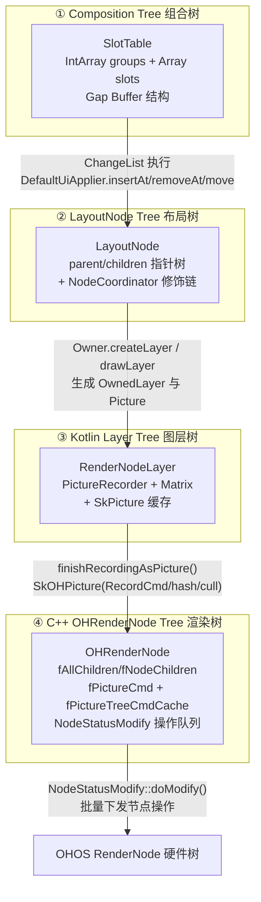

上面这张图适合先建立全局印象，但它还有一层很容易被说得太轻：四棵树之间传的不是“同一份树对象”，而是每个阶段刚刚算出来的结果。Compose 先产出结构变化；布局树再把这些结构变化变成可测量、可放置、可绘制的节点；layer 树继续把局部子树压成可回放 picture；到了 C++ 侧，这些 picture 和节点状态又会被整理成一棵适合局部更新、适合批量提交的渲染树。每一跳都在换一种数据形态。

### 1.1 四棵树之间到底传了什么

如果只记“Composition 树变成 LayoutNode 树，LayoutNode 树再变成 Layer 树”，后面看代码时还是会发虚。真正有用的，是把每一跳传过去的结果对象看清楚：上一层到底产出了什么，下一层又拿这份结果做了什么。

```mermaid
flowchart LR
    subgraph T1[① Composition Tree]
        A1[SlotTable<br/>groups + slots]
        A2[重组结果<br/>ChangeList / Change lambda]
    end

    subgraph T2[② LayoutNode Tree]
        B1[LayoutNode 树<br/>children / coordinator 链]
        B2[节点状态<br/>measurePending / layoutPending / isPlaced]
    end

    subgraph T3[③ Kotlin Layer Tree]
        C1[OwnedLayer / RenderNodeLayer]
        C2[Picture 结果<br/>matrix + position + SkPicture]
    end

    subgraph T4[④ C++ OHRenderNode Tree]
        D1[OHRenderNode 树<br/>fAllChildren / fDesireNodeChildren]
        D2[提交队列<br/>fNodeOpInfos / batchCtx]
    end

    A1 --> A2
    A2 -->|applyChanges + DefaultUiApplier| B1
    B1 --> B2
    B2 -->|Owner.createLayer + drawLayer| C1
    C1 --> C2
    C2 -->|finishRecordingAsPicture| D1
    D1 --> D2
    D2 -->|doModify| SYS[ArkUI RenderNode / RenderService]
```

这张图里最重要的地方，是每条箭头右边写的都不是抽象阶段名，而是实际负责交接的符号。Composition 侧把重组结果先收成 `ChangeList`，然后通过 `DefaultUiApplier.insertBottomUp/remove/move` 去改 `LayoutNode` 树；LayoutNode 侧不会直接把整棵树搬给 layer，而是先走 `Owner.createLayer()`、`drawLayer()` 这类路径，把需要隔离的子树抽成 `OwnedLayer`；到了 layer 侧，真正跨到 C++ 的也不是“整个 Kotlin 节点”，而是 `finishRecordingAsPicture()` 产出的 picture 结果；最后 C++ 再把这些结果整理成 `NodeStatusModify` 里的批量操作，统一下发给 ArkUI。

#### Composition Tree → LayoutNode Tree：传的是结构变更，不是节点实例

这一步最容易被说成“Composition 生成 LayoutNode”。代码里其实不是这么直给的。Composition 侧真正稳定产出的，是 `SlotTable` 上读旧写新之后得到的 `ChangeList`。这些 change 本身还是一组待执行动作，要等 `applyChanges()` 跑起来，交给 `DefaultUiApplier.insertBottomUp()`、`remove()`、`move()` 之后，`LayoutNode` 树才真的被改掉。

```text
场景：信息流列表（LazyColumn），用户下滑 ≈ 一个卡片高度
       顶部 FeedItem#0 滚出视口，底部 FeedItem#4 新进视口

SlotTable.groups  (每 5 个 int 代表一个 composable group)

滚动前
+-------+-----------+-----------+--------------+------------+
|  key  | nodeCount | groupSize | parentAnchor | dataAnchor |
+-------+-----------+-----------+--------------+------------+
| LazyC |     4     |    48     |      -1      |     0      |  ← LazyColumn root
| 1001  |     1     |    11     |       0      |     4      |  ← FeedItem#0  (avatar+text+image)
| 1002  |     1     |    11     |       0      |    15      |  ← FeedItem#1
| 1003  |     1     |    11     |       0      |    26      |  ← FeedItem#2
| 1004  |     1     |    11     |       0      |    37      |  ← FeedItem#3
+-------+-----------+-----------+--------------+------------+

slots (节点对象/remember 值)
+----------+----------+----------+----------+----------+----------+
| item#0   | scrollY  | item#1   | item#2   | item#3   | <gap...> |
| (data)   | = 0f     | (data)   | (data)   | (data)   |          |
+----------+----------+----------+----------+----------+----------+

用户下滑后触发重组，applyChanges 前的 ChangeList

+--------------------+--------------------------------------------------+
| op                 | payload                                          |
+--------------------+--------------------------------------------------+
| remove             | parent=LazyColumn, index=0, count=1             |  ← FeedItem#0 离屏
| insertBottomUp     | parent=LazyColumn, index=3, node=FeedItem#4     |  ← FeedItem#4 入屏
+--------------------+--------------------------------------------------+

DefaultUiApplier 执行后 LayoutNode 树变为：

LayoutNode(LazyColumn)
├─ LayoutNode(FeedItem#1)   [y=0,   h=120dp]
├─ LayoutNode(FeedItem#2)   [y=120, h=120dp]
├─ LayoutNode(FeedItem#3)   [y=240, h=120dp]
└─ LayoutNode(FeedItem#4)   [y=360] <- insertAt(index=3, instance)
```

所以从第一棵树流向第二棵树的，不是一份完整的树快照，而是一份“结构补丁”。补丁里描述的是该插谁、删谁、挪谁。下一层拿到这份结果以后，才把它落成 `_foldedChildren`、coordinator 链和 owner 回调。也正因为中间隔了这层补丁，Compose 才有机会把修改压到最小，而不是每次状态一变就整棵树重建。

#### LayoutNode Tree → Kotlin Layer Tree：传的是绘制边界和局部录制单元

第二跳也不是“每个 LayoutNode 都会变成一个 Layer”。真正发生的事情更克制。`LayoutNode` 先长出自己的 coordinator 链，进入绘制时再由 owner 通过 `createLayer()` 决定要不要创建 `OwnedLayer`。只有需要图层隔离、缓存或独立变换的那部分子树，才会落成 `RenderNodeLayer` 这一层。

```text
场景：FeedItem#2 卡片内部结构（头像 + 文字 + 配图，含 elevation 投影）

LayoutNode 子树

LayoutNode(FeedItem#2_Row)              w=360 h=120dp
├─ _foldedParent   -> LayoutNode(LazyColumn)
├─ _foldedChildren -> [AvatarNode, ContentColumn]
│
├─ AvatarNode (CircleAvatar, 40×40dp)
│   ├─ _foldedChildren -> [Image]
│   └─ outerCoordinator
│       └─ wrapped -> ClipCoordinator(Circle)  ← clip=true → createLayer()
│           └─ wrapped -> InnerCoordinator
│
├─ ContentColumn
│   ├─ _foldedChildren -> [UserNameText, PostText, PostImage, ActionRow]
│   └─ outerCoordinator
│       └─ wrapped -> PaddingCoordinator(8dp)
│           └─ wrapped -> InnerCoordinator
│
└─ outerCoordinator
    └─ wrapped -> ShadowCoordinator(elevation=4dp)  ← 有投影 → createLayer()
        └─ wrapped -> PaddingCoordinator(12dp)
            └─ wrapped -> InnerCoordinator

                        createLayer() 返回 true 的节点
                        各自独立生成一个 OwnedLayer

RenderNodeLayer(FeedItem#2_Card_shadow)
+---------------------------------------------+
| size        = IntSize(360, 120)             |
| position    = IntOffset(0, 120)             |  ← 距列表顶 120dp
| matrix      = Matrix()  [scale=1, no rotate]|
| shadowElevation = 4f                        |
| pictureRecorder = PictureRecorder()         |
| picture     : Picture? = null (首帧未录制)  |
| drawBlock   = { c, _ -> drawCard(c) }       |
+---------------------------------------------+

RenderNodeLayer(AvatarImage_clip)
+---------------------------------------------+
| size        = IntSize(40, 40)               |
| position    = IntOffset(12, 40)             |
| clip        = true  (圆形裁剪)              |
| pictureRecorder = PictureRecorder()         |
| picture     : Picture? = null               |
| drawBlock   = { c, _ -> drawImage(c, bitmap)}|
+---------------------------------------------+

drawLayer() 触发时：
    FeedItem 子树 coordinator 计算完毕
        -> drawBlock 被调用
        -> PictureRecorder.beginRecording(Rect(0,120,360,240))
        -> [绘制头像圆圈 / 昵称文字 / 正文 / 配图]
        -> picture = finishRecordingAsPicture()
```

这意味着第二棵树传给第三棵树的结果，本质上是一种“可以独立录制的边界”。这份结果里不只是节点位置，还包括 draw block、matrix、position、clip、alpha 等图层属性。到了 `RenderNodeLayer.drawLayer()`，这份边界才会进一步收缩成 picture。换句话说，LayoutNode 树提供的是“哪些内容该单独画、单独记、单独变换”，而不是直接提供最终可提交的绘制命令。

#### Kotlin Layer Tree → C++ OHRenderNode Tree：传的是 picture 录制结果和局部绘制信息

第三跳是真正的数据形态切换点。`RenderNodeLayer` 在 Kotlin 侧手里拿着的是 `PictureRecorder`、`matrix`、`position` 和 draw block；但 `finishRecordingAsPicture()` 之后，C++ 侧产出的已经不是普通 `SkPicture` 概念，而是带着 `RecordCmd`、cull rect、paint area、hash 和 origin node 关系的 `SkOHPicture`。

```text
场景：FeedItem#2 卡片完成一次录制（内容未发生变化，hash 命中缓存）

Kotlin 侧录制前的 RenderNodeLayer

RenderNodeLayer(FeedItem#2_Card_shadow)
├─ matrix   = Matrix()
│             [  1   0   0   0  ]
│             [  0   1   0   0  ]  ← 无内部变换（滚动位移由父节点处理）
│             [  0   0   1   0  ]
│             [  0 120   0   1  ]
├─ position = IntOffset(x=0, y=120)   ← 视口内第二张卡顶边
├─ size     = IntSize(w=360, h=120)
├─ alpha    = 1.0f
├─ shadowElevation = 4f
├─ pictureRecorder = PictureRecorder(fOHRecorder=<active>, fNowOHNode=#7)
└─ drawBlock = { canvas, _ ->
       drawAvatar(canvas, avatarBitmap, Rect(12,40,52,80))
       drawText(canvas, "李四",  offset=(60,44), bold)
       drawText(canvas, "周末买了新相机，试拍了几张...", offset=(60,68))
       drawImage(canvas, postPhoto, Rect(0,88,360,120))
   }

finishRecordingAsPicture() 产出的 SkOHPicture

+------------------------------------------------------------+
| SkOHPicture                                                |
|------------------------------------------------------------|  
| fCull             = Rect(0, 120, 360, 240)                 |  ← 实际绘制边界（px）
| fUserCull         = Rect(0, 120, 360, 240)                 |
| fOHRecordCmd      = OH_Drawing_RecordCmd*                  |  ← 头像+文字+图的绘制命令序列
| fDrawCostEstimate = (cpu=0.8, gpu=2.1)                     |  ← 预估绘制开销
| fHash             = 0xa3f24e91                             |  ← 本帧 content hash
| fOriginNode       = shared_ptr<OHRenderNode#7>             |  ← 绑定的 C++ 渲染节点
| fCacheCloneNodes  = [OHRenderNode#7]                       |
+------------------------------------------------------------+

录制完整路径：

drawBlock （头像 + 昵称 + 正文 + 配图）
    -> OH_Drawing_RecordCmdUtilsBeginRecording(...)   // 开始记录命令
    -> SkCanvas 记录 drawImage / drawText ...         // 翻译成 OH_Drawing 命令
    -> 统计 paintArea = Rect(0,120,360,240)           // 真实绘制边界
    -> fHash = hash(所有 draw 命令 + 参数)           // 用于下帧命中缓存
    -> OH_Drawing_RecordCmdUtilsFinishRecording(...)  // 封住命令
    -> 封装成 SkOHPicture(fOHRecordCmd, #7, ...)

下一帧如果"李四"的卡片没有任何状态变化：
    fHash 不变 → fContentHasChanged = false → 这帧跳过录制，直接 playback
```

这一跳为什么重要？因为从这里开始，系统手里第一次有了“平台真能消费”的录制结果。`SkPictureRecorder` 在录制过程中一边累加绘制边界，一边维护 hash，一边让 `OHRenderNode` 收子节点；到了 `finishRecordingAsPicture()`，这些信息会一起封装进 picture 结果。也就是说，第三棵树送给第四棵树的，不只是“画面内容”，还包括局部脏区、内容哈希、子节点关系和后续局部更新要用的上下文。

#### OHRenderNode Tree → RenderService：传的是批量节点操作，不是整棵树重提交

第四跳也不等于“把 OHRenderNode 整棵树交给系统”。`traverseAndUpdateStatus()` 和 `updateNodeStatus()` 真正做的，是根据这棵渲染树当前的内容哈希、子节点模式和绘制区域，把需要改动的部分整理成 `NodeModifyInfo` 队列。最后 `NodeStatusModify::doModify()` 再把这些离散操作收成 `batchCtx`，一次性走 `RenderNodeImplC::FillOpsForBatch` 或对应的 ArkTS 路径。

```text
场景：用户下滑一帧，FeedItem#0 离屏、FeedItem#4 首次入屏

OHRenderNode(LazyColumn_root)  ← 整个列表容器节点
│
├─ fAllChildren        = [item#1_node, item#2_node, item#3_node, item#4_node]
│                         // item#0_node 已被上一帧 remove，item#4_node 本帧新增
│
├─ fNodeChildren       = [item#2_node, item#3_node]
│                         // 有 elevation 投影 → 拆成独立 RenderNode
│                         // item#1 和 item#4 内容简单 → Picture 模式合并绘制
│
├─ fDesireNodeChildren = [item#2_node, item#3_node, item#4_node]
│                         // diff 后 item#4 投影动效刚触发，希望提升为节点
│
├─ fLocalPaintArea     = Rect(0, 0, 360, 480)   // 4 张卡片的联合区域
├─ fPictureTreeHash    = 0xc917ab32              // 变了（item#0 删除 + item#4 新增）
├─ fNodeEffectHash     = 0x004f12e7
└─ updateNodeStatus()  核心就是算出下面这份操作队列

traverseAndUpdateStatus / updateNodeStatus() 计算出的增量

fNodeOpInfos :  [NodeModifyInfo × 6]

+--------------------+-----------------------------------------------------+
| op                 | nodes / numbers                                     |
+--------------------+-----------------------------------------------------+
| REMOVE_CHILD       | parent=root, child=item#0_node                      | ← 离屏
| APPEND_CHILD       | parent=root, child=item#4_node                      | ← 入屏
| UPDATE_POSITION    | node=item#1_node,  x=0, y=-60  (vp)                 | ← 随滚动位移
| UPDATE_POSITION    | node=item#2_node,  x=0, y=60   (vp)                 |
| UPDATE_POSITION    | node=item#3_node,  x=0, y=180  (vp)                 |
| INVALIDATE         | node=root                                           |
+--------------------+-----------------------------------------------------+

注意：item#1、item#2、item#3 的内容没变（昵称/文字/图片 hash 相同），
      只有 position 变了 → 只发 UPDATE_POSITION，不重新录制 picture。

doModify() 把 fNodeOpInfos 压成 batchCtx

batchCtx
├─ nodeType = NODE_C  (capiRenderNodeFixed=true 时走 C API)
├─ op[0]: removeChild(root, item#0_node)
├─ op[1]: appendChild(root, item#4_node)
├─ op[2]: setPosition(item#1_node, 0, -60)
├─ op[3]: setPosition(item#2_node, 0,  60)
├─ op[4]: setPosition(item#3_node, 0, 180)
└─ op[5]: invalidate(root)

ApplyBatchModify(batchCtx, ...) 一次 NAPI/C 调用提交给平台
↓
RenderService 只感知到 6 条节点操作，不需要知道上面四棵树发生了什么
```

所以传给 RenderService 的最后结果，实际上是一组批量节点操作：插入子节点、删除子节点、更新位置、更新矩阵、更新透明度、触发 invalidate。它不是每帧把整棵 OHRenderNode 树从头灌给系统，而是把这一帧真正变化的那部分整理成可提交的操作队列。FusionRenderer 后面很多性能优化，靠的就是这里不是“全量重提”，而是“增量下发”。

### 1.2 四棵树的结果是怎么一层层收紧的

从结果形态上看，这四棵树其实在做一件很一致的事：把信息一步步收紧。Composition Tree 先把变化压成结构补丁；LayoutNode Tree 把补丁落实成可测量、可布局、可绘制的节点关系；Layer Tree 再从里面切出需要隔离和缓存的那部分子树，把它录制成 picture；OHRenderNode Tree 最后继续把 picture 和节点状态整理成批量节点操作，交给 RenderService。

这条链越往后，数据就越接近平台真正需要的形态，也越不关心 Compose Runtime 原本的高层语义。前面还在谈 group、slot、LayoutNode、placeBlock；到了后面，谈的是 picture hash、draw area、child node diff、batch modify。理解这点以后，后面的初始化、重组、测量、布局、绘制几章就不会像五段平行说明，而会更像同一条数据链在不同阶段逐层变形。

### ① Composition Tree (SlotTable)

Gap Buffer 结构，每个 group 占 5 个 int：`[key, nodeCount, groupSize, parentAnchor, dataAnchor]`。SlotWriter 维护 `groupGapStart/Len` + `slotsGapStart/Len`，局部插入/删除 O(1)。

### ② LayoutNode Tree

`_foldedParent` / `_foldedChildren` 指针树，支持虚拟节点折叠（`_unfoldedChildren`）。每个 LayoutNode 有 `outerCoordinator → wrapped → ... → innerCoordinator` 修饰链（NodeCoordinator 单向链表）。

### ③ RenderNodeLayer (Kotlin Layer Tree)

每个有 `graphicsLayer` 修饰的节点创建一个 `RenderNodeLayer`，持有 `PictureRecorder` + `SkPicture` 缓存 + 4×4 变换矩阵。

### ④ C++ OHRenderNode Tree

核心渲染树，维护：
- `fAllChildren`（全部子节点，含 Picture 模式）
- `fNodeChildren`（独立 RenderNode 子节点）
- `fDesireNodeChildren`（期望子节点列表，用于 diff）
- 三级哈希：`fNodeSelfContentHash`（自身），`fPictureTreeHash`（子树），`fNodeEffectHash`（含变换/裁剪）
- 帧稳定性计数器：`fSelfContentKeepSameCnt` / `fSelfContentKeepChangeCnt`

---

## 二、阶段一：初始化（Initialization）

### 2.1 原理

FusionRenderer 的初始化不是一次做完的。它被拆成三次绑定，分别落在三个不同的生命周期时机上：

1. **Kotlin 容器创建**：`ComposeArkUIViewController(env) { App() }` 创建 `ComposeArkUIViewContainer`，但**不创建** RenderNode、Mediator、ComposeScene 等重量级对象
2. **ArkTS 运行时绑定**：`FusionRendererCompose.aboutToAppear()` 触发时，创建 `NodeContent`、`RenderFrameManager`，通过 NAPI 调用 Kotlin 侧 `initFusionRendererNode()` 创建 CRenderNode 或 JsRenderNode
3. **Content 延迟绑定**：`setContent()` 延迟到首次 `onSurfaceChanged(w,h)` 后，确保尺寸已知再启动 Composition

这么拆不是为了形式上的分层，而是因为底下有个很硬的约束：CRenderNode 必须在已经挂到 ArkUI 组件树上的 `NodeContent` 上创建，否则 `OH_ArkUI_GetNodeContentFromNapiValue` 会直接失败。偏偏 `NodeContent` 真正可用的时机，就是 `aboutToAppear`。

### 2.2 执行流程分步详解

初始化不是一条直线流程，而是被 ArkUI 生命周期切成了三个前后衔接的子阶段。下图给的是每个子阶段的触发时机和内部步骤，顺便也把各自的前置条件标出来了。

拆成三段，是因为它们各管一件事。第一段先把 Compose 页面包成一个能交给 ArkTS 持有和回调的控制器；第二段等组件真的进了 ArkUI 树，再去创建依赖 `NodeContent` 的 RenderNode 和帧驱动；第三段继续往后推，等尺寸稳定，再把首个 Composition 注进去。少哪一段都不行。没有第一段，ArkTS 拿不到 `napi_value controller`；没有第二段，CRenderNode 因为拿不到已挂载的 `NodeContent` 会直接失败；没有第三段，Composition 会在尺寸未知时启动，先做出一轮注定要推翻的布局。

#### 子阶段 A：Kotlin 容器创建（编译期/App 启动时触发）

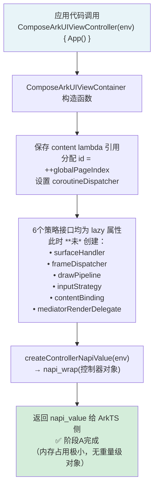

**关键点**：这一段还没到渲染。它先做的是把 Compose 页面包成一个 Kotlin 控制器，方便 ArkTS 后面安全地持有、转交和回调。页面内容这时已经有了，但平台运行时环境还没准备好，所以这里只保存 `content lambda`、`id` 和调度配置，不去碰 RenderNode、Mediator、ComposeScene 这些必须依赖平台上下文的重量级对象。

整个容器创建阶段的内存分配约 200 条指令，只保存引用和配置，不分配任何渲染资源。六个策略接口的 `lazy` 委托很关键，它们只在首次访问时初始化，避免在 ArkUI 组件树还没就绪时提前创建依赖 ArkTS 上下文的对象。子阶段 A 说白了就是先把入口搭好，让后面的 ArkTS 生命周期能顺利接住，而不是在这里抢跑。

#### 子阶段 B：ArkTS 运行时绑定（`aboutToAppear` 生命周期触发）

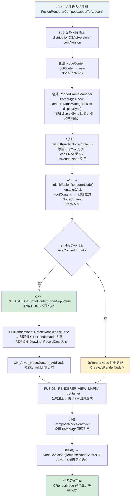

**关键点**：这一段才是真正把前面那个 Kotlin 控制器接进 ArkUI 运行时。走到这里，页面才第一次有机会拿到可被系统驱动的 RenderNode、NodeContent 和帧调度能力。前一段解决的是“控制器先有”，这一段解决的是“平台宿主终于到位”，所以 `aboutToAppear` 是唯一合法时机。

`NodeContent` 到了这个时机才真正挂上 ArkUI 组件树，`OH_ArkUI_GetNodeContentFromNapiValue` 也才拿得到原生句柄。若在此之前，比如在 `aboutToAppear` 外面的全局代码里调用它，会直接因为 `GetNodeContentFromNapiValue failed: 401` 崩掉。`FUSION_RENDERER_VIEW_MAP` 也是在这里完成全局注册，后续 C++ draw 回调要靠 `renderNodeId` 回查对应的 `ComposeArkUIViewContainer`。所以子阶段 B 不是“顺手建几个对象”，而是平台侧真正落位的那一步。从这里开始，Compose 内容才算正式挂上 ArkUI 节点树，也才轮得到 RenderService 来调度它。

#### 子阶段 C：Content 延迟绑定（`onAreaChange` → `onSurfaceChanged` 触发）

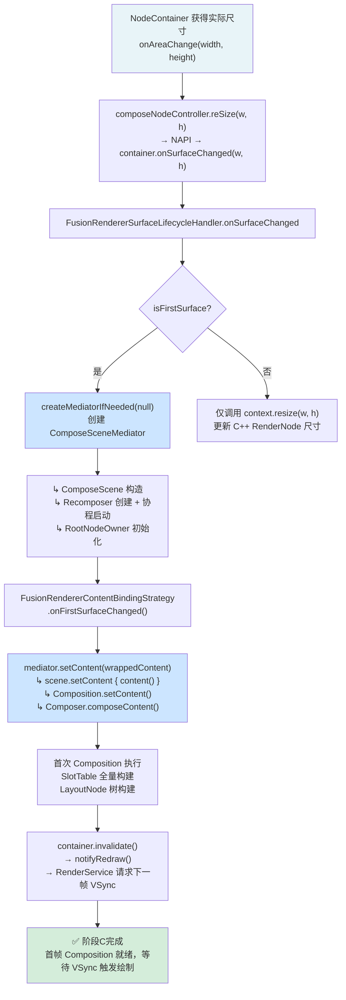

**关键点**：这一段负责把真正的 Compose 内容送进组合、测量和后续绘制链路，但前提是平台节点和尺寸都已经准备好。问题不在于 content 有没有，而在于这时根节点到底该按多大空间启动还没有答案，所以 `setContent()` 不能在 controller 刚创建时就急着执行。

`setContent()` 放到这里有两个直接原因：①首次 Composition 需要已知的 `width/height`，这样根节点收到的初始约束才是对的；②Mediator 和 ComposeScene 的构造也依赖 `onSurfaceChanged` 提供的 Surface 上下文。于是延迟绑定策略下，`FusionRendererContentBindingStrategy.onMediatorCreated()` 保持空实现，真正注入 content 的位置放在 `onFirstSurfaceChanged()`。子阶段 C 干的其实就是“让内容正式起跑”，而且一上来就跑在正确尺寸和正确上下文里，避免首轮 Composition、Measure、Layout 先空转一圈。

#### 三阶段触发时序对照

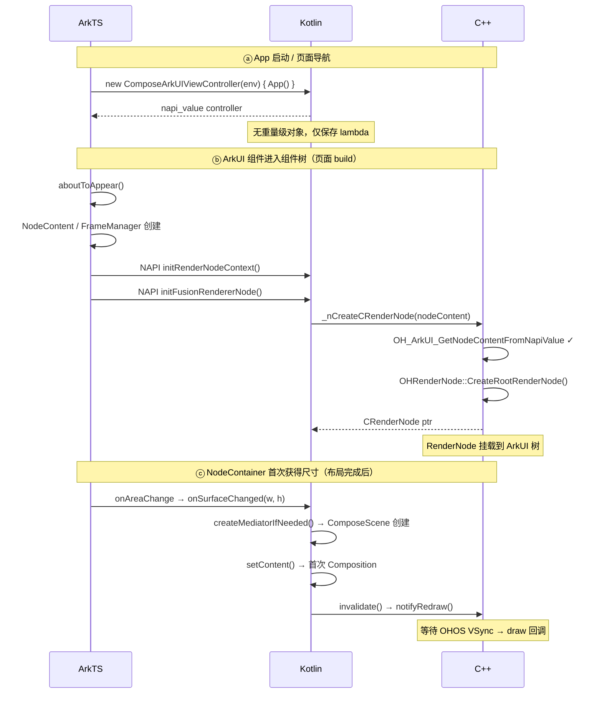

三个阶段之间的依赖关系很硬：B 阶段必须等 A 阶段先把 `napi_value` 准备好，C 阶段又必须等 B 阶段里的 `NodeContainer` 先拿到尺寸。顺序一乱，初始化就会直接失败。

### 2.3 架构图——初始化参与组件总览

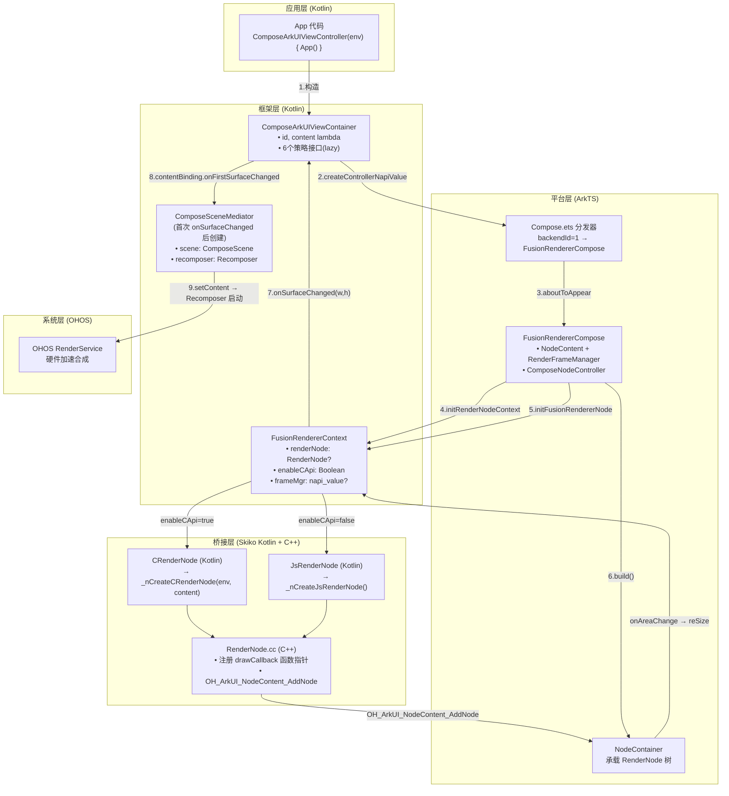

这张架构图从左往右看最直观。左边是 App 代码和 Compose 容器，先把页面内容包成一个控制器对象；中间是 Kotlin 和 C++ 的桥接层，把 RenderNode、draw callback 和 NodeContent 串起来；右边是 ArkTS 和 OHOS 系统层，负责提供组件树、尺寸变化和硬件合成。图里的 9 条连线，基本就是初始化把一个 Composable 页面接进系统渲染管线的全过程。

这张图里真正该盯住的不是类名，而是创建顺序。`ComposeArkUIViewContainer` 最先出现，而且很轻，只保存 content 和配置；`FusionRendererContext` 接着出现，开始持有 renderNode 和帧驱动上下文；真正重的 `ComposeSceneMediator` 一直拖到首次 `onSurfaceChanged` 之后才创建。初始化不是一次性把对象全 new 出来，而是按“控制器先有、RenderNode 后有、Mediator 最后有”的顺序往里推进。这样做很朴素，就是为了把依赖 ArkUI 生命周期和尺寸信息的对象尽量往后放，少踩早建、错建和重复建这几个坑。

### 2.3 机制图——CRenderNode vs JsRenderNode 选择

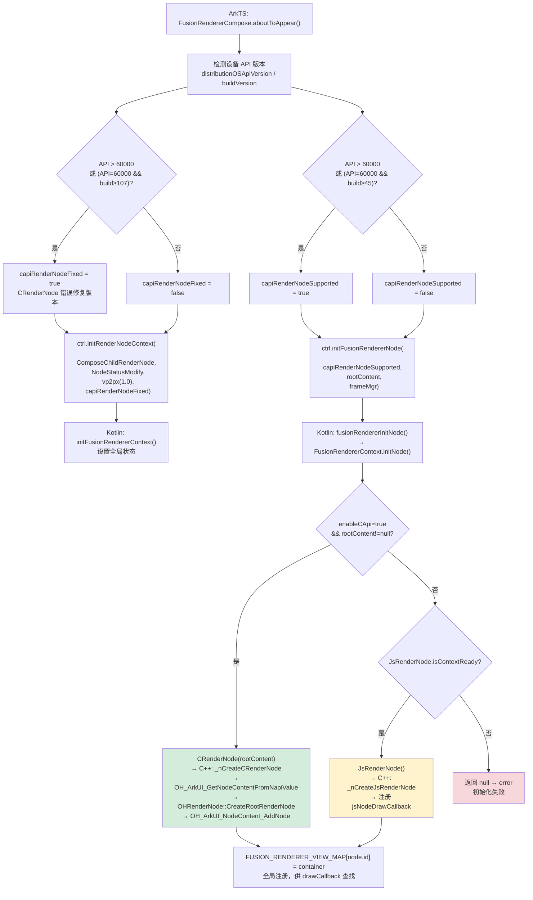

这张机制图不是简单的“二选一”，而是两层判断。第一层先看设备支不支持 C API RenderNode；第二层再看这个版本是不是已经带上了必要修复。最后会得到两个布尔状态：`capiRenderNodeSupported` 决定能不能走 CRenderNode，`capiRenderNodeFixed` 决定这条 CRenderNode 路径够不够稳定。两个名字很像，分工其实很清楚，一个管能不能用，一个管用起来稳不稳。

后半段最关键的是 `rootContent` 这个条件。就算设备支持 C API，只要 `NodeContent` 还没挂好，`_nCreateCRenderNode` 也拿不到 ArkUI 原生句柄，这时就只能退回 `JsRenderNode`，或者直接失败。所以这个选择机制同时受两头约束，一头是设备能力，一头是生命周期时机。CRenderNode 更快，刷新链路也更短，但前提更苛刻；JsRenderNode 更像兜底路径，代价是多一层 ArkTS 同步刷新。

### 2.4 时序图——完整初始化时序

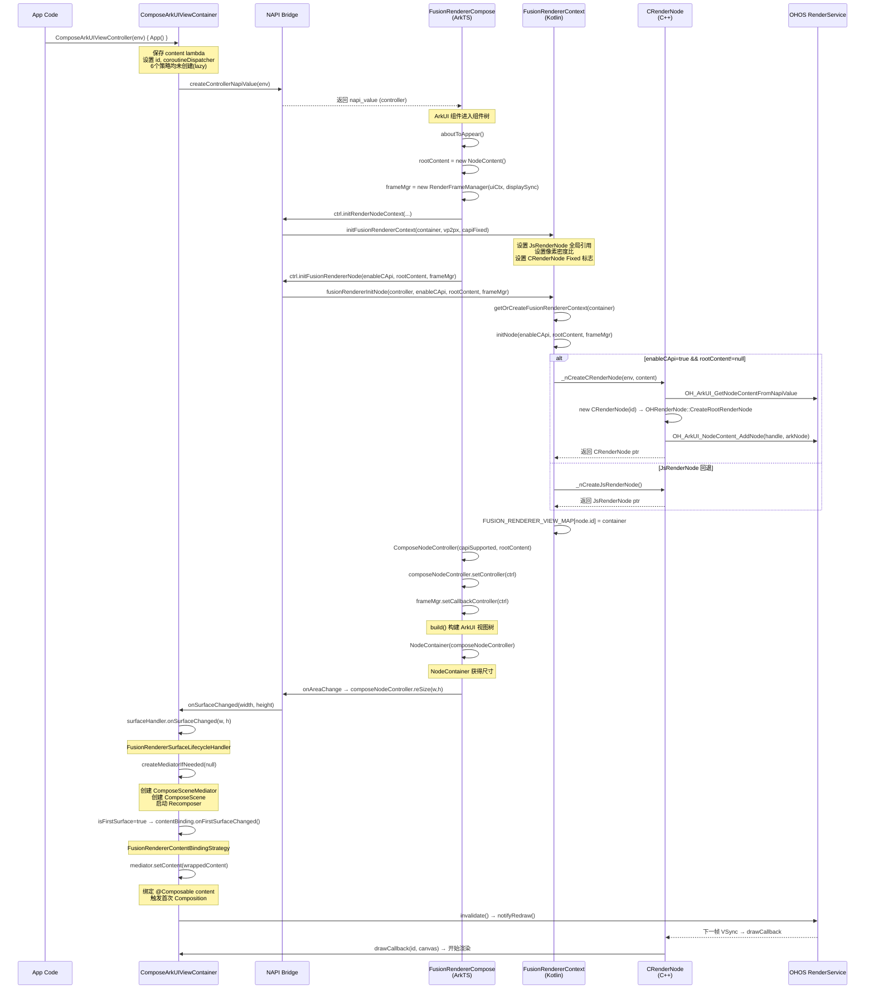

这张时序图最有用的地方，是把“谁先发生，谁必须等谁”摊开了。App 代码先创建 `ComposeArkUIViewContainer`，但这时既没有 RenderNode，也没有 ComposeScene；等 ArkTS 进入 `aboutToAppear`，`NodeContent` 和 `RenderFrameManager` 才真正到位，RenderNode 也终于能安全创建；再往后，`NodeContainer` 拿到尺寸，`onAreaChange` 触发 `onSurfaceChanged`，Mediator 和首次 `setContent` 才接上。整条链路里每一步都在等前一个条件满足，顺序一乱就会出问题。

把这张图和前面的三阶段绑定放在一起看，就能明白为什么初始化总有点“慢半拍”的感觉。不是系统反应慢，而是它一直在等正确的时机：先等控制器能传递，再等 NodeContent 能挂载，再等尺寸稳定，最后才把 Compose Runtime 接进来。时序上看着有点绕，换来的好处很直接，首次 Composition、首次测量和首次绘制都落在有效上下文里，不用靠后面的补丁去兜前面留下的错状态。

### 2.5 类图——初始化核心类关系

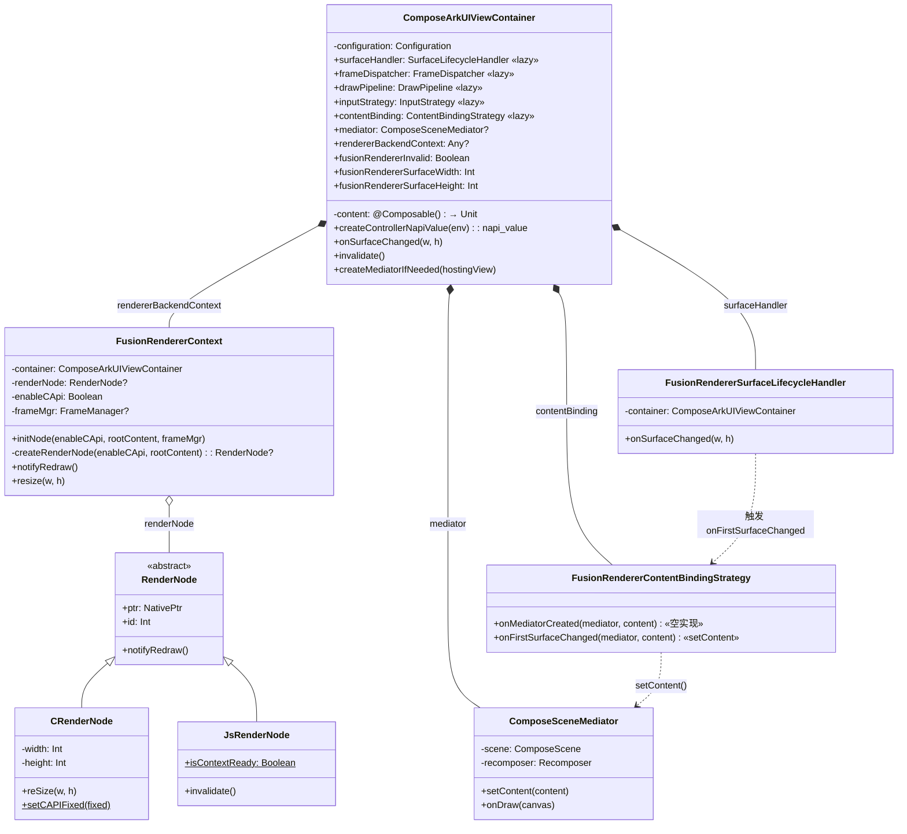

`ComposeArkUIViewContainer` 是中央控制器，持有策略实例和 Mediator。`FusionRendererContext` 持有渲染节点（CRenderNode/JsRenderNode），通过策略模式与容器解耦。延迟绑定路径：`SurfaceLifecycleHandler.onSurfaceChanged()` → `ContentBindingStrategy.onFirstSurfaceChanged()` → `Mediator.setContent()`。

### 2.6 负载分析

#### 指令分布

> ⚠️ **初始化阶段为首帧一次性执行**，稳态滑动 hiperf 采样中无对应热点分布。以下指令数为代码路径理论估算，不来源于 hiperf `raw-instruction-retired` 数据。首次 `CompositionImpl#setContent` 可在采样文件中查到 subEvents = **22,778,727**，可作为首帧组合成本参考。

|       子阶段        | 主要函数                                        | 理论估算（首帧）|   占比   | 说明                                  |
| :-----------------: | ----------------------------------------------- | :---------: | :------: | ------------------------------------- |
|   Kotlin 容器构造   | `ComposeArkUIViewContainer.<init>`              |    ~200     |    2%    | 设置属性、注册旋转监听                |
|      NAPI 桥接      | `createControllerNapiValue`                     |    ~500     |    5%    | napi_wrap + 属性导出                  |
| ArkTS aboutToAppear | `FusionRendererCompose.aboutToAppear`           |   ~1,000    |   10%    | NodeContent/FrameManager 创建         |
| **RenderNode 创建** | `_nCreateCRenderNode → CreateRootRenderNode`    |   ~3,000    | **30%**  | OH_ArkUI 句柄获取 + 子节点创建 + 挂载 |
|    Mediator 创建    | `createMediatorIfNeeded → ComposeSceneMediator` |   ~2,000    |   20%    | ComposeScene + Recomposer 初始化      |
| **首次 setContent** | `mediator.setContent → composeInitial`          |   ~3,000    | **30%**  | 首次 Composition 全量 SlotTable 构建（实测 subEvents 22,778,727） |
|  其他（注册/监听）  | 拖拽、键盘、屏幕变化注册                        |    ~300     |    3%    | —                                     |
|      **合计**       |                                                 | **~10,000** | **100%** | 首页初始化一次性开销（理论）                  |

#### 热点函数 TOP-5

> ⚠️ 以下为首帧理论估算，稳态 hiperf 采样中无此阶段热点数据。

| 排名 | 函数                                 |  语言  | 理论估算（首帧）| 优化状态               |
| :--: | ------------------------------------ | :----: | :--------: | ---------------------- |
|  1   | `Composition.composeInitial()`       | Kotlin |   ~3,000   | 无法避免（首帧必须）   |
|  2   | `OHRenderNode::CreateRootRenderNode` |  C++   |   ~2,000   | OHOS API 开销为主      |
|  3   | `OH_ArkUI_NodeContent_AddNode`       |  OHOS  |   ~1,000   | 系统调用               |
|  4   | `ComposeSceneMediator.<init>`        | Kotlin |   ~1,500   | 含 Recomposer 协程创建 |
|  5   | `RenderFrameManager.<init>`          | ArkTS  |    ~500    | displaySync 创建       |

#### 已有优化

- **lazy 策略**：6 个策略接口延迟到首次使用时创建，节省首帧约 600 条构造指令
- **延迟 setContent**：避免在尺寸未知时触发无效 Composition

#### 优化机会

- 首帧 `composeInitial` 占 30%，考虑 **预组合（preCompose）** 方案在后台线程提前执行
- `CreateRootRenderNode` 的 OHOS API 调用可考虑缓存/池化

### 2.7 过渡阶段：帧调度（Initialization → Recomposition）

初始化收尾之后，流程还不会立刻跳到重组。中间隔着一个很容易漏看的阶段：帧调度。它的任务很明确，就是把 OHOS 的 `displaySync` / `VSync` 信号接进来，再把 redraw 请求对齐到 ArkUI / RenderService 的 draw 生命周期。

如果把这一步省掉，文档读起来就会像“`State` 一变，系统马上开始重组”。实际并不是这样。FusionRenderer 先得把这一帧的调度链走通：

`displaySync/VSync → ArkUIViewController.onFrame() → ChoreographerManager 分发 → FusionRendererFrameDispatcher.onFrame() → FusionRendererContext.notifyRedraw() → CRenderNode/JsRenderNode 请求 redraw → OHRenderNode.doRedraw() → fCallbackC 回调 Kotlin → BaseComposeScene.render()`

这五段不是简单地把信号“转一手”。VSync 接收是在把 OHOS 的系统时钟引入 Compose 控制器，不然 Compose 根本不知道该在哪一帧处理动画和重组；Compose 分发负责把时钟精准发给当前页面实际注册的帧监听者，不经过这层，多页面和多控制器场景就没法隔离；Redraw 请求是在告诉平台 RenderNode“这一帧需要刷新”，因为 Compose 不能越过 ArkUI/RenderService 自己决定 draw 时机；平台投递负责把 redraw 对齐到 RenderNode 的实际 draw 生命周期，并顺手完成去重，不然一次状态抖动就可能放大成多次 draw；最后的 Kotlin 回调接入，是把平台 draw callback 真正接回 `BaseComposeScene.render()`，只有走到这里，后面的重组、测量、布局、绘制才算开始。

#### 2.7.1 机制图——帧调度完整路径

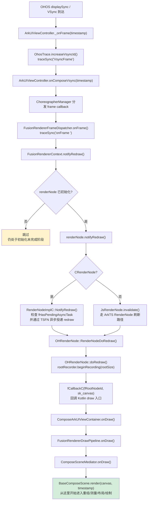

这条路径里最重要的控制点有两个：

1. `FusionRendererFrameDispatcher.onFrame()` 并不直接执行重组，它只负责发出 redraw 请求。
2. `BaseComposeScene.render()` 才是 Compose Runtime 真正开始工作的入口，后续的 `performScheduledEffects`、`performScheduledRecomposerTasks`、`frameClock.sendFrame()`、`doMeasureAndLayout()` 和 `draw()` 都发生在这里。

#### 2.7.2 子阶段拆解

顺着这条链往下看，更像一次接力。`_ArkUIViewController_onFrame()` 先接住系统帧信号，顺手生成 `vsyncId` 和 trace；`ChoreographerManager` 再把这次时钟发给当前页面真正注册的帧监听者；`FusionRendererContext.notifyRedraw()` 负责把“这一帧需要刷新”的意图交给平台 RenderNode；接着 `RenderNodeImplC::NotifyRedraw()` 这类平台逻辑去完成去重和投递；最后 `OHRenderNode::doRedraw()` 再把平台 callback 接回 `BaseComposeScene.render()`。走到这里，后面的重组、测量、布局和绘制才算有了真正的起点。

#### 2.7.3 为什么这一阶段必须独立看待

- 它决定了**谁是帧时钟的真正来源**。FusionRenderer 不是自己拉起一个独立渲染循环，而是严格挂在 OHOS 的 `displaySync` 和 ArkUI draw 生命周期上。
- 它决定了**重组何时发生**。`State` 失效后只是把 scope 标脏，真正的重组必须等到下一次 `BaseComposeScene.render()` 中的 `frameClock.sendFrame()`。
- 它决定了**多次刷新请求如何去重**。CRenderNode 路径下 `fHasPendingAsyncTask` 会防止同一批次内重复投递 redraw，避免滚动、触摸、尺寸变化同时发生时产生 draw 风暴。

#### 2.7.4 时序图——从初始化结束到进入重组

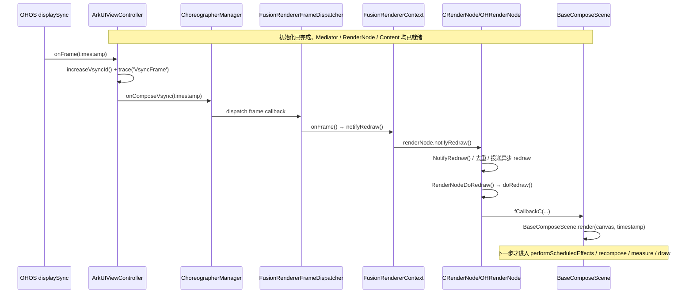

#### 2.7.5 负载特征

帧调度阶段自身开销低于主要渲染阶段，hiperf 实测核心函数 selfEvents：`EventHandler::SendEvent` **6,587,365**（0.401%）、`PipelineContext::FlushVsync` 本体 **5,996,245**（0.365%）、`CoroutineDispatcher#interceptContinuation` **4,500,813**（0.274%），三者合计 **~17.1M**，远低于重组（235M subEvents）、测量布局（115M）等阶段；但它对**掉帧抖动**非常敏感，因为这里一旦重复投递 redraw 或线程切换延迟，就会直接推迟后续整个渲染主链路的开始时间。

---

## 2.8 过渡阶段：手势与输入事件处理（FlushTouchEvents）

`FlushVsync` 调用 `FlushTouchEvents` 是帧内最先完成的一批工作。这个阶段在渲染管线正式开始之前把当前帧积压的所有触摸事件消化掉，并将手势识别的结果（滚动偏移、拖拽状态）写入 `MutableState`，等到后续 `BaseComposeScene.render()` 进入重组时再把修改收进来。换句话说，手势处理不在 `render()` 里，而是发生在它之前。

```
FlushVsync (375M)
  ├─ FlushTouchEvents (208M)   ← 本节范围
  │     └─ ... → BaseComposeScene.sendPointerEvent → 手势识别 → State 写入
  └─ notifyRedraw / draw 路径  ← L1-0 剩余部分 (167M)
        └─ render() → 重组 / 测量 / 布局 / 绘制
```

这一阶段在 perf 采样中的成本是 **208M 指令（12.71%）**，与重组（L1-2）量级相当，是一帧中仅次于帧调度／绘制的第二大独立消耗源。任何向 `pointerInput {}` 修饰符里写复杂逻辑或深度嵌套手势节点，都会直接反映在这里。

### 2.8.1 完整调用链

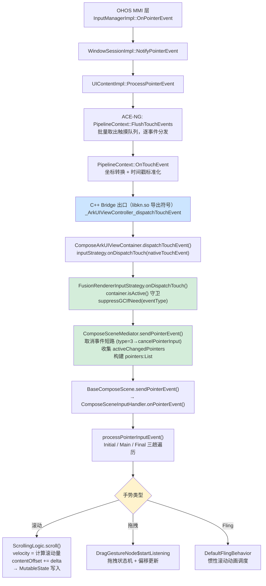

### 2.8.2 子阶段拆解

| 子阶段 | 入口函数 | subEvents | 说明 |
| ------ | -------- | --------: | ---- |
| ① MMI 跨进程投递 | `InputManagerImpl::OnPointerEvent` | 55M (3.40%) | OHOS 系统层跨进程反序列化指针数据，固有开销 |
| ② ACE-NG 批量分发 | `PipelineContext::FlushTouchEvents` | 208M (12.71%) | **L1-手势入口**：主循环逐事件调用 `OnTouchEvent` |
| ③ C++ Bridge 桥接 | `_ArkUIViewController_dispatchTouchEvent` | 165M (10.07%) | libkn.so 导出符号，单次调用开销极低 |
| ④ Kotlin 层路由 | `ComposeArkUIViewContainer#dispatchTouchEvent` | 163M (9.97%) | `FusionRendererInputStrategy` 守卫 + GC 抑制 |
| ⑤ 场景输入路由 | `BaseComposeScene#sendPointerEvent` | 113M (6.89%) | 三趟遍历（Initial→Main→Final），命中测试 |
| ⑥ 手势识别叶子 | `ScrollingLogic.scroll` 等 | ~164M (合计) | 滚动偏移计算 57M、inertia 51M、drag 42M、fling 15M |

注意：③④⑤ 的 subEvents **逐层包含**，不可直接相加。各子阶段的独立成本需要从父级中减去子级。真正的算法开销集中在⑥的叶子函数。

### 2.8.3 FusionRenderer 路径的特殊处理

**GC 抑制（`suppressGCIfNeed`）**

滑动过程中 Kotlin/Native GC 如果在 FlushTouchEvents 期间被触发，会导致明显的帧耗时毛刺。`FusionRendererInputStrategy` 在 `onDispatchTouch` 调用栈里通过 `suppressGCIfNeed(eventType)` 对 `Press` 时启动 GC 抑制，`Release`/`Cancel` 时停止，Move 事件不做操作（保持抑制状态不变），避免高频 Move 事件期间发生 GC。

**触摸取消短路**

`ComposeSceneMediator.sendPointerEvent()` 在最外层先检查 `rawTouchType == 3`（OHOS 取消事件），清空 `activeChangedPointers` 并直接调用 `scene.cancelPointerInput()`，不走后续的命中测试和手势识别路径，避免在取消事件上浪费资源。

**多点触控跟踪**

`activeChangedPointers: LinkedHashMap<PointerId, PointerInputChange>` 在每次事件到来时先移除已释放的指针，再合并本次变化，保持完整的多指状态，传递给 `scene.sendPointerEvent()` 的 `pointers` 参数。这保证了两指缩放、两指滚动场景下命中测试拿到的是完整触摸快照。

**InternalArkUIViewController.dispatchTouchEvent 的两层守卫**

```kotlin
override fun onDispatchTouch(nativeTouchEvent: napi_value): Boolean {
    if (!container.isActive()) return true   // ← 守卫 1：容器未就绪时直接消费，不传递
    return container.mediator?.sendPointerEvent(container.requiredEnv, nativeTouchEvent) ?: false
    //                                                                      ↑ 守卫 2：mediator 为 null 时返回 false
}
```

`isActive()` 为 false（页面 onPageHide 之后或销毁过程中）时，事件直接被消费，不进入 Compose，防止 State 写入脏化一个即将销毁的 Scene。

### 2.8.4 时序图——一次滑动事件的完整投递

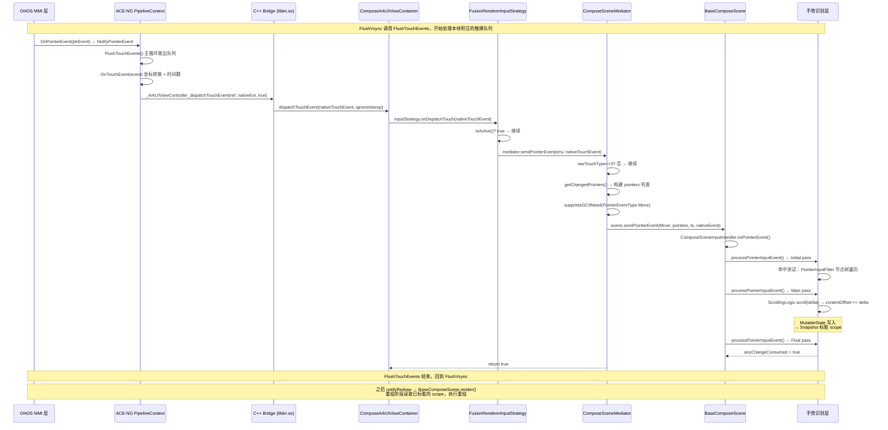

### 2.8.5 为什么手势处理必须在 render() 之前

**状态写入时序**：手势处理产生的 `MutableState` 写入（如 `scrollOffset`、`dragging`）必须在同一帧的 `render()` 开始之前完成，否则 `SnapshotStateObserver` 无法在当帧的 `frameClock.sendFrame()` 中看到这些变化，导致滚动结果推迟一帧才显示。

**统一事件队列**：ACE-NG 把多个触摸事件攒成队列，`FlushTouchEvents` 在一次 vsync 周期内把它们全部消化掉。如果放到 `render()` 之后，队列里多于一帧的事件就只能下一帧再处理，引入额外延迟。

**避免脏图层二次绘制**：手势识别把 `scrollOffset` 改掉之后，`render()` 里的测量、布局和绘制都会基于新偏移执行，生成当帧最终结果。如果顺序反过来，当帧就要多一次无效绘制（旧偏移绘一次，再处理手势写状态，但已经错过本帧绘制窗口）。

### 2.8.6 负载特征与优化建议

**典型负载数据（滑动场景）**

| 函数 | selfEvents | 占主线程% | 类型 |
| ---- | ---------: | --------: | ---- |
| `ScrollingLogic$1.scroll` | 617K | 0.038% | 滚动量计算叶子 |
| `DefaultScrollableState.scroll` | 600K | 0.037% | scrollBy 应用叶子 |
| `ComposeSceneInputHandler#onPointerEvent` | 597K | 0.036% | 场景级路由本体 |
| `DragGestureNode$startListening` | — | — | 拖拽状态机（subEvents 42M） |
| `Node#buildCache` | 620K | 0.038% | 命中缓存构建 |

> ⚠️ 编排函数（`FlushTouchEvents`、`sendPointerEvent`）selfEvents 极小；开销分散到算法叶子节点。

**主要优化方向**

| 优化手段 | 收益 |
| -------- | ---- |
| 减少 `pointerInput {}` 修饰符嵌套层数 | 降低 `Node#buildCache` 和命中测试遍历成本；节点树越浅，Initial→Main→Final 三趟越快 |
| 移出 `pointerInput {}` 中的昂贵计算 | `pointerInput{}` 内的协程在每个 Move 事件上都会 resume，里面做浮点运算、列表操作会在 60fps 下每秒放大 60 倍 |
| 使用 `awaitPointerEventScope` 而不是逐事件消费 | 减少协程切换次数 |
| 避免在手势识别中直接写大型 `MutableState` | 写入触发 Snapshot 通知，嵌套修改会导致 `applyObservers` 调用增多；考虑先积累增量再帧尾一次性应用 |
| 区分 Press 与 Move 的处理路径 | Press 是低频事件，可做更多工作；Move 是高频事件（~60/s），应尽量轻量 |

---

## 三、阶段二：重组（Recomposition）

### 3.1 原理

重组可以先粗暴地理解成一句话：`State` 变了，但系统不想把整棵 UI 树重跑一遍，于是它只去找真正受影响的那一小块，然后把那部分重新执行。

这里最关键的数据结构是 **SlotTable**。它把组合树线性化存起来，内部用的是一种很像文本编辑器的 Gap Buffer 结构。直觉上理解就够了：最近要改的地方，系统会尽量把“空位”留在附近，这样局部插入和删除就不会牵动整张表。

**重组触发链**：`State.value 写入 → Snapshot.sendApplyNotifications() → 标记相关 RecomposeScope 无效 → Recomposer.compositionInvalidations 入队 → 下一帧 frameClock.sendFrame() → 执行 recompose + applyChanges`

### 3.2 执行流程分步详解

重组可以拆成 5 个连续子阶段。即便某个 Composable 这次最后被跳过了，也不是“什么都没发生”，而是在链路里很早就被 `$changed` 参数和 `skipCurrentGroup()` 筛掉了。把这五段拆开，后面看性能问题会省很多力气。

之所以要拆成五段，是因为每一段处理的问题根本不是一类。前半段先回答“这次状态写入到底影响了谁”，把失效范围压到具体的 `RecomposeScope`；然后把这些 scope 对齐到下一帧统一处理，避免同一帧里连续写状态时反复重组。中间的 `Composer Diff` 才是核心算法，它重新执行受影响的 Composable，并尽量把变更压小；接下来的 `applyChanges` 把差异真正写回 SlotTable 和 LayoutNode 树，不然这些变化只会停在内存里的临时列表里；最后的副作用分发，负责在结构更新完成后按正确时序处理 remember、forget 和 side effect。少了这一步，Compose 的生命周期语义就会错位。

#### 子阶段 A：状态变更检测与 Scope 失效（帧间异步）

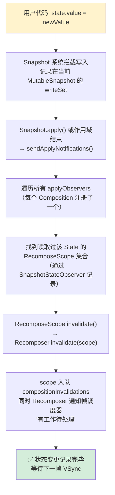

**关键机制**：Snapshot 系统使用**观察者 + 全局作用域树**记录每个 `State` 的读取者集合。写入时不立即重组，而是标记失效并等待下一帧批量处理。这避免了同一帧内多次写同一 State 引发多次重组。

#### 子阶段 B：帧调度与重组队列触发（VSync 帧内）

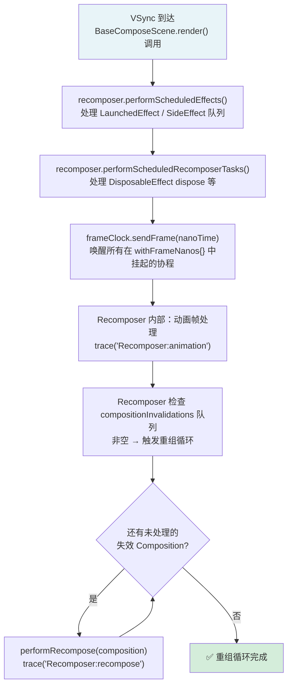

**关键机制**：`performScheduledEffects` 和 `performScheduledRecomposerTasks` 处理**副作用队列**，与重组本身分离。`frameClock.sendFrame()` 是动画系统的心跳——它唤醒在 `rememberCoroutineScope()` 中调用 `withFrameNanos{}` 的动画协程。只有这三步完成后，才进入真正的 Composable 重组。

#### 子阶段 C：Composer 重组执行——SlotTable Diff（核心算法）

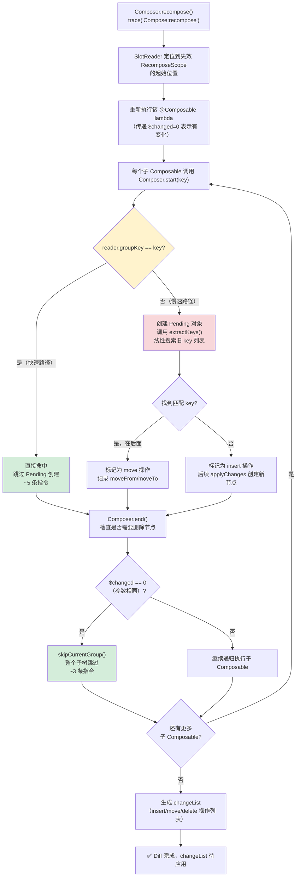

**关键机制**：`$changed` 参数是 Compose 编译器的核心优化——它在编译时为每个参数分配一个 bit 位，运行时通过比较旧值哈希快速判断参数是否变化。完全没有变化的子树通过 `skipCurrentGroup()` **3 条指令**跳过，而无需进入 lambda 执行。`Pending.extractKeys()` 是当前已知的性能热点（O(n) 线性搜索），在大列表重排序场景下开销可观。

#### 子阶段 D：变更应用——applyChanges 写入 SlotTable

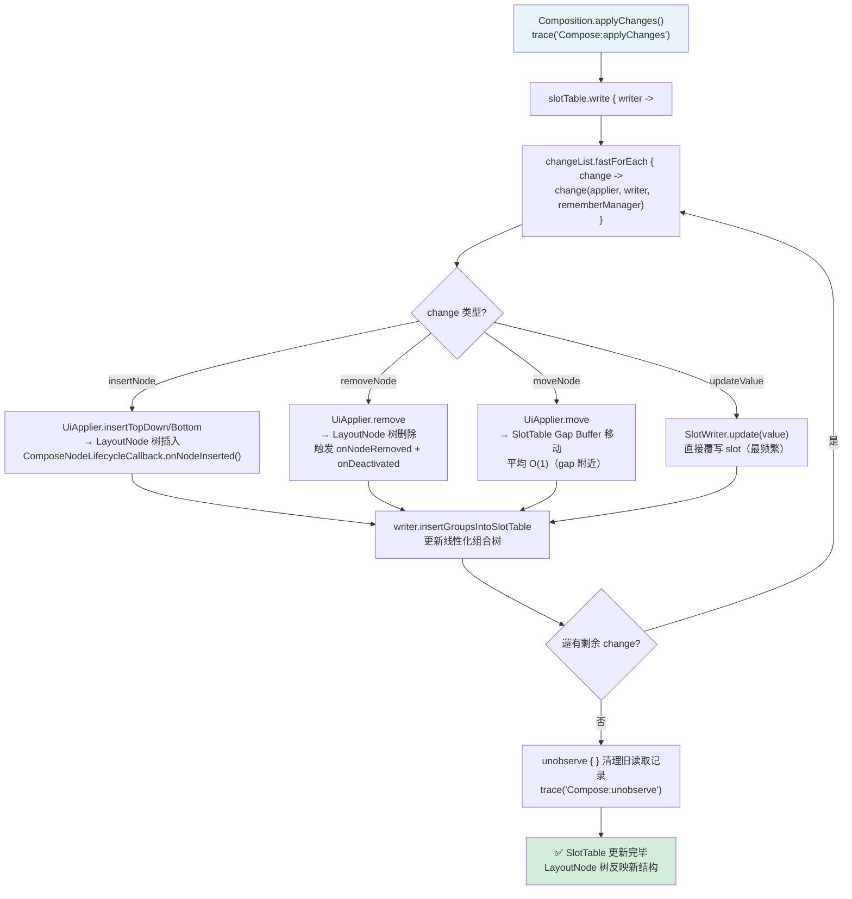

**关键机制**：所有写操作都在 `slotTable.write{}` 块内批量执行，持有写锁期间不允许其他读写。`changeList` 是 `Composer.recompose()` 阶段生成的 lambda 列表，每个 entry 是一个 `Change = (Applier<*>, SlotWriter, RememberManager) -> Unit` 函数类型。`Gap Buffer` 在 gap 附近的移动代价极低（O(1)），但若 gap 与操作位置距离远则需要 O(n) 平移——这是大列表末尾插入时的开销来源。

#### 子阶段 E：副作用分发——Remember 事件与 SideEffect

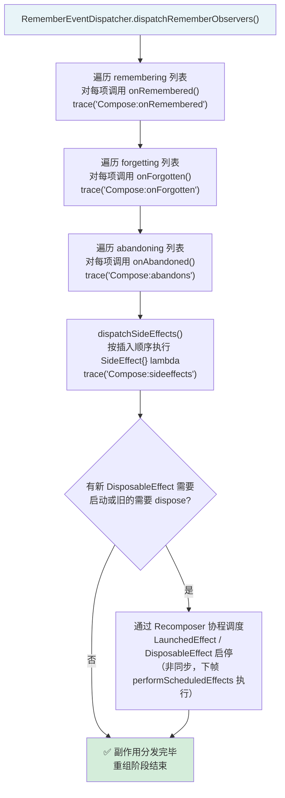

**关键机制**：`SideEffect{}` 是**同步执行**的，在 `applyChanges` 完成后立即调用，可在此时访问最新的 Compose 状态。相比之下，`LaunchedEffect` 和 `DisposableEffect` 是**协程驱动**的，它们的启停被提交到 `Recomposer` 的协程队列，在下一帧的 `performScheduledEffects()` 中处理。这种分离设计确保了副作用的执行时序可预测。

#### 五个子阶段完整时序对照

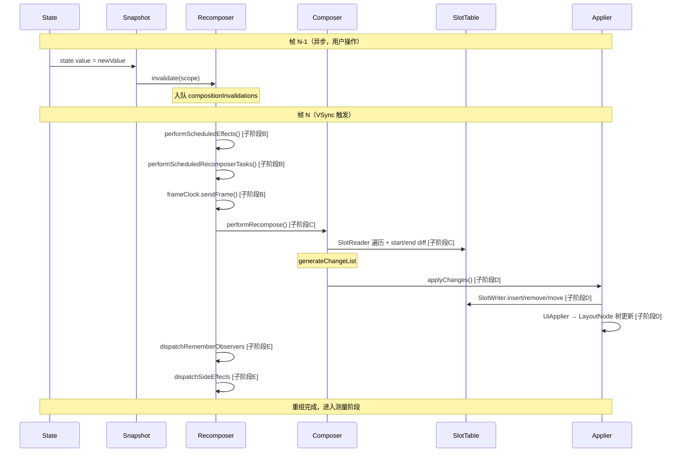

### 3.3 架构图——重组数据流全景

```mermaid
graph TB
    subgraph "Snapshot 系统"
        STATE["mutableStateOf(value)<br/>State 对象写入"]
        SNAP["Snapshot.sendApplyNotifications()<br/>遍历所有 modified states"]
        SCOPE["RecomposeScope 标记 invalid<br/>scope.invalidate()"]
    end
    
    subgraph "Recomposer 调度"
        RECOMP["Recomposer<br/>compositionInvalidations: List"]
        FRAME["frameClock.sendFrame(nanoTime)<br/>withFrameNanos 回调"]
        PERF_RECOMP["performRecompose(composition)<br/>→ composition.recompose()"]
    end
    
    subgraph "Composer Diff 引擎"
        COMPOSER["Composer<br/>SlotReader(旧) + SlotWriter(新)"]
        PENDING["Pending 对象<br/>keyInfos: 旧子 group key 列表<br/>used: 已匹配 key 列表"]
        CHANGES["ChangeList<br/>记录 insert/remove/move 操作"]
    end
    
    subgraph "SlotTable"
        GROUPS["groups: IntArray<br/>每 group = 5个int<br/>[key, nodeCount, groupSize,<br/>parentAnchor, dataAnchor]"]
        SLOTS["slots: Array~Any?~<br/>State 值, 参数缓存,<br/>Composable lambda 引用"]
        GAP["Gap Buffer<br/>groupGap + slotsGap<br/>O(1) 局部操作"]
    end
    
    subgraph "Applier → LayoutNode Tree"
        APPLIER["UiApplier<br/>insertAt / removeAt / move"]
        LNODE["LayoutNode 树<br/>_foldedChildren 更新"]
    end
    
    STATE -->|"写入触发"| SNAP
    SNAP -->|"遍历 observers"| SCOPE
    SCOPE -->|"入队"| RECOMP
    RECOMP -->|"帧回调触发"| FRAME
    FRAME --> PERF_RECOMP
    PERF_RECOMP --> COMPOSER
    COMPOSER --> PENDING
    PENDING --> CHANGES
    COMPOSER --> GAP
    GAP --> GROUPS
    GAP --> SLOTS
    CHANGES -->|"applyChanges()"| APPLIER
    APPLIER --> LNODE
```

这张图把重组拆成四层，是为了把“状态变了”这件事掰开来看。最上层的 Snapshot 系统只负责发现变化、标记 scope 失效；Recomposer 再把这些失效 scope 对齐到某一帧里统一处理；真正吃 CPU 的地方在 Composer diff，它一边读旧树，一边写新树，尽量把变更压到最小；最后 Applier 才把这些变更落成 `LayoutNode` 树上的插入、删除和移动。四层挨得很近，职责其实差得很远。

这也是为什么重组优化不能只盯着某一个函数。Snapshot 层如果失效范围放大，后面所有层都会跟着膨胀；Composer 层如果 key diff 走不到快速路径，`Pending` 和 `ChangeList` 的开销就会上来；Applier 层如果变更太碎，LayoutNode 树更新也会变重。图里的四层其实是在回答同一个问题：怎么把一次状态变化尽量限制在最小范围内，并且把真正写树的动作推迟到最后一次性完成。

### 3.3 机制图——Composer.start() Key Diff 算法

```mermaid
flowchart TD
    Entry["Composer.start(key, objectKey, kind, data)"]
    
    Entry --> ChkInsert{当前是 inserting 模式?}
    ChkInsert -->|是| WriterInsert["writer.startNode(key) 或 writer.startGroup(key)<br/>Gap Buffer 在当前 gap 位置写入新 group<br/>指令数: ~5 (写入 5 个 int 字段)"]
    WriterInsert --> EnterGroup["enterGroup(isNode, newPending=null)"]
    
    ChkInsert -->|否| ChkKey{"reader.groupKey ==<br/>key && objectKey 匹配?"}
    ChkKey -->|"✅ 快速路径"| FastPath["startReaderGroup(isNode)<br/>仅推进 reader 位置<br/>不修改 SlotTable<br/>指令数: ~3 (读取 + 比较)"]
    FastPath --> EnterGroup
    
    ChkKey -->|"❌ key 不匹配"| LazyPending{"pending == null?"}
    LazyPending -->|是| CreatePending["pending = Pending(<br/>  keyInfos = reader.extractKeys(),<br/>  startIndex = nodeIndex)<br/>收集当前 group 所有子 key<br/>指令数: O(children_count)"]
    LazyPending -->|否| UsePending["使用已有 pending"]
    
    CreatePending --> SearchKey
    UsePending --> SearchKey
    SearchKey["pending.getNext(key, objectKey)<br/>在 keyInfos 中线性搜索"]
    
    SearchKey --> Found{找到匹配?}
    Found -->|"是: 在位置 i"| ChkMove{"currentRelativePosition > 0?<br/>(需要移动?)"}
    ChkMove -->|是| DoMove["changeListWriter.moveCurrentGroup(key, objectKey, i)<br/>记录 MOVE 操作<br/>reader.reposition(i)"]
    ChkMove -->|否| NoMove["位置正确，无需移动"]
    DoMove --> MarkUsed["pending.recordUsed(keyInfo)<br/>标记为已使用"]
    NoMove --> MarkUsed
    MarkUsed --> StartReader["startReaderGroup(isNode)<br/>继续处理子树"]
    StartReader --> EnterGroup
    
    Found -->|"否: 新 key"| SwitchInsert["进入 insert 模式:<br/>writer.beginInsert()"]
    SwitchInsert --> NewPending["newPending = Pending(emptyList, nodeIndex)<br/>为新插入的子树创建空 pending"]
    NewPending --> RegisterInsert["pending.registerInsert(keyInfo, nodeIndex)<br/>记录插入位置"]
    RegisterInsert --> EnterGroup
    
    EnterGroup --> PushStack["pendingStack.push(pending)<br/>parentStateStack.push(<br/>  groupNodeCount, rGroupIndex, nodeIndex)<br/>重置计数器: groupNodeCount=0"]
    
    style FastPath fill:#d4edda
    style DoMove fill:#fff3cd
    style SwitchInsert fill:#d1ecf1
```

这张图讲的是 `Composer.start()` 到底在忙什么。每进入一个 group，它都会先试最便宜的路径：reader 看到的 key 和 objectKey 恰好匹配，就直接往前推进，几乎不碰 SlotTable；只有不匹配时，系统才会惰性创建 `Pending`，把旧子树的 key 抽出来，再判断这是移动、插入，还是全新的节点。图里的分支，基本就是重组成本的来源图谱。快速路径越多，重组越像巡检；慢路径越多，它才越像重建。

`Pending.getNext()` 之所以是热点，也能从这张图里直接看出来。每次 key 不匹配，Composer 都得在还没用过的旧 key 列表里继续找，这一步如果发生在可见 item 很多的 LazyList 上，复杂度会迅速抬高。换个说法，这张图里最贵的不是“写”，而是“找”——找旧树里那个还能复用的位置到底在哪。

### 3.4 机制图——Composer.end() 清理与节点移动

```mermaid
flowchart TD
    Entry["Composer.end(isNode)"]
    
    Entry --> GetPending{"pending != null<br/>&& pending.keyInfos.size > 0?"}
    GetPending -->|否| SkipDiff["无需 diff<br/>直接进入清理"]
    
    GetPending -->|是| BuildLists["previous = pending.keyInfos  (旧序列)<br/>current = pending.used  (新序列)<br/>usedKeys = current.toSet()"]
    BuildLists --> IteratePrev["遍历 previous: previousIndex = 0..end"]
    
    IteratePrev --> ChkUsed{"previousInfo ∈ usedKeys?"}
    ChkUsed -->|"否: 已删除"| Delete["changeListWriter.removeNode(deleteOffset, count)<br/>pending.updateNodeCount(location, 0)<br/>reader.skipGroup()<br/>invalidations.removeRange(start, end)<br/>← 清除该 scope 的所有无效标记"]
    
    ChkUsed -->|"是: 存在"| ChkPlaced{"previousInfo ∈ placedKeys?<br/>(已放置?)"}
    ChkPlaced -->|是| Skip["skip (已在正确位置)"]
    ChkPlaced -->|否| Compare["比较 currentInfo vs previousInfo"]
    
    Compare --> Same{同一个?}
    Same -->|是| InPlace["位置正确<br/>previousIndex++"]
    Same -->|"否: 需要移动"| CalcPos["nodePosition = pending.nodePositionOf(currentInfo)"]
    CalcPos --> ChkOffset{"nodePosition != nodeOffset?"}
    ChkOffset -->|是| MoveNode["changeListWriter.moveNode(<br/>  from = nodePosition + startIndex,<br/>  to = nodeOffset + startIndex,<br/>  count = updatedNodeCount)<br/>pending.registerMoveNode(...)"]
    ChkOffset -->|否| AlreadyOk["节点已在目标位置"]
    
    Delete --> IteratePrev
    Skip --> IteratePrev
    InPlace --> IteratePrev
    MoveNode --> IteratePrev
    AlreadyOk --> IteratePrev
    
    IteratePrev -->|"遍历完成"| EndMove["changeListWriter.endNodeMovement()"]
    SkipDiff --> CheckTail
    EndMove --> CheckTail
    
    CheckTail --> RemoveTail["while (!reader.isGroupEnd):<br/>  recordDelete() + reader.skipGroup()<br/>  changeListWriter.removeNode(...)"]
    RemoveTail --> ExitGroup["exitGroup(expectedNodeCount, inserting)<br/>恢复 parentStateStack"]
    
    style Delete fill:#f8d7da
    style MoveNode fill:#fff3cd
    style InPlace fill:#d4edda
```

如果说 `start()` 负责把新树走出来，那 `end()` 负责的就是把旧树收干净。图里从 `previous`、`current`、`usedKeys` 三组数据出发，最后只会落到三件事上：旧节点没再出现，就删；旧节点还在，但位置变了，就记一条 move；旧节点还在而且位置也对，那就什么都不做。整个尾部清理过程，就是在给“新树已经走出来了，旧树还剩什么”这件事收尾。

这里还有一个很容易被忽略的点：删除不仅仅是从结构上把节点移走，还会顺手清理相关 `invalidations`。这意味着 `end()` 不只是结构 diff 的最后一步，也是无效标记和生命周期垃圾回收的收尾点。少了这一步，重组不是“差一点完成”，而是会把已经失效的旧状态残留到下一帧里。

### 3.5 时序图——一帧中的完整重组流程

```mermaid
sequenceDiagram
    participant State as State~T~
    participant Snap as Snapshot System
    participant RS as RecomposeScope
    participant Recomp as Recomposer
    participant FC as FrameClock
    participant Comp as Composition
    participant Composer as Composer
    participant ST as SlotTable
    participant CL as ChangeList
    participant App as UiApplier
    participant LN as LayoutNode Tree

    Note over State: 用户操作 → State.value 写入
    State->>Snap: GlobalSnapshot.notifyObjectsInitialized()
    Snap->>Snap: sendApplyNotifications()
    Snap->>RS: 遍历 readObservers → scope.invalidate()
    RS->>Recomp: compositionInvalidations.add(composition)
    
    Note over FC: 下一帧 VSync 到达
    FC->>FC: sendFrame(nanoTime)
    FC->>Recomp: withFrameNanos 回调
    
    Recomp->>Recomp: recordComposerModifications()
    Recomp->>Recomp: compositionInvalidations → toRecompose
    
    loop 每个 invalidated Composition
        Recomp->>Comp: performRecompose(composition, modifiedValues)
        Comp->>Comp: drainPendingModificationsForCompositionLocked()
        Comp->>Composer: composer.recompose(invalidations)
        
        Note over Composer: 遍历 invalidations: List~RecomposeScope~
        loop 每个 invalid scope
            Composer->>Composer: composer.recomposeToGroupEnd()
            Note over Composer: 重新执行 @Composable lambda
            
            Composer->>ST: SlotReader 读旧树 group
            Composer->>ST: SlotWriter 写新树 group
            
            alt key 匹配 + 参数不变
                Composer->>ST: reader.skipGroup() (跳过整个子树)
            else key 匹配 + 参数变了
                Composer->>Composer: start(key) → 进入子 group
                Composer->>Composer: 重新执行子 @Composable
            else key 不匹配
                Composer->>Composer: Pending diff (见机制图)
                Composer->>CL: 记录 insert/remove/move
            end
        end
        
        Comp-->>Recomp: 返回 composition (有变更)
    end
    
    Note over Recomp: Phase: applyChanges
    Recomp->>Comp: composition.applyChanges()
    Comp->>ST: slotTable.write { slots → ... }
    Comp->>CL: changes.executeAndFlushAllPendingChanges(applier, slots, ...)
    
    CL->>App: applier.onBeginChanges()
    loop 每个 Change 操作
        alt Insert
            CL->>App: applier.insertTopDown(index, node)
            App->>LN: parent._foldedChildren.add(index, child)
            App->>LN: child.attach(owner)
        else Remove
            CL->>App: applier.remove(index, count)
            App->>LN: parent._foldedChildren.removeAt(index)
            App->>LN: child.detach()
        else Move
            CL->>App: applier.move(from, to, count)
            App->>LN: parent._foldedChildren 重排
        end
    end
    CL->>App: applier.onEndChanges()
    
    Comp->>Comp: rememberManager.dispatchRememberObservers()
    Comp->>Comp: rememberManager.dispatchSideEffects()
```

这张时序图把“一次状态变化最后怎么落成一帧重组”完整摊开了。前半段还在 Snapshot 和 Recomposer 之间流转，主要是在标记哪些 scope 失效；到了 `withFrameNanos` 之后，真正的帧内工作才开始。Composer 重跑受影响的 group，SlotTable 同步读旧写新，ChangeList 把结构差异积累起来，最后 `applyChanges()` 再一次性把这些差异写到 LayoutNode 树上。顺着这条链读下来，就会很清楚：重组不是某个函数一下子做完的，而是“发现变化、计算差异、落地树变更、最后收副作用”几段接起来的。

后半段的时序也解释了为什么 Compose 一直强调批量和原子性。所有 `invalidations` 尽量挤在同一帧里处理，是为了避免多次 layout/draw；`applyChanges()` 放在一个 `slotTable.write {}` 块里做，是为了避免树状态一半旧、一半新；副作用又被故意推迟到结构变更之后，确保它看到的是稳定树。换句话说，这张图描述的不只是顺序，更是在说明 Compose 为什么能在一帧内把这么多事压在一起还不至于乱。

### 3.6 类图——重组核心类

```mermaid
classDiagram
    class Recomposer {
        -compositionInvalidations: List~Composition~
        -broadcastFrameClock: BroadcastFrameClock
        +runRecomposeAndApplyChanges()
        -performRecompose(composition, modifiedValues)
        +performScheduledEffects()
    }
    
    class Composition {
        -composer: ComposerImpl
        -slotTable: SlotTable
        -applier: Applier~LayoutNode~
        -observations: ScopeMap
        -changes: ChangeList
        +recompose(): Boolean
        +applyChanges()
        -applyChangesInLocked(changes)
    }
    
    class ComposerImpl {
        -reader: SlotReader
        -writer: SlotWriter
        -pending: Pending?
        -pendingStack: Stack~Pending~
        -changeListWriter: ChangeListWriter
        -inserting: Boolean
        +start(key, objectKey, kind, data)
        +end(isNode)
        +recompose(invalidations): Boolean
        +skipCurrentGroup()
        -recomposeToGroupEnd()
    }
    
    class SlotTable {
        -groups: IntArray
        -groupsSize: Int
        -slots: Array~Any?~
        -slotsSize: Int
        -anchors: ArrayList~Anchor~
        +read(block): T
        +write(block): T
    }
    
    class SlotReader {
        +groupKey: Int
        +groupObjectKey: Any?
        +extractKeys(): MutableList~KeyInfo~
        +skipGroup(): Int
        +startGroup()
        +endGroup()
    }
    
    class SlotWriter {
        -groupGapStart: Int
        -groupGapLen: Int
        -slotsGapStart: Int
        -slotsGapLen: Int
        +startGroup(key)
        +endGroup()
        +beginInsert()
        +endInsert()
        +moveGroup(offset)
    }
    
    class Pending {
        -keyInfos: MutableList~KeyInfo~
        -used: MutableList~KeyInfo~
        +getNext(key, objectKey): KeyInfo?
        +recordUsed(keyInfo)
        +registerInsert(keyInfo, nodeIndex)
        +nodePositionOf(keyInfo): Int
    }
    
    class UiApplier {
        -current: LayoutNode
        +insertTopDown(index, instance)
        +remove(index, count)
        +move(from, to, count)
    }
    
    Recomposer "1" *-- "*" Composition
    Composition *-- ComposerImpl
    Composition *-- SlotTable
    Composition *-- UiApplier
    ComposerImpl --> SlotReader : 读旧树
    ComposerImpl --> SlotWriter : 写新树
    ComposerImpl --> Pending : key diff
    SlotTable --> SlotReader : read()
    SlotTable --> SlotWriter : write()
    UiApplier ..> LayoutNode : 操作树节点
```

- `Recomposer` 管理多个 `Composition`（主 Composition + SubComposition）
- `ComposerImpl` 同时操作 `SlotReader`（读旧树）和 `SlotWriter`（写新树），通过 `Pending` 实现 key diff
- `SlotWriter` 的 4 个 gap 字段实现 Gap Buffer 快速插入
- `applyChanges()` 时通过 `UiApplier` 一次性应用到 `LayoutNode` 树

### 3.7 负载分析

#### 指令分布（滑动场景，每帧）

|        子阶段         | 主要函数                                          | 无优化估算  | 优化后估算 | 优化手段                                 |
| :-------------------: | ------------------------------------------------- | :---------: | :--------: | ---------------------------------------- |
|     Snapshot 通知     | `sendApplyNotifications`                          |    ~500     |    ~500    | —                                        |
|      Scope 收集       | `recordComposerModifications`                     |    ~200     |    ~200    | —                                        |
| **Composable 重执行** | `recomposeToGroupEnd → @Composable lambda`        |   ~30,000   |   ~1,500   | `$changed` 参数跳过 + `skipCurrentGroup` |
|   **Composer Diff**   | `start/end → Pending.getNext`                     |   ~15,000   |    ~500    | key 快速路径匹配                         |
|     applyChanges      | `executeAndFlushAllPendingChanges`                |   ~3,000    |    ~200    | 仅 1-2 个 item 变更                      |
|    Applier 树操作     | `insertTopDown / remove / move`                   |   ~1,000    |    ~100    | —                                        |
|      副作用分发       | `dispatchRememberObservers / dispatchSideEffects` |    ~300     |    ~50     | 仅新 item 触发                           |
|       **合计**        |                                                   | **~50,000** | **~3,050** | **减幅 94%**                             |

#### 热点函数 TOP-5（hiperf 实测）

> selfEvents = 函数本体实质指令；编排者函数 selfEvents ≈ 0，表现为 subEvents。数据来源：hiperf pid=37777 libkn.so `raw-instruction-retired`。

| 排名 | 函数 | 类型 | hiperf selfEvents | hiperf subEvents | 占主线程% | 说明 |
| :--: | ----- | ---- | ----------------: | ----------------: | --------: | ---- |
|  1   | `IntObjectMap#get`（`Pending.getNext` 内核） | Kotlin / Collection | **6,324,788** | 9,692,127 | 0.385% | SlotTable diff key 哈希查找；线性探测在大 key 集合下冲突率升高 |
|  2   | `DispatchedTask#run`（重组任务执行入口） | Kotlin / kotlinx-coroutines | **6,321,257** | 161,276,688 | 0.385% | 重组 lambda 的实际执行入口，帧内每重组一次 |
|  3   | `updateComposerInvalidations` | Kotlin / Compose | **3,689,835** | 3,689,835 | 0.225% | Snapshot apply 通知映射 RecomposeScope 失效标记；细粒度 State 写入多时开销可观 |
|  4   | `ComposerImpl#startReplaceGroup`（编排者） | Kotlin / Compose | ≈ 0 | 4,243,432 | — | 每次 @Composable 调用所必经；自身 selfEvents 极小，开销全在子调用链 |
|  5   | `DefaultUiApplier#insertBottomUp`（编排者） | Kotlin / Compose UI | ≈ 0 | 1,098,086 | — | LayoutNode 树插入入口；制度元素多时酿造 |

#### 已有优化

| 优化机制                 | 原理                                                         | 减少指令数 | 减幅 |
| ------------------------ | ------------------------------------------------------------ | :--------: | :--: |
| **`$changed` 参数传播**  | 编译器为每个 Composable 生成 `$changed` 位标记参数，全部参数不变时 `skipCurrentGroup()` 跳过整个子树 |  ~28,500   | 57%  |
| **Key 快速路径**         | `start(key)` 时 `reader.groupKey == key` 直接命中，不创建 Pending |  ~14,500   | 29%  |
| **Gap Buffer O(1) 插入** | 插入/删除操作在 gap 附近为 O(1)，远离 gap 时 O(n) 移动 gap   |   ~2,800   | 5.6% |
| **applyChanges 批量**    | 所有变更在单个 `slotTable.write` 块内执行，减少锁竞争        |    ~700    | 1.4% |

#### 优化机会

- `Pending.getNext()` 是 O(n) 线性搜索，可改为 `HashMap<key, KeyInfo>` 索引降至 O(1)
- 大列表场景（50+ 可见 item）`extractKeys()` 开销可观，上游 Compose 正在优化

---

## 四、阶段三：测量（Measure）

### 4.1 原理

测量阶段做的事可以说得很朴素：把“这个组件想怎么摆”翻成一组真实的像素尺寸。难点不在公式，而在顺序。谁先量，谁后量，父子之间怎么传约束，都会直接影响结果。

Compose 在这里有一条很硬的规矩：正常情况下，一个节点一帧只量一次。做到这一点靠的不是“大家自觉”，而是 `measurePending` 这类脏标记和一个有顺序的调度队列。没脏的节点别进队，进了队的节点也尽量别重复量。

约束传播也不神秘。父节点把 `Constraints(minW, maxW, minH, maxH)` 往下传，子节点在这个范围里给出自己的尺寸，再把结果往上交。约束往下走，尺寸往上返，整个过程就是这么一层层完成的。

### 4.2 执行流程分步详解

测量阶段真正麻烦的地方，不是公式，而是两件事：到底哪些节点该重测，以及约束怎么沿着 Modifier 链传下去。每个子阶段用到的数据结构和算法都不一样。

这五段是在依次回答五个问题。先判断这一帧到底谁该重测，不然整棵布局树都会被反复全量测量；再把父节点约束沿着 `NodeCoordinator` 和 Modifier 链一层层传到真正的内容节点，因为尺寸语义本来就散落在这条链上；随后由具体的 `MeasurePolicy` 把约束翻成宽高和 `placeBlock`，没有这一步，LayoutNode 手里只有约束，没有结果；文本测量之所以单独拎出来，是因为文本不是普通盒子，必须经过排版才会有真实高度；最后的 `forceMeasureTheSubtree` 是顺序修正机制，专门处理“父节点现在就急着要子节点新尺寸”的场景，不然某些依赖子尺寸的布局只能拿到过期值。

#### 子阶段 A：脏节点调度——深度排序队列

```mermaid
flowchart TD
    A1["重组完成<br/>受影响的 LayoutNode.requestRemeasure()"]
    A1 --> A2["measurePending = true<br/>将 LayoutNode 添加到<br/>measureAndLayoutDelegate.relayoutNodes<br/>（DepthSortedSet）"]
    A2 --> A3["DepthSortedSet 按 depth 升序维护<br/>（小根堆，深度浅的节点优先）"]
    A3 --> A4["doMeasureAndLayout() 调用<br/>(BaseComposeScene 每帧调用2次)"]
    A4 --> A5["measureAndLayoutDelegate.measureAndLayout()"]
    A5 --> A6["relayoutNodes.popEach { layoutNode ->"]
    A6 --> A7{layoutNode.measurePending?}
    A7 -->|否，已被父节点测量| A8["跳过（父节点测量时已包含子节点）"]
    A7 -->|是| A9["remeasureAndRelayoutIfNeeded(layoutNode)"]
    A9 --> A10[下一个节点]
    A8 --> A10
    A10 --> A11{"队列是否还有元素?<br/>（可能在测量中产生新的脏节点）"}
    A11 -->|是| A6
    A11 -->|否| A12["callOnLayoutCompletedListeners()\n✅ 调度完成"]

    style A3 fill:#cce5ff
    style A8 fill:#d4edda
    style A12 fill:#d4edda
```

**关键机制**：`DepthSortedSet` 的深度优先顺序保证**父节点先于子节点处理**。当父节点被测量时，它会递归测量所有子节点，因此子节点后续从队列取出时 `measurePending` 已为 false，可以直接跳过——这是避免重复测量的核心机制。

#### 子阶段 B：单节点测量——NodeCoordinator 链约束传递

```mermaid
flowchart LR
    subgraph "从 LayoutNode 角度"
        LN["LayoutNode\n.outerCoordinator\n.remeasure(constraints)"]
    end
    
    subgraph "Modifier 链（从外到内）"
        MC1["LayoutModifierNodeCoordinator\n(如 Modifier.padding(16.dp))\n→ 消费部分约束\n输出：收紧后的约束"]
        MC2["LayoutModifierNodeCoordinator\n(如 Modifier.size(100.dp))\n→ 强制覆写约束\n输出：固定约束"]
        MC3["InnerNodeCoordinator\n→ 调用 MeasurePolicy\n(Row/Column/Box/Custom)"]
    end
    
    subgraph "子节点"
        CH1["Child 1 LayoutNode\n返回 Placeable(w1, h1)"]
        CH2["Child 2 LayoutNode\n返回 Placeable(w2, h2)"]
    end
    
    LN -->|"Constraints(0,maxW,0,maxH)"| MC1
    MC1 -->|"Constraints(0,maxW-32,0,maxH-32)"| MC2
    MC2 -->|"Constraints(100,100,100,100)"| MC3
    MC3 -->|子约束| CH1
    MC3 -->|子约束| CH2
    CH1 -->|"Placeable(w1,h1)"| MC3
    CH2 -->|"Placeable(w2,h2)"| MC3
    MC3 -->|"MeasureResult(W,H)"| MC2
    MC2 -->|"MeasureResult(100,100)"| MC1
    MC1 -->|"MeasureResult(W+32,H+32)"| LN
```

**关键机制**：每个 `LayoutModifierNodeCoordinator` 都是约束的**拦截和变换**节点。`padding(16.dp)` 拦截约束并将 `maxW` 减去 `32px`（两侧），然后把变换后的约束传递给内层。`Constraints` 对象实际被打包成一个 64-bit Long（4 个 13-bit 字段），比较约束是否变化只需一次 64-bit 整数比较。

#### 子阶段 C：MeasurePolicy 执行——布局策略测量

```mermaid
flowchart TD
    C1["InnerNodeCoordinator.measure(constraints)"]
    C1 --> C2["调用 LayoutNode.measurePolicy\n.measure(scope, constraints)"]
    C2 --> C3{"MeasurePolicy 类型?"}
    C3 -->|Column/Row| C4["ColumnMeasurePolicy\n顺序测量每个子节点\n累加主轴尺寸\n取交叉轴最大值"]
    C3 -->|Box| C5["BoxMeasurePolicy\n所有子节点用相同约束测量\n尺寸 = 子节点最大值"]
    C3 -->|LazyColumn| C6["LazyListMeasurePolicy\nSubcomposeLayout 按需组合\n仅测量 viewport 内可见 item"]
    C3 -->|Custom| C7["用户自定义 MeasurePolicy\n调用 measurable.measure(childConstraints)"]
    C4 --> C8["返回 layout(w, h) { ... }\n布局 lambda 延迟执行（Layout 阶段）"]
    C5 --> C8
    C6 --> C8
    C7 --> C8
    C8 --> C9["MeasureResult 封装 (w, h, placeBlock)"]
    C9 --> C10["NodeCoordinator 记录 measuredWidth/measuredHeight"]
    C10 --> C11{"尺寸发生变化?"}
    C11 -->|是| C12["requestRelayout()\n向上传播尺寸变化\n父节点可能需要重测"]
    C11 -->|否| C13["不传播，父节点不受影响"]
    C12 --> C14["✅ 本节点测量完毕"]
    C13 --> C14

    style C6 fill:#cce5ff
    style C12 fill:#fff3cd
    style C14 fill:#d4edda
```

**关键机制**：`MeasurePolicy.measure()` 返回的不是立即执行的布局，而是一个 `layout(w, h) { placeChildren }` 构建的 `MeasureResult`——其中 `placeChildren` lambda 被**延迟**到布局阶段执行。这是 Compose 测量与布局解耦的核心机制。**尺寸不变停止传播**：若测量结果与上次相同，`requestRelayout`  不向上传播，避免整棵树重测。

#### 子阶段 D：文本测量——MultiParagraph 管线（测量阶段最大热点）

```mermaid
flowchart TD
    D1["Text @Composable 执行\nBasicText → TextController.measure()"]
    D1 --> D2["MultiParagraphLayoutCache.layoutWithConstraints(constraints)"]
    D2 --> D3{"缓存命中?\n(constraints 相同 &&\n annotatedString 相同)"}
    D3 -->|是| D4["直接返回缓存的 MultiParagraph\n~5 条指令"]
    D3 -->|否| D5["MultiParagraph.layout(maxWidth)"]
    D5 --> D6["拆分为多个 Paragraph\n（每个不同样式段一个）"]
    D6 --> D7["ParagraphImpl::layout() [C++]\ntrace('ParagraphImpl::layout')"]
    D7 --> D8["调用 Skia TextShaper\n执行字体匹配 + 字形绑定"]
    D8 --> D9["LineBreaker 执行换行算法\n基于 Unicode 断行规则"]
    D9 --> D10["TextLine::layout()\n计算每行 x/y 坐标"]
    D10 --> D11["返回 totalHeight"]
    D11 --> D12["MultiParagraph 返回 Size(maxWidth, totalHeight)"]
    D4 --> D12
    D12 --> D13["Text LayoutNode 记录测量结果\n✅ 文本测量完毕"]

    style D3 fill:#fff3cd
    style D4 fill:#d4edda
    style D7 fill:#f8d7da
```

**关键机制**：`MultiParagrapLayoutCache` 的缓存命中判断包含完整的 `Constraints` 比较和 `AnnotatedString` 内容比较。一旦命中，文本测量几乎零开销。未命中时进入 C++ `ParagraphImpl::layout()`，这是整个测量阶段的**最大性能热点**，包含字体加载、Unicode 处理、行布局三个 CPU 密集型子步骤。LazyList 场景下只有**新进入 viewport** 的 item 触发未命中，已渲染的 item 始终命中缓存。

#### 子阶段 E：forceMeasureTheSubtree——子树强制重测

```mermaid
flowchart TD
    E1{"父节点测量时发现\n子节点 measurePending=true<br/>但子节点深度 > 当前处理深度?"}
    E1 -->|是| E2["调用 forceMeasureTheSubtree(layoutNode)"]
    E2 --> E3["递归遍历子树\n对所有 measurePending=true 的节点\n立即调用 remeasureAndRelayoutIfNeeded"]
    E3 --> E4["子节点重测完毕\n结果向上返回给父节点"]
    E4 --> E5["父节点收到子节点最新尺寸\n继续原有测量流程"]
    E1 -->|否| E6["子节点在后续 popEach 中自然处理"]

    style E2 fill:#fff3cd
    style E4 fill:#d4edda
```

**关键机制**：`forceMeasureTheSubtree` 是一个**特殊的测量顺序修正机制**。当父节点需要子节点的最新尺寸（例如 `wrapContent`），但子节点还在队列中等待时，必须临时打破队列顺序立即测量子节点。这只在布局依赖关系为非线性时触发，正常的 `Column/Row` 等布局不会触发此路径。

#### 完整测量调用链（LazyColumn 滑动场景）

```mermaid
sequenceDiagram
    participant MALD as MeasureAndLayoutDelegate
    participant LN as LayoutNode(LazyColumn)
    participant Sub as SubcomposeLayout
    participant Item as Item LayoutNode
    participant Text as Text LayoutNode
    participant CPP as ParagraphImpl(C++)

    MALD->>LN: relayoutNodes.popEach
    Note over LN: measurePending=true
    LN->>LN: outerCoordinator.remeasure(screenConstraints)
    LN->>Sub: LazyListMeasurePolicy.measure()
    Note over Sub: 计算可见 item 范围
    Sub->>Sub: subcompose(key, itemContent)
    Note over Sub: 仅对新 item 执行 Composition
    Sub->>Item: item.outerCoordinator.remeasure(itemConstraints)
    Item->>Text: text.outerCoordinator.remeasure(textConstraints)
    Text->>Text: MultiParagraphLayoutCache.layoutWithConstraints()
    alt 缓存未命中（新 item）
        Text->>CPP: ParagraphImpl::layout(maxWidth)
        CPP-->>Text: totalHeight
    else 缓存命中（已见 item）
        Text-->>Text: 缓存返回
    end
    Text-->>Item: MeasureResult(w, textHeight)
    Item-->>Sub: MeasureResult(w, itemHeight)
    Sub-->>LN: MeasureResult(w, visibleHeight)
    LN-->>MALD: 测量完毕
    MALD->>MALD: callOnLayoutCompletedListeners()
```

### 4.3 架构图——测量系统组件关系

```mermaid
graph TB
    subgraph "调度层"
        SCENE["BaseComposeScene.render()"]
        OWNER["RootNodeOwner<br/>measureAndLayout()"]
        DELEGATE["MeasureAndLayoutDelegate<br/>• relayoutNodes: 深度排序队列<br/>• root: LayoutNode"]
    end
    
    subgraph "节点层"
        LNODE["LayoutNode<br/>• measurePending:Boolean<br/>• layoutPending:Boolean<br/>• outerCoordinator<br/>• innerCoordinator"]
        OUTER["OuterMeasureAndPlaceCoordinator<br/>(LayoutModifierNode 链头)"]
        LMOD["LayoutModifierNode<br/>measure(measurable, constraints)<br/>修改约束后传递给下一个"]
        INNER["InnerNodeCoordinator<br/>measure(constraints)<br/>→ 执行 MeasurePolicy.measure"]
    end
    
    subgraph "策略层"
        POLICY["MeasurePolicy<br/>由 Layout/Column/Row/Box 等定义<br/>measure(measurables, constraints): MeasureResult"]
        CHILD_M["子 Measurable 列表<br/>每个对应一个子 LayoutNode.outerCoordinator"]
    end
    
    subgraph "结果层"
        PLACEABLE["Placeable<br/>• measuredWidth: Int<br/>• measuredHeight: Int"]
        RESULT["MeasureResult<br/>• width, height<br/>• alignmentLines<br/>• placeChildren: () → Unit"]
    end
    
    SCENE -->|"doMeasureAndLayout()"| OWNER
    OWNER --> DELEGATE
    DELEGATE -->|"popEach: 按深度取节点"| LNODE
    LNODE -->|"performMeasure(constraints)"| OUTER
    OUTER --> LMOD
    LMOD -->|"measurable.measure(modifiedConstraints)"| LMOD
    LMOD -->|"最内层"| INNER
    INNER -->|"measurePolicy.measure(children, constraints)"| POLICY
    POLICY -->|"child.measure(childConstraints)"| CHILD_M
    CHILD_M -->|"递归子节点"| OUTER
    POLICY -->|"layout(width, height)"| RESULT
    RESULT --> PLACEABLE
    INNER --> PLACEABLE
    LMOD --> PLACEABLE
    OUTER --> PLACEABLE
    PLACEABLE -->|"返回给父节点"| DELEGATE
```

这张架构图把测量阶段拆成四层，因为“测谁”“怎么传约束”“谁算尺寸”“结果往哪回”本来就不是一回事。调度层负责决定这一帧到底轮到谁被测；节点层里的 `NodeCoordinator` 链负责一层层改写约束；策略层的 `MeasurePolicy` 才真正决定宽高和放置逻辑；结果层则把 `Placeable` 和 `MeasureResult` 交回给父节点。每一层都像中转站，少一层，测量语义就会断。

按这个图去理解测量，会比盯着某个 `measure()` 函数轻松很多。父节点并不是直接“量子节点”，它是先把约束交给协调器链；协调器链也不会自己决定布局，它只是不断修饰约束，把最终决定权交给 `MeasurePolicy`；等策略层算出结果后，结果再沿原路返还。这种分层看起来啰嗦，但正因为它拆得细，Compose 才能同时支持 padding、size、weight、intrinsics 和各种自定义布局。

### 4.3 机制图——MeasureAndLayoutDelegate 深度排序队列算法

```mermaid
flowchart TD
    Start["measureAndLayout()"]
    Start --> PerfML["performMeasureAndLayout(fullPass=true)"]
    PerfML --> ChkEmpty{"relayoutNodes.isNotEmpty()?"}
    ChkEmpty -->|否| Done["callOnLayoutCompletedListeners()"]
    
    ChkEmpty -->|是| PopEach["popEach: 取深度最浅的节点"]
    
    PopEach --> ChkMeasure{"layoutNode.measurePending?"}
    ChkMeasure -->|是| DoRemeasure["doRemeasure(layoutNode, constraints)<br/>→ outerCoordinator.remeasure(constraints)"]
    
    DoRemeasure --> ChkSize{"outerCoordinator.size 变化?"}
    ChkSize -->|"是: 尺寸变了"| Propagate["影响传播:"]
    Propagate --> ParentType{"parent 的测量来源?"}
    ParentType -->|"InMeasureBlock"| ReqRemeasure["parent.requestRemeasure()<br/>→ relayoutNodes.add(parent)"]
    ParentType -->|"InLayoutBlock"| ReqRelayout["parent.requestRelayout()<br/>→ relayoutNodes.add(parent)"]
    
    ChkSize -->|"否: 尺寸不变"| ChkLayout{"layoutPending?"}
    ChkMeasure -->|否| ChkLayout
    ReqRemeasure --> ChkLayout
    ReqRelayout --> ChkLayout
    
    ChkLayout -->|是| DoLayout["placeOuterCoordinator()<br/>→ layoutNode.place(x, y) 或 replace()"]
    ChkLayout -->|否| Next
    
    DoLayout --> ChkChildren{"子节点有 measurePending?<br/>但当前节点未 remeasure?"}
    ChkChildren -->|是| ForceSubtree["forceMeasureTheSubtree(layoutNode)<br/>递归子树中脏节点，直接测量<br/>不经过父约束传播"]
    ChkChildren -->|否| Next
    ForceSubtree --> Next
    
    Next --> PopEach
    
    style DoRemeasure fill:#d4edda
    style DoLayout fill:#d1ecf1
    style ForceSubtree fill:#fff3cd
    style Propagate fill:#f8d7da
```

这张图其实在回答一个很具体的问题：一帧里这么多节点都可能标脏，系统凭什么知道先量谁、后量谁？答案就是 `relayoutNodes` 这条按深度排序的队列。它优先处理更浅的节点，因为父节点一旦重测，很多子节点的状态会顺手一起更新；尺寸没变时，传播也会在这里被截断，不让整棵树继续往上冒泡。图里的分支，说到底都在为“少测一次就少测一次”服务。

`forceMeasureTheSubtree` 这条支线也很值得注意。它看上去像例外，其实是在处理一个很现实的情况：父节点当前这次布局流程里，急着要子节点的最新尺寸，但正常队列顺序还没轮到那个子节点。与其让父节点重走一遍更大的流程，不如直接把那一小段子树拉出来立刻量完。这个分支的存在，说明测量调度不是死板的 FIFO，而是带有局部修正能力的。

### 4.4 机制图——NodeCoordinator 链约束传递

```mermaid
flowchart LR
    subgraph "Column(Modifier.padding(16))"
        C_ROOT["Constraints<br/>0..1080 × 0..2340<br/>(屏幕尺寸)"]
    end
    
    subgraph "NodeCoordinator Chain"
        NC_PAD["PaddingModifier<br/>NodeCoordinator<br/>constraints: 0..1080 × 0..2340"]
        NC_PAD -->|"减去 padding 32px"| NC_BG["BackgroundModifier<br/>NodeCoordinator<br/>constraints: 0..1048 × 0..2308"]
        NC_BG -->|"透传不变"| NC_INNER["InnerNodeCoordinator<br/>constraints: 0..1048 × 0..2308"]
    end
    
    subgraph "MeasurePolicy (Column)"
        MP["Column measure:<br/>遍历 children 依次测量<br/>累加高度, 取最大宽度"]
    end
    
    subgraph "子节点测量"
        C1["Text('Title')<br/>constraints: 0..1048 × 0..2308<br/>→ MultiParagraph.layout<br/>→ 返回 800 × 48"]
        C2["Text('Body')<br/>constraints: 0..1048 × 0..2260<br/>→ 返回 800 × 96"]
        C3["Image<br/>constraints: fixed 240×240<br/>→ 返回 240 × 240"]
    end

    NC_INNER -->|"measurePolicy.measure()"| MP
    MP -->|"child[0].measure"| C1
    MP -->|"child[1].measure"| C2
    MP -->|"child[2].measure"| C3
    
    subgraph "返回路径(自底向上)"
        RES["MeasureResult<br/>width = max(800,800,240) = 800<br/>height = 48+96+240 = 384"]
    end
    
    C1 --> RES
    C2 --> RES
    C3 --> RES
    RES -->|"width=800, height=384"| NC_INNER
    NC_INNER -->|"+0"| NC_BG
    NC_BG -->|"+32"| NC_PAD
    NC_PAD -->|"最终: 832 × 416"| C_ROOT
```

这张图把“约束怎么一路走进去，再怎么一路退回来”画得很直白。左边的大约束从父节点进来，先被 `PaddingModifier` 缩一圈，再经过其他不改尺寸的 Coordinator，最后落到 `InnerNodeCoordinator` 和具体的 `MeasurePolicy` 上。测量结果不是突然冒出来的，而是子节点先量完，`MeasureResult` 再一层层往回返，外层 Coordinator 顺手把自己的 padding、margin 这类影响叠回去。

图里拿 `Text`、`Image` 和 Column 举例也很有代表性。像 `Image` 这种固定尺寸节点，量起来很快；而 `Text` 不一样，它会把开销带进 `MultiParagraph.layout()`，也就是文本排版引擎那一层。换句话说，这张图一边说明了约束传播机制，一边也顺手告诉你：为什么同样是一个子节点，有的测量几乎是常数成本，有的却会变成整段测量链里的热点。

### 4.5 时序图——LazyColumn item 的测量流程

```mermaid
sequenceDiagram
    participant MALD as MeasureAndLayout<br/>Delegate
    participant RN as relayoutNodes<br/>(深度排序队列)
    participant LC as LazyColumn<br/>LayoutNode
    participant OC as OuterCoordinator
    participant IC as InnerCoordinator<br/>(LazyMeasurePolicy)
    participant LZ as LazyListMeasure
    participant ITEM as Item LayoutNode
    participant TEXT as Text LayoutNode

    MALD->>RN: popEach() → 取 LazyColumn (depth=1)
    RN-->>MALD: LazyColumn, measurePending=true
    
    MALD->>LC: doRemeasure(rootConstraints)
    LC->>OC: remeasure(Constraints 0..1080 × 0..2340)
    OC->>OC: fillMaxWidth → 固定宽度 1080
    OC->>IC: wrapped.measure(fixedConstraints)
    IC->>LZ: LazyMeasurePolicy.measure(children, constraints)
    
    Note over LZ: 计算 viewport:<br/>firstVisibleItem + offset
    
    loop 前向填充直到 viewport 满
        LZ->>ITEM: getAndMeasure(itemIndex)
        Note over ITEM: SubcomposeLayout:<br/>新 item → compose<br/>已缓存 → 复用
        
        ITEM->>TEXT: child[0].measure(textConstraints)
        Note over TEXT: MultiParagraph.layout()<br/>← 最昂贵的操作
        TEXT-->>ITEM: Placeable(800 × 48)
        
        ITEM-->>LZ: Placeable(1080 × 96)
        
        LZ->>LZ: currentOffset += 96
        LZ->>LZ: if currentOffset >= 2340 → break
    end
    
    LZ-->>IC: MeasureResult(1080 × 2340)
    IC-->>OC: Placeable(1080, 2340)
    OC-->>MALD: sizeChanged? → 否
```

这张时序图把 LazyColumn 那种“边组合边测量”的过程讲清楚了。`MeasureAndLayoutDelegate` 先把 LazyColumn 从队列里取出来，随后外层 Coordinator 固定宽度，真正的 `LazyMeasurePolicy` 再根据 viewport 去决定这次到底需要多少 item。新的 item 会在 `SubcomposeLayout` 里先 compose，再进入测量；已经出现过的 item 则尽量复用。所以这里看到的不是“一次把所有子节点量完”，而是一边往前填 viewport，一边按需生成和测量内容。

这张图也解释了为什么 LazyColumn 的性能问题经常和文本绑在一起。列表本身的调度逻辑并不算特别重，真正贵的是 item 里那些第一次出现的 `Text`，它们会把开销带到 `MultiParagraph.layout()`。所以当列表滚动时，性能波峰往往不在容器本身，而在新进入视口的内容第一次被 subcompose 和测量的那一刻。

### 4.6 类图——测量系统核心类

```mermaid
classDiagram
    class MeasureAndLayoutDelegate {
        -root: LayoutNode
        -relayoutNodes: DepthSortedSet
        +measureAndLayout(onLayout): Boolean
        -remeasureAndRelayoutIfNeeded(node)
        -doRemeasure(node, constraints): Boolean
        +requestRemeasure(node)
        +requestRelayout(node)
        -forceMeasureTheSubtree(node)
    }
    
    class DepthSortedSet {
        -set: TreeSet~LayoutNode~
        +add(node, invalidationKind)
        +popEach(block)
        +isNotEmpty(): Boolean
    }
    
    class LayoutNode {
        +measurePending: Boolean
        +layoutPending: Boolean
        +outerCoordinator: NodeCoordinator
        +innerCoordinator: NodeCoordinator
        +measuredByParent: UsageByParent
        +measure(constraints): Placeable
        +requestRemeasure()
        +invalidateMeasurements()
    }
    
    class NodeCoordinator {
        <<abstract>>
        +wrapped: NodeCoordinator?
        +position: IntOffset
        +size: IntSize
        +layer: OwnedLayer?
        +measure(constraints): Placeable
        +remeasure(constraints): Boolean
    }
    
    class LayoutModifierNodeCoordinator {
        -layoutModifierNode: LayoutModifierNode
        +measure(constraints): Placeable
    }
    
    class InnerNodeCoordinator {
        +measure(constraints): Placeable
    }
    
    class Constraints {
        +minWidth: Int
        +maxWidth: Int
        +minHeight: Int
        +maxHeight: Int
    }
    
    class MeasurePolicy {
        <<interface>>
        +measure(measurables, constraints): MeasureResult
    }
    
    MeasureAndLayoutDelegate *-- DepthSortedSet
    MeasureAndLayoutDelegate --> LayoutNode
    LayoutNode *-- NodeCoordinator : outerCoordinator
    NodeCoordinator <|-- LayoutModifierNodeCoordinator
    NodeCoordinator <|-- InnerNodeCoordinator
    NodeCoordinator --> NodeCoordinator : wrapped
    InnerNodeCoordinator --> MeasurePolicy
```

- `MeasureAndLayoutDelegate` 是测量调度器，持有深度排序的 `relayoutNodes` 队列
- `Constraints` 被打包为单个 `Long` 值（4 个 13-bit 字段），比较操作仅需 1 次 64-bit 等值判断
- `InnerNodeCoordinator` 调用用户的 `MeasurePolicy` 执行实际布局策略

### 4.7 负载分析

#### 指令分布（滑动场景，每帧）

|          子阶段           | 主要函数                                          | 无优化估算  | 优化后估算 | 优化手段                  |
| :-----------------------: | ------------------------------------------------- | :---------: | :--------: | ------------------------- |
|         队列调度          | `popEach + 深度排序`                              |    ~200     |    ~200    | —                         |
|       **约束传播**        | `outerCoordinator.remeasure → NodeCoordinator 链` |   ~8,000    |    ~400    | 脏标记跳过不变节点        |
|  **MeasurePolicy 执行**   | `Column/Row/Box.measure`                          |   ~5,000    |    ~300    | 仅脏子树重测              |
| **MultiParagraph.layout** | `Text 文本排版`                                   |   ~15,000   |   ~1,000   | 仅新进入 viewport 的 item |
|         尺寸传播          | `sizeChanged → requestRemeasure/Relayout`         |   ~1,000    |    ~50     | 尺寸不变时停止            |
|  forceMeasureTheSubtree   | 递归子树脏节点                                    |    ~800     |    ~50     | 极少触发                  |
|         **合计**          |                                                   | **~30,000** | **~2,000** | **减幅 93%**              |

#### 热点函数 TOP-5（hiperf 实测）

> selfEvents = 函数本体实质指令；编排者函数 selfEvents ≈ 0，表现为 subEvents。数据来源：hiperf pid=37777 libkn.so `raw-instruction-retired`。

| 排名 | 函数 | 类型 | hiperf selfEvents | hiperf subEvents | 占主线程% | 说明 |
| :--: | ----- | ---- | ----------------: | ----------------: | --------: | ---- |
|  1   | `org_jetbrains_skia_Font__1nGetMetrics` | C++ / Skia | **5,551,688** | 5,551,688 | 0.338% | 取字体 Ascent/Descent/Leading 度量值；`TextMeasurer.measure` 每次调用均触发，建议 `remember` 缓存 |
|  2   | `LocaleConfig::ModifyExtParam` | C++ / OHOS i18n | **4,652,422** | 4,652,422 | 0.283% | 每行文字排版时获取 Locale 扩展参数，含 string 拼接；建议在 LocaleProvider 层缓存 |
|  3   | `Kotlin_String_unsafeStringToUtf8` | Kotlin / KN | **4,455,540** | 15,278,237 | 0.271% | Text 节点将 Kotlin String 转为 UTF-8 传入 Skia；文字测量路径固有开销 |
|  4   | `MeasureAndLayoutDelegate.remeasureAndRelayoutIfNeeded`（编排者） | Kotlin / Compose UI | **1,928,735** | 89,541,775 | 0.117% | 测量循环主入口；局部 selfEvents 表示调度逻辑，真正开销在子调用链 |
|  5   | `ParagraphImpl::layout`（编排者） | C++ / Skia | ≈ 0 | **29,204,216** | 1.78% | 文字行布局主入口；全部开销分散到字体/Locale/String 转换子函数 |

#### 已有优化

| 优化机制                   | 原理                                                         | 减少指令数 | 减幅 |
| -------------------------- | ------------------------------------------------------------ | :--------: | :--: |
| **measurePending 脏标记**  | 只有 `measurePending=true` 的节点进入队列，未脏节点 1 次布尔判断跳过 |  ~25,000   | 83%  |
| **尺寸不变停止传播**       | `doRemeasure` 后 `size` 未变 → 不向上 `requestRemeasure`     |   ~2,000   |  7%  |
| **forceMeasureTheSubtree** | 跳过父节点重测，直接递归子树脏节点                           |    ~700    |  2%  |
| **Constraints Long 打包**  | 4 个 13-bit 约束打包为 1 个 Long，比较仅需 1 次 64-bit 操作  |    ~300    |  1%  |

#### 优化机会

- `MultiParagraph.layout()` 占优化后的 ~40%，可考虑**预估高度**方案（同类 item 缓存历史测量结果）
- LazyList 新 item 的 SubcomposeLayout 首次测量包含完整 composition，可考虑**异步预测量**
- `BaseComposeScene.render()` 中 `doMeasureAndLayout()` 被调用**两次**（第二次处理 Snapshot 通知可能引入的脏标记），大多数帧第二次无新脏节点但仍有函数调用开销

---

## 五、阶段四：布局（Layout / Placement）

### 5.1 原理

测量只告诉系统“这个东西有多大”，布局才真正回答“它应该放哪”。到了这一段，前面算出来的尺寸会被翻成具体坐标，最后落到屏幕上。

大多数场景里，这一步就是普通的 `placeAt(x, y)`。只有碰到 `LookaheadScope` 这类动画布局时，系统才会额外跑两套位置：一套是目标位置，一套是当前这帧的插值位置。

位置一旦变了，后面还会连带触发一串同步：`placeAt()` 往下传到 `NodeCoordinator.placeSelf()`，再更新 layer 属性、变换矩阵，最后把这些变化推到 C++ 和 ArkUI 那边去。也就是说，布局不是“算完坐标就结束”，它还是后续矩阵和属性同步的起点。

### 5.2 执行流程分步详解

布局阶段的核心，是把 `MeasureResult` 里的 `placeBlock` 一路推到 C++ 矩阵写入。每个坐标设置都可能连带触发 C++ 侧的矩阵重算，所以把各子阶段的触发条件看清楚，才知道哪些 GPU 属性刷新其实可以避免。

这五段处理的是五个不同层次的问题。第一步先把测量阶段返回的 `placeBlock` 真正执行掉，不然节点虽然“测出来了”，但还没有位置；第二步决定当前节点是否要进入 Lookahead / Approach 双 pass，因为动画布局要同时维护目标位置和当前插值位置；第三步把位置、缩放、旋转这些高层概念落成真正的矩阵和 layer 属性，不然 C++ 和 RenderService 根本看不懂最终变换；第四步把分散的属性变更合并后一次性交给 ArkUI，这一步一省掉，每个属性变化都会放大成一次跨边界调用；最后才轮到 `OnPositioned` 回调，把已经稳定下来的最终坐标交给业务代码，像弹窗锚点、对齐和吸附这类逻辑都依赖这一刻。

#### 子阶段 A：测量结果转布局执行——placeBlock 触发

```mermaid
flowchart TD
    A1["MeasureAndLayoutDelegate\nrelayoutNodes.popEach"]
    A1 --> A2{"layoutPending = true?"}
    A2 -->|否| A3["跳过，约 1 次布尔判断"]
    A2 -->|是| A4["layoutNode.replace()\n→ outerCoordinator.placeAt(0, 0, 0)"]
    A4 --> A5["NodeCoordinator.placeSelf(position, zIndex, layerBlock)"]
    A5 --> A6{"position 与上次相同?"}
    A6 -->|是且无 zIndex/layer 变化| A7["不推送 POSITION 操作\n约 10 条指令退出"]
    A6 -->|否| A8["记录新 position\n向后推送 POSITION 到 NodeStatusModify"]
    A8 --> A9["执行 MeasureResult.placeBlock lambda\n（MeasurePolicy.layout{} 中定义的位置逻辑）"]
    A9 --> A10["对每个子 Placeable 调用\nplaceable.place(x, y) / placeRelative(x, y)"]
    A10 --> A11["递归：每个子 Placeable 调用\nNodeCoordinator.placeAt(x, y)"]
    A11 --> A12["✅ 父节点布局完毕\n子节点递归处理"]

    style A3 fill:#d4edda
    style A7 fill:#d4edda
    style A12 fill:#d4edda
```

**关键机制**：`placeAt()` 接收的坐标是**父坐标系中的相对位置**，而非屏幕绝对坐标。`NodeCoordinator` 链的叠加才形成最终的屏幕坐标矩阵。`layoutPending` 脏标记的跳过逻辑是布局阶段性能的主要保障——未变化节点仅需 1 次布尔判断。

#### 子阶段 B：Lookahead Pass vs Approach Pass（动画场景）

```mermaid
flowchart TD
    B1{"当前布局节点在\nLookaheadScope 内?"}
    B1 -->|否（普通场景）| B2["单 Pass 布局\nplaceAt() 直接计算最终坐标\n一帧完成"]
    B1 -->|是（动画场景）| B3["Lookahead Pass\n计算目标最终坐标\n（不实际更新 position）"]
    B3 --> B4["Approach Pass\n基于动画进度插值\n计算当前帧坐标"]
    B4 --> B5["placeAt() 应用插值坐标\n每帧重新计算（动画运行时）"]
    B2 --> B6["✅ 布局位置确定"]
    B5 --> B6

    style B2 fill:#d4edda
    style B6 fill:#d4edda
```

**关键机制**：`LookaheadScope` 使布局系统支持"目标驱动"动画——Lookahead Pass 计算最终稳定位置，Approach Pass 每帧计算动画插值位置。非动画场景完全走单 Pass，无额外开销。

#### 子阶段 C：updateLayerProperties——变换矩阵构建与写入

```mermaid
flowchart TD
    C1["NodeCoordinator.placeSelf() 内部\n调用 updateLayerProperties()"]
    C1 --> C2["读取 graphicsLayer 属性：\ntranslationX/Y, scaleX/Y,\nrotationX/Y/Z, transformOrigin,\ncameraDistance, alpha"]
    C2 --> C3{"mutatedFields 位字段检查\n哪些属性实际发生变化?"}
    C3 -->|无属性变化| C4["早返回，不重算矩阵\n约 5 条指令"]
    C3 -->|有变化| C5["RenderNodeLayer.updateMatrix()"]
    C5 --> C6["Matrix 4×4 重新构建：\n1. reset() — 单位矩阵\n2. 设置 transformOrigin pivot\n3. rotateX/Y/Z (sin/cos 调用)\n4. scaleX/Y\n5. translateX/Y/Z"]
    C6 --> C7["matrix.values 写入后\n调用 C++ 接口：\nnativeLayer.setMatrix(matrix)"]
    C7 --> C8["NodeStatusModify.pushStatusToModify(\n  TRANSFORM, matrix.values)\n（入队，批量提交）"]
    C8 --> C9["若 alpha 有变化：\npushStatusToModify(ALPHA, alpha)"]
    C9 --> C10["若 clipShape 有变化：\npushStatusToModify(CLIP, clipBounds)"]
    C10 --> C11["✅ 矩阵与属性入队完毕"]

    style C4 fill:#d4edda
    style C11 fill:#d4edda
```

**关键机制**：`mutatedFields` 是一个 Int 位字段，每个属性占一至多位。只有实际变化的属性才触发矩阵重算和 NAPI 调用。对于大多数静态节点（无动画、无变换），`mutatedFields == 0` → 整个 `updateLayerProperties` 约 5 条指令完成。三角函数的 `sin/cos` 调用仅在有旋转时触发。

#### 子阶段 D：NodeStatusModify——属性批量收集与提交

```mermaid
flowchart TD
    D1["布局阶段所有 pushStatusToModify() 调用\n（分散在各 NodeCoordinator.placeSelf）"]
    D1 --> D2["NodeStatusModify 内部维护\nfNodeOpInfos 队列\nstruct { nodeId, opType, values }"]
    D2 --> D3["**所有节点布局完成后**\n（非每节点立即提交）"]
    D3 --> D4["NodeStatusModify::doModify() 一次性执行"]
    D4 --> D5{"enableCApi?\n（CRenderNode 路径）"}
    D5 -->|是| D6["RenderNodeImplC::FillOpsForBatch()\n直接调用 OHOS C API\nOH_ArkUI_NodeContent_SetXxx"]
    D5 -->|否| D7["RenderNodeImplTS::ApplyBatchModify()\nNAPI 回调至 ArkTS JsRenderNode.setXxx"]
    D6 --> D8["ArkUI 节点属性更新完毕\n下帧 OHOS 合成器读取新属性"]
    D7 --> D8
    D8 --> D9["fNodeOpInfos.clear()\n✅ 批量提交完毕"]

    style D6 fill:#d4edda
    style D9 fill:#d4edda
```

**关键机制**：批量提交是减少 NAPI 调用次数的关键。假设 50 个节点各有 3 个属性变化（POSITION/SIZE/TRANSFORM），不批量为 150 次 NAPI 调用，批量后为 1 次 `doModify()` 调用包含 150 条操作。CRenderNode 路径（`enableCApi=true`）直接调用 OHOS C API，比 JsRenderNode 的 NAPI 回调 ArkTS 路径少一层 JS 引擎开销。

#### 子阶段 E：OnPositioned 回调分发

```mermaid
flowchart TD
    E1["RootNodeOwner.dispatchOnPositionedCallbacks()"]
    E1 --> E2["遍历所有注册了 onGloballyPositioned 的节点"]
    E2 --> E3{"节点位置发生变化?"}
    E3 -->|否| E4["跳过"]
    E3 -->|是| E5["触发 onGloballyPositioned { layoutCoordinates } 回调"]
    E5 --> E6["用户代码获取最新的\nLayoutCoordinates 信息\n（如计算弹窗位置、锚点对齐）"]
    E6 --> E7["trace('OnPositionedDispatch')"]
    E4 --> E8["✅ 布局阶段完全结束"]
    E7 --> E8

    style E4 fill:#d4edda
    style E8 fill:#d4edda
```

**关键机制**：`onGloballyPositioned` 是布局阶段**最后一步**，在所有节点位置确定后回调。这是获取准确屏幕坐标的唯一可靠时机（早于此时坐标可能未完全计算）。回调数量与 Modifier 链上的 `onGloballyPositioned{}` 调用数量成正比，滥用会影响帧时间。

#### 完整布局调用链（Column 三子节点场景）

```mermaid
sequenceDiagram
    participant MALD as MeasureAndLayoutDelegate
    participant COL as Column LayoutNode
    participant MP as ColumnMeasurePolicy
    participant C1 as Child1 NodeCoordinator
    participant C2 as Child2 NodeCoordinator
    participant C3 as Child3 NodeCoordinator
    participant NSM as NodeStatusModify

    MALD->>COL: relayoutNodes.popEach (layoutPending=true)
    COL->>COL: outerCoordinator.placeAt(0, 0)
    COL->>MP: MeasureResult.placeBlock()
    Note over MP: Column: 顺序 place 子节点
    MP->>C1: child1.place(x=0, y=0)
    C1->>C1: placeSelf(position(0,0))
    C1->>C1: updateLayerProperties() → pushStatusToModify(POSITION)
    C1-->>NSM: push(C1_id, POSITION, 0, 0)
    MP->>C2: child2.place(x=0, y=h1)
    C2->>C2: placeSelf(position(0,h1))
    C2->>C2: updateLayerProperties() → pushStatusToModify(POSITION)
    C2-->>NSM: push(C2_id, POSITION, 0, h1)
    MP->>C3: child3.place(x=0, y=h1+h2)
    C3->>C3: placeSelf(position(0,h1+h2))
    C3->>C3: updateLayerProperties() → pushStatusToModify(POSITION)
    C3-->>NSM: push(C3_id, POSITION, 0, h1+h2)
    Note over NSM: 收集所有节点的属性变更
    MALD->>NSM: doModify() 批量提交
    NSM->>NSM: FillOpsForBatch() → OH_ArkUI C API
    Note over NSM: ArkUI 节点属性一次性刷新
```

### 5.3 架构图——布局系统与变换矩阵传播

```mermaid
graph TB
    subgraph "布局调度"
        MALD["MeasureAndLayoutDelegate<br/>remeasureAndRelayoutIfNeeded"]
        PLACE["placeOuterCoordinator()<br/>→ layoutNode.place(0,0) 或 replace()"]
    end
    
    subgraph "LayoutNode.placeChildren()"
        POLICY["MeasurePolicy.placeChildren()<br/>用户定义的放置 lambda<br/>Column: 依次 y += child.height<br/>Box: 按 alignment 计算 x,y"]
        PLCB["Placeable.placeAt(x, y, zIndex)<br/>→ NodeCoordinator.placeAt()"]
    end
    
    subgraph "NodeCoordinator 变换链"
        NC_PLACE["NodeCoordinator.placeSelf(position, zIndex)<br/>① this.position = position<br/>② updateLayerProperties()"]
        LAYER_UPDATE["RenderNodeLayer.updateLayerProperties()<br/>仅在 mutatedFields ≠ 0 时执行"]
        MATRIX["updateMatrix():<br/>reset → translate(pivot)<br/>→ rotateX/Y/Z → scale(X,Y)<br/>→ translate(-pivot) → translate(trans)"]
    end
    
    subgraph "C++ OHRenderNode 属性同步"
        PUSH["NodeStatusModify::pushStatusToModify()"]
        BATCH["doModify(): 批量提交<br/>POSITION + SIZE + TRANSFORM<br/>+ CLIP + OPACITY"]
    end
    
    subgraph "OHOS RenderService"
        RS_NODE["ArkUI RenderNode<br/>硬件合成属性"]
    end
    
    MALD --> PLACE
    PLACE --> POLICY
    POLICY --> PLCB
    PLCB --> NC_PLACE
    NC_PLACE --> LAYER_UPDATE
    LAYER_UPDATE --> MATRIX
    MATRIX --> PUSH
    PUSH --> BATCH
    BATCH -->|"单次 NAPI 调用"| RS_NODE
```

这张架构图把布局阶段的关键路径串得很完整：先是 `MeasurePolicy.placeChildren()` 决定孩子放在哪，再由 `Placeable.placeAt()` 把这个位置交给 `NodeCoordinator`，然后 layer 系统把位置变化扩展成矩阵和属性变化，最后 `NodeStatusModify` 再把这些变化一次性推给 ArkUI。布局不是停在 Kotlin 的 `x/y` 坐标上，最后一定会落到 RenderNode 的平台属性同步里。

图里 `mutatedFields` 这个点也很重要。不是每次布局都会重算矩阵，也不是每次位置变化都会把所有属性重新推一遍。只有真正发生变化的字段才会走后面的矩阵构建和批量同步。这个设计让布局既能保持语义完整，又不至于因为一丁点局部移动就把整个图层属性链全跑一遍。

### 5.3 机制图——placeOuterCoordinator 布局决策

```mermaid
flowchart TD
    Start["remeasureAndRelayoutIfNeeded(layoutNode)"]
    
    Start --> ChkMeasure{"measurePending?"}
    ChkMeasure -->|是| Remeasure["doRemeasure(node, constraints)"]
    ChkMeasure -->|否| ChkLayout
    Remeasure --> SizeChg{"sizeChanged?"}
    SizeChg -->|是| PropagateUp["向上传播"]
    SizeChg -->|否| ChkLayout
    PropagateUp --> ChkLayout
    
    ChkLayout{"layoutPending?"}
    ChkLayout -->|否| ChkForce{"子节点有 measurePending?"}
    ChkForce -->|是| ForceSub["forceMeasureTheSubtree()"]
    ChkForce -->|否| Return
    
    ChkLayout -->|是| ChkPlaced{"isPlacedByPlacedParent?"}
    ChkPlaced -->|否| Return["跳过（不可见节点）"]
    
    ChkPlaced -->|是| DoPlace{"node === root?"}
    DoPlace -->|是| PlaceRoot["layoutNode.place(0, 0)"]
    DoPlace -->|否| Replace["layoutNode.replace()"]
    
    PlaceRoot --> ExecLayout["placeChildren lambda"]
    Replace --> ExecLayout
    
    ExecLayout --> ChildPlace["placeable.placeAt(x, y, zIndex)"]
    ChildPlace --> CoordPlace["placeSelf(position, zIndex)"]
    CoordPlace --> LayerChk{"layer != null?"}
    LayerChk -->|是| LayerUpdate["layer.move + updateLayerProperties"]
    LayerChk -->|否| DirectPos["记录 position"]
    
    LayerUpdate --> OnPlaced["onPositionedDispatcher.onNodePositioned()"]
    DirectPos --> OnPlaced
    
    style PlaceRoot fill:#d4edda
    style Replace fill:#d1ecf1
    style ForceSub fill:#fff3cd
    style Return fill:#f5f5f5
```

这张机制图真正想表达的是，布局阶段并不是“见节点就放”，而是先做一轮决策。节点如果不可见，直接跳过；尺寸先前已经稳定、只是位置要重跑时，走 `replace()` 比重新完整 place 更便宜；如果父节点自己没脏，但子节点脏了，系统又会临时切去 `forceMeasureTheSubtree()`。图里这些分叉看着细碎，实际都在筛掉不必要的工作。

把它理解成一个决策器会更直观。它接收的是“这个节点当前有哪些脏状态”，输出的是“本帧到底该做到哪一步”。有的节点停在 `Return` 就够了，有的要重新执行 `placeChildren`，有的甚至要把子树测量也捎带上。布局性能能不能稳住，很大程度上就看这张图里的分支是不是大多数时候都能走到便宜路径上。

### 5.4 机制图——变换矩阵构建

```mermaid
flowchart LR
    subgraph "RenderNodeLayer.updateMatrix()"
        START["matrix.reset()"] --> T1["translate(pivotX, pivotY)"]
        T1 --> RX["rotateX(rotationX)"]
        RX --> RY["rotateY(rotationY)"]
        RY --> RZ["rotateZ(rotationZ)"]
        RZ --> SC["scale(scaleX, scaleY)"]
        SC --> T2["translate(-pivotX, -pivotY)"]
        T2 --> T3["translate(translationX, translationY)"]
    end
    
    subgraph "传播路径"
        PUSH_M["draw 阶段: canvas.concat(matrix)"]
        SYNC_M["NodeStatusModify::TRANSFORM"]
    end
    
    T3 --> PUSH_M
    T3 --> SYNC_M
```

这张图看起来简单，但它解决的是一个很基础的问题：旋转、缩放和平移为什么不会把节点“拧到奇怪的位置上”。答案就在这条固定顺序里。系统先把坐标原点挪到 `pivot`，在那个点上做旋转和缩放，再把原点挪回去，最后叠加平移。没有这套“先搬过去、再变换、最后搬回来”的顺序，旋转和缩放都会围着错误的中心打转。

同一个矩阵之所以同时连到 draw 阶段和属性同步阶段，也说明它不是局部临时量。它一方面会在当前帧 `canvas.concat(matrix)` 时直接影响绘制结果，另一方面又会被送进 `NodeStatusModify::TRANSFORM`，同步给平台层 RenderNode。也就是说，这张图表达的是一份矩阵同时服务于“这次怎么画”和“平台以后怎么记住这个状态”。

### 5.5 时序图——Column 子节点布局流程

```mermaid
sequenceDiagram
    participant MALD as MeasureAndLayoutDelegate
    participant COL as Column LayoutNode
    participant MP as Column MeasurePolicy
    participant C1 as Child[0] h=48
    participant C2 as Child[1] h=96
    participant C3 as Child[2] h=240
    participant RNL as RenderNodeLayer
    participant NSM as NodeStatusModify

    MALD->>COL: remeasureAndRelayoutIfNeeded
    Note over COL: layoutPending=true
    
    MALD->>COL: replace() → placeChildren
    COL->>MP: MeasureResult.placeChildren()
    
    MP->>C1: placeable[0].placeRelative(0, 0)
    C1->>RNL: layer.move(0, 0) → 位置未变 → 无操作
    
    MP->>C2: placeable[1].placeRelative(0, 48)
    C2->>RNL: layer.move(0, 48)
    alt position 变了
        RNL->>RNL: invalidateParentLayer()
    end
    
    MP->>C3: placeable[2].placeRelative(0, 144)
    C3->>RNL: layer.move(0, 144)
    C3->>RNL: updateLayerProperties()
    alt mutatedFields 有位变化
        RNL->>RNL: updateMatrix()
    end
    
    Note over NSM: 帧末 doModify() 批量推送
```

这张时序图很适合拿来理解，一个普通的 Column 布局，为什么最后会牵出 layer 和平台属性同步。Column 的 `placeChildren()` 只是顺序给每个孩子一个 y 偏移，但每个孩子一旦 `placeRelative()` 了，后面紧跟着就会有 `layer.move()`、`updateLayerProperties()`，必要时还会触发 `updateMatrix()`。所以布局不是一条停在 Compose 内部的链，它会一路把位置变化往 layer 和 RenderNode 上带。

图里 `Child[0]`、`Child[1]`、`Child[2]` 的差别也很有意思。位置没变的那个孩子，几乎什么都不干；位置变了但属性没变的孩子，只需要更新位移；真正重的，是既位移了又触发属性变化的孩子，它会把矩阵重算带进来。最后 `NodeStatusModify` 在帧末批量提交，说明前面的布局动作虽然分散发生，但平台同步是故意攒到最后一起做的。

### 5.6 类图——布局核心类

```mermaid
classDiagram
    class MeasureAndLayoutDelegate {
        -relayoutNodes: DepthSortedSet
        +measureAndLayout(): Boolean
        -remeasureAndRelayoutIfNeeded(node): Boolean
        -forceMeasureTheSubtree(node)
    }
    
    class LayoutNode {
        +layoutPending: Boolean
        +isPlaced: Boolean
        +zSortedChildren: MutableVector
        +place(x, y)
        +replace()
    }
    
    class RenderNodeLayer {
        -matrix: Matrix
        -position: IntOffset
        -mutatedFields: Int
        +move(position)
        +updateLayerProperties()
        -updateMatrix()
    }
    
    class MeasureResult {
        +width: Int
        +height: Int
        +placeChildren: () → Unit
    }
    
    class OnPositionedDispatcher {
        -layoutNodes: MutableVector
        +onNodePositioned(node)
        +dispatch()
    }
    
    MeasureAndLayoutDelegate --> LayoutNode
    LayoutNode --> MeasureResult : placeChildren
    LayoutNode --> RenderNodeLayer : layer
    MeasureAndLayoutDelegate --> OnPositionedDispatcher
```

- `MeasureResult.placeChildren` 是用户定义的放置 lambda
- `OnPositionedDispatcher` 帧末统一分发 `onGloballyPositioned` 回调
- `RenderNodeLayer.mutatedFields` 位标记仅在属性值变化时触发矩阵重算

### 5.7 负载分析

#### 指令分布（滑动场景，每帧）

|          子阶段           | 主要函数                                 | 无优化估算  | 优化后估算 | 优化手段               |
| :-----------------------: | ---------------------------------------- | :---------: | :--------: | ---------------------- |
|    placeChildren 执行     | `MeasurePolicy.placeChildren lambda`     |   ~5,000    |    ~500    | 仅脏节点重布局         |
|   **placeAt 坐标计算**    | `NodeCoordinator.placeSelf + placeAt`    |   ~5,000    |    ~500    | 位置不变 → 跳过        |
| **updateLayerProperties** | `RenderNodeLayer.updateMatrix`           |   ~3,000    |    ~300    | `mutatedFields` 位检查 |
|   NodeStatusModify 入队   | `pushStatusToModify(POSITION/TRANSFORM)` |   ~1,000    |    ~100    | —                      |
|  onPositionedDispatcher   | `onNodePositioned + dispatch`            |   ~1,000    |    ~100    | 仅变化节点             |
|         **合计**          |                                          | **~15,000** | **~1,500** | **减幅 90%**           |

#### 热点函数 TOP-5（hiperf 实测）

> selfEvents = 函数本体实质指令；编排者函数 selfEvents ≈ 0，表现为 subEvents。数据来源：hiperf pid=37777 libkn.so `raw-instruction-retired`。

| 排名 | 函数 | 类型 | hiperf selfEvents | hiperf subEvents | 占主线程% | 说明 |
| :--: | ----- | ---- | ----------------: | ----------------: | --------: | ---- |
|  1   | `RectManager#dispatchCallbacks` | Kotlin / Compose UI | **5,240,799** | 18,221,197 | 0.319% | `onGloballyPositioned` 等布局位置回调分发本体；嵌套回调越多开销越高 |
|  2   | `NodeCoordinator#onPlaced` | Kotlin / Compose UI | **2,950,606** | 7,503,587 | 0.180% | 节点放置后回调，含 `onGloballyPositioned` 和子节点递归 |
|  3   | `NodeCoordinator#placeSelf` | Kotlin / Compose UI | **1,846,475** | 28,911,001 | 0.112% | 坐标设置 + layer 属性更新入口；subEvents 含 matrix 计算全链路 |
|  4   | `placeChildren`（LookaheadCapablePlaceable）（编排者） | Kotlin / Compose UI | **492,989** | 53,608,209 | 0.030% | 用户链中 placeChildren lambda 本体；subEvents 含全部子节点 placeSelf 开销 |
|  5   | `OnPositionedDispatcher#dispatchHierarchy` | Kotlin / Compose UI | **607,018** | 607,018 | 0.037% | `onGloballyPositioned` 调用树递归分发；节点越多越耗 |

#### 已有优化

| 优化机制                  | 原理                                         | 减少指令数 | 减幅 |
| ------------------------- | -------------------------------------------- | :--------: | :--: |
| **layoutPending 脏标记**  | 未脏节点 1 次布尔判断跳过                    |  ~10,000   | 67%  |
| **mutatedFields 位检查**  | 属性实际未变不重算矩阵                       |   ~2,500   | 17%  |
| **NodeStatusModify 批量** | N 次属性变更合并为 1 次 doModify() NAPI 调用 |    ~500    |  3%  |
| **isPlaced 跳过**         | 不可见节点不执行布局                         |    ~500    |  3%  |

#### 优化机会

- `updateMatrix()` 中的三角函数（`sin/cos`）对无旋转节点可用快速路径跳过
- 同一节点的 POSITION + SIZE + TRANSFORM 三次 `pushStatusToModify` 可合并

---

## 六、阶段五：绘制（Draw）

### 6.1 原理

绘制阶段最容易被误会成“把前面算好的东西画出来”。其实远不止这些。FusionRenderer 在这里一边录制，一边做缓存命中判断，还要同步维护 C++ 渲染树和 ArkUI RenderNode 状态。真正落到屏幕上的，是这些事情一起做完后的结果。

它的主链路可以先概括成 5 步：

1. **Kotlin 层录制**：`RenderNodeLayer.drawLayer()` 通过 `SkPictureRecorder` 录制 `SkPicture`（缓存：`picture != null` 时直接复用）
2. **C++ 层转换**：`SkCanvas` (C++) 将每个 `drawRect/drawCircle/drawText` 转换为 `OH_Drawing_*` API 调用，同时累加 64-bit FNV 哈希
3. **节点树遍历**：`OHRenderNode::traverseAndUpdateStatus()` 递归遍历 C++ 渲染树
4. **批量提交**：`NodeStatusModify::doModify()` 一次性提交所有属性变更
5. **硬件合成**：OHOS RenderService 接管

### 6.2 执行流程分步详解

绘制阶段不能只理解成“把 UI 画出来”。在 FusionRenderer 里，它同时承担六件事：把 Kotlin 场景树展开、把 layer 子树切成独立录制单元、把 Skia 命令翻译成 OH_Drawing 指令、维护 C++ 渲染树状态、批量同步到 ArkUI，最后再交给 RenderService 做硬件合成。

这六段看上去是一条长链，其实每一段都在解决不同的问题。开头那一段是在进入本帧 draw 前把脏 layer 收拾干净，不然一上来就会复用过期 picture；随后 LayoutNode 树绘制分发要决定当前节点走普通 draw 链，还是切到 layer 隔离路径，因为 Modifier 链和 `graphicsLayer` 本来就不是一回事；再往下的 `RenderNodeLayer` 录制，是把带 layer 的子树压缩成可复用 picture，它既是隔离边界，也是 Kotlin 层缓存边界；C++ 命令转换负责把 Kotlin/Skia 侧的 `drawRect`、`drawText` 变成 OHOS 真正能消费的 `OH_Drawing` 指令；`OHRenderNode` 树状态更新则是在维护 FusionRenderer 的核心优势，也就是 Picture/Node 模式切换、局部刷新和树级缓存；最后的批量提交与硬件合成，是把前面所有中间状态真正写回 ArkUI RenderNode 树，不然这一帧再复杂，也只停留在 Kotlin/C++ 的内存里，屏幕不会变。

#### 子阶段 A：绘制入口与脏 Layer 预处理

```mermaid
flowchart TD
    A1["OHOS RenderService 触发 draw callback"]
    A1 --> A2["_ArkUIViewController_draw(canvas)"]
    A2 --> A3["ComposeArkUIViewContainer.onDraw(canvas, ts, targetTs)"]
    A3 --> A4["FusionRendererDrawPipeline.onDraw(...)"]
    A4 --> A5["ComposeSceneMediator.onDraw(...)"]
    A5 --> A6["BaseComposeScene.render(canvas, timestamp)"]
    A6 --> A7["RootNodeOwner.draw(canvas)"]
    A7 --> A8["OwnedLayerManager.draw(canvas)"]
    A8 --> A9["遍历 dirtyLayers\n调用 updateDisplayList()"]
    A9 --> A10["dirtyLayers.clear()\n准备进入根节点绘制"]
    A10 --> A11["✅ 本帧绘制上下文就绪"]

    style A1 fill:#e8f4f8
    style A11 fill:#d4edda
```

这一段的任务很直接：把平台层的 draw callback 接回 Compose 场景，同时在真正递归绘制前把 `dirtyLayers` 处理干净。原因也很现实，上一帧积累下来的 layer 脏状态如果不先整理，本帧就会把过期 picture 带进后续流程。

#### 子阶段 B：LayoutNode 树绘制分发

```mermaid
flowchart TD
    B1["root.draw(canvas, null)"]
    B1 --> B2["outerCoordinator.draw(canvas)"]
    B2 --> B3{"当前 Coordinator\n是否持有 layer?"}
    B3 -->|是| B4["layer.drawLayer(canvas)"]
    B3 -->|否| B5["drawContainedDrawModifiers(canvas)"]
    B5 --> B6["按 Modifier 链执行\nbackground / border / clip / drawWithContent"]
    B6 --> B7["performDraw(canvas)"]
    B7 --> B8["InnerNodeCoordinator.performDraw()\n遍历 z-sorted children"]
    B8 --> B9["对子节点递归 draw()"]
    B4 --> B10["layer 子树切换到独立录制路径"]
    B9 --> B11["✅ 当前子树分发完成"]
    B10 --> B11

    style B4 fill:#cce5ff
    style B11 fill:#d4edda
```

这一段的任务，是决定当前子树到底应该直接画，还是先被 layer 隔离后再画。这个分流不能省，因为 Compose 的 Modifier 链和 `graphicsLayer` 本来就是两套不同语义：前者强调顺序执行的绘制修饰，后者强调隔离、缓存和独立变换。

#### 子阶段 C：RenderNodeLayer 录制与 Kotlin 层缓存

```mermaid
flowchart TD
    C1["RenderNodeLayer.drawLayer(canvas)"]
    C1 --> C2{"picture != null\n且未被 invalidate?"}
    C2 -->|是| C3["直接 drawPicture(cachedPicture)\n命中 Kotlin 层缓存"]
    C2 -->|否| C4["pictureRecorder.beginRecording(bounds)"]
    C4 --> C5["得到 pictureCanvas\n桥接到 C++ SkCanvas"]
    C5 --> C6["performDrawLayer(pictureCanvas, bounds)"]
    C6 --> C7["递归绘制当前 layer 子树"]
    C7 --> C8["finishRecordingAsPicture()"]
    C8 --> C9["缓存新 picture 并回放到主 canvas"]
    C3 --> C10["✅ layer 绘制完成"]
    C9 --> C10

    style C3 fill:#d4edda
    style C9 fill:#d4edda
```

这一段的任务，是把“需要隔离的子树”收缩成一个可复用 picture。它不能省掉，因为 layer 不只是为了变换，它还是 Kotlin 侧最重要的一层缓存边界。省掉之后，哪怕内容没变，很多带 `graphicsLayer` 的节点也得每帧重录。

#### 子阶段 D：C++ 命令转换与录制完成

```mermaid
flowchart TD
    D1["SkPictureRecorder::beginRecording(bounds)"]
    D1 --> D2["创建 SkCanvas / OHRecorder"]
    D2 --> D3["Kotlin drawXxx()\n跨边界调用 C++ SkCanvas::drawXxx()"]
    D3 --> D4["每条命令转换成\nOH_Drawing_* API 调用"]
    D4 --> D5["同步维护：\n录制边界 / overlap 标记 / FNV hash"]
    D5 --> D6{"遇到 saveLayer / restore?"}
    D6 -->|是| D7["创建子录制上下文\nrestore 时合并"]
    D6 -->|否| D8["继续录制"]
    D7 --> D8
    D8 --> D9["finishRecordingAsPicture()"]
    D9 --> D10["生成 OH_Drawing_RecordCmd*\n并封装为 SkOHPicture"]
    D10 --> D11["✅ Kotlin 图元已变成平台可消费命令"]

    style D10 fill:#d4edda
    style D11 fill:#d4edda
```

这一段的任务，是把 Compose/Skia 世界里的绘制指令翻译成 OHOS 原生录制命令。它必须存在，因为 RenderService 并不认识 Kotlin 侧的 `drawRect()`、`drawText()` 调用，它只认识经过 C++ 录制器固化后的 `RecordCmd`。

#### 子阶段 E：OHRenderNode 树状态更新

```mermaid
flowchart TD
    E1["OHRenderNode::finishUpdate(canvas)"]
    E1 --> E2["读取 getFinishDrawBounds()\n得到实际脏区"]
    E2 --> E3["markOverlapping(isContentOverlapping)"]
    E3 --> E4["updateFrameWithLayerPaint()\n同步 frame / effect / clip"]
    E4 --> E5["updateNodeStatus()"]
    E5 --> E6{"内容哈希是否变化?"}
    E6 -->|否| E7["跳过大部分 updateSelf 路径"]
    E6 -->|是| E8["进入 updateSelf / updateChildrenStatus"]
    E8 --> E9{"当前节点更适合\nPicture 还是 Node 模式?"}
    E9 -->|Picture| E10["合并到父节点 RecordCmd"]
    E9 -->|Node| E11["保留独立 RenderNode"]
    E10 --> E12["rebuildDesireNodeChildren()"]
    E11 --> E12
    E7 --> E12
    E12 --> E13["updatePictureTreeHash / updateFatherMatrix"]
    E13 --> E14["rasterCacheStatusUpdate()"]
    E14 --> E15["pushStatusToModify(...) 入队"]
    E15 --> E16["✅ C++ 渲染树状态同步完成"]

    style E7 fill:#d4edda
    style E14 fill:#cce5ff
    style E16 fill:#d4edda
```

这一段的任务，是把“本帧刚录完的内容”变成一棵可增量维护的 OHRenderNode 树。它不能省掉，因为 FusionRenderer 的性能并不只来自录制本身，更来自后面对 Picture/Node 模式、局部刷新、树级缓存和矩阵继承的持续维护。

#### 子阶段 F：批量提交与硬件合成

```mermaid
flowchart TD
    F1["Root OHRenderNode::doRedraw()"]
    F1 --> F2["rootRecorder.beginRecording(rootSize)"]
    F2 --> F3["通过 fCallbackC 回调 Kotlin\n执行完整 draw 流程"]
    F3 --> F4["rootRecorder.finishRecordingAsPicture()"]
    F4 --> F5["render_node.updateNodeStatus()"]
    F5 --> F6["NodeStatusModify::doModify()"]
    F6 --> F7{"CRenderNode 路径?"}
    F7 -->|是| F8["RenderNodeImplC::FillOpsForBatch()\n批量更新 ArkUI 节点"]
    F7 -->|否| F9["RenderNodeImplTS::ApplyBatchModify()\n回调 ArkTS 路径"]
    F8 --> F10["ArkUI RenderNode 树完成更新"]
    F9 --> F10
    F10 --> F11["OHOS RenderService 执行\npictureDraw / nodeDraw / GPU 合成"]
    F11 --> F12["✅ 本帧绘制真正落到屏幕"]

    style F8 fill:#d4edda
    style F12 fill:#d4edda
```

这一段的任务，是把前面所有中间状态真正提交给平台。前面的步骤再完整，也只是 Kotlin/C++ 内存里的准备工作；只有 `NodeStatusModify::doModify()` 之后，ArkUI RenderNode 树才真的拿到新的内容和属性，屏幕才会变。

#### 六个子阶段完整时序对照

```mermaid
sequenceDiagram
    participant OHOS as OHOS RenderService
    participant K as Kotlin Scene
    participant L as RenderNodeLayer
    participant C as SkCanvas/Recorder(C++)
    participant N as OHRenderNode Tree
    participant A as ArkUI Node Tree

    OHOS->>K: draw callback
    K->>K: RootNodeOwner.draw()
    K->>K: OwnedLayerManager.draw()
    K->>L: dirtyLayers.updateDisplayList()
    K->>K: root LayoutNode draw()
    alt 节点带 graphicsLayer
        K->>L: drawLayer()
        alt picture cache 命中
            L-->>K: drawPicture(cachedPicture)
        else cache miss
            L->>C: beginRecording()
            K->>C: drawXxx()...
            C-->>L: finishRecordingAsPicture()
            L-->>K: drawPicture(newPicture)
        end
    else 普通节点
        K->>K: NodeCoordinator.performDraw()
    end
    K->>N: finishUpdate / updateNodeStatus()
    N->>N: 模式决策 + hash 更新 + cache 决策
    N->>A: NodeStatusModify.doModify()
    A-->>OHOS: RenderNode 属性更新
    OHOS->>OHOS: pictureDraw / nodeDraw / GPU 合成
```

### 6.3 架构图——绘制系统分层全景

```mermaid
graph TB
    subgraph "Kotlin 绘制入口"
        SCENE["BaseComposeScene.draw(canvas)"]
        OWNER["RootNodeOwner.draw → ownedLayerManager.draw"]
        ROOT_LN["Root LayoutNode.draw()"]
    end
    
    subgraph "NodeCoordinator 绘制链"
        OUTER_D["outerCoordinator.draw(canvas)<br/>→ layer?.drawLayer() OR drawContainedDrawModifiers()"]
        MOD_DRAW["DrawModifierNode chain<br/>background → shadow → border"]
        INNER_D["InnerNodeCoordinator.performDraw<br/>→ zSortedChildren.forEach { child.draw }"]
    end
    
    subgraph "RenderNodeLayer 录制"
        RNL["RenderNodeLayer.drawLayer(canvas)"]
        CHK_PIC{"picture != null?"}
        RECORD["beginRecording → performDrawLayer → finishRecording"]
        REUSE["canvas.drawPicture(picture) ← 缓存复用"]
    end
    
    subgraph "Skiko C++ 桥接"
        SK_CANVAS["SkCanvas (C++)<br/>drawXxx → OH_Drawing API<br/>hash.push() + fDrawBounds 累加"]
        SK_PIC_REC["SkPictureRecorder (C++)<br/>→ SkOHPicture(RecordCmd)"]
    end
    
    subgraph "OHRenderNode 树遍历"
        TRAVERSE["traverseAndUpdateStatus() 递归"]
        BEGIN_UP["beginUpdate() → 创建录制器"]
        CALLBACK["fUpdateCallback → 回调 Kotlin drawBlock"]
        FINISH_UP["finishUpdate() → hash 比较 → 更新 SkOHPicture"]
    end
    
    subgraph "缓存系统"
        PIC_TREE["PictureTreeCmdCache: O(5N)→O(1)"]
        RASTER["RasterCache: GPU 纹理缓存"]
        NSM_BATCH["NodeStatusModify: 批量提交"]
    end
    
    SCENE --> OWNER --> ROOT_LN
    ROOT_LN --> OUTER_D --> MOD_DRAW --> INNER_D
    INNER_D -->|"递归"| OUTER_D
    OUTER_D --> RNL --> CHK_PIC
    CHK_PIC -->|"命中"| REUSE
    CHK_PIC -->|"重录"| RECORD --> SK_CANVAS --> SK_PIC_REC
    SK_PIC_REC --> TRAVERSE --> BEGIN_UP --> CALLBACK --> FINISH_UP
    FINISH_UP --> PIC_TREE
    FINISH_UP --> RASTER --> NSM_BATCH
```

这张架构图把绘制阶段拆成五层，因为 FusionRenderer 的“画一帧”根本不是单层工作。最上面是 Kotlin 场景和 LayoutNode 树，负责把当前需要绘制的内容递归展开；中间经过 `RenderNodeLayer` 之后，部分子树会被切成独立录制单元；再往下才是 Skiko 的 C++ 桥接，把 Kotlin 侧 draw 指令翻译成 `OH_Drawing` 命令；命令生成之后，`OHRenderNode` 树还要继续做模式选择、状态同步和缓存判断，最后才轮到 NodeStatusModify 和 RenderService 把结果真正提交到系统合成层。

这张图还顺手说明了为什么绘制阶段经常“看起来慢，但实际没那么慢”。因为它不是每一层都每帧完整执行一遍。Kotlin 有 `SkPicture` 缓存，C++ 有内容 hash 和 `PictureTreeCmdCache`，更下面还有 `RasterCache`。真正贵的是穿透多层缓存一路走到底的那部分节点，而不是整棵树都按同样成本处理。

### 6.4 机制图——NodeCoordinator 绘制链遍历

```mermaid
flowchart TD
    Entry["LayoutNode.draw(canvas)<br/>→ outerCoordinator.draw(canvas)"]
    
    Entry --> ChkLayer{"layer != null?"}
    
    ChkLayer -->|"是: RenderNodeLayer"| LayerDraw["layer.drawLayer(canvas)<br/>↓ 见录制机制图"]
    
    ChkLayer -->|"否: 无 layer"| Translate["canvas.translate(pos.x, pos.y)"]
    Translate --> DrawContained["drawContainedDrawModifiers()"]
    
    DrawContained --> ChkDrawMod{"head(Nodes.Draw)?"}
    ChkDrawMod -->|"是"| DrawScope["LayoutNodeDrawScope.draw<br/>→ DrawModifierNode.draw()"]
    DrawScope --> DrawContent["drawContent() 继续链"]
    DrawContent --> NextMod{"nextDrawNode?"}
    NextMod -->|"有"| NextDraw["next.performDraw()"]
    NextMod -->|"无"| FallThrough["wrapped.performDraw()"]
    
    ChkDrawMod -->|"否"| PerformDraw["performDraw()"]
    FallThrough --> PerformDraw
    NextDraw --> DrawContent
    
    PerformDraw --> IsInner{"InnerNodeCoordinator?"}
    IsInner -->|"否"| ChainNext["wrapped?.draw()"]
    ChainNext --> ChkLayer
    
    IsInner -->|"是"| SortChildren["zSortedChildren"]
    SortChildren --> ForEachChild["forEach child:"]
    ForEachChild --> ChkPlaced{"child.isPlaced?"}
    ChkPlaced -->|是| ChildDraw["child.draw(canvas) ← 递归"]
    ChkPlaced -->|否| SkipChild["跳过"]
    ChildDraw --> Entry
    
    style LayerDraw fill:#d4edda
    style ChildDraw fill:#fff3cd
```

这张图把 `NodeCoordinator` 的绘制链画成了一个很标准的“洋葱模型”。从 `outerCoordinator` 进去之后，不是立刻画内容，而是先问当前节点有没有 layer；没有的话，再沿着 `DrawModifierNode` 一层层往里走，谁包了一层绘制修饰，谁就先拿到控制权；一直走到 `InnerNodeCoordinator`，才真正开始按 z-index 递归子节点。图里的每个分叉，都是在说明“现在该谁先画”。

这套链式遍历之所以重要，是因为 Compose 的绘制语义本来就不是平铺的。背景、阴影、边框、clip、`drawWithContent`，这些东西都要求外层先处理，再决定内容什么时候进去。Layer 又是另一套语义，它会直接截断当前链路，改走独立录制路径。所以这张图实际上是在解释绘制优先级和控制权是怎么一层层传下去的。

### 6.5 机制图——RenderNodeLayer 双层录制与缓存

```mermaid
flowchart TD
    Entry["RenderNodeLayer.drawLayer(canvas)"]
    
    Entry --> PicChk{"picture != null?"}
    
    PicChk -->|"✅ 缓存命中"| FastPath["canvas.save()<br/>canvas.concat(matrix)<br/>canvas.translate(pos)<br/>canvas.drawPicture(picture)<br/>canvas.restore()<br/>指令数: 5"]
    
    PicChk -->|"❌ 缓存未命中"| BeginRec["pictureRecorder.beginRecording(±2³⁰ rect)<br/>→ C++ SkCanvas enableHash(true)"]
    
    BeginRec --> PerfDraw["performDrawLayer(pictureCanvas, bounds)"]
    PerfDraw --> ChkAlpha{"alpha > 0?"}
    ChkAlpha -->|否| Empty["不画"]
    ChkAlpha -->|是| Shadow{"shadow?"}
    Shadow --> ChkClip{"clip?"}
    ChkClip --> ChkSaveLayer{"需要 saveLayer?<br/>(alpha<1 || renderEffect || offscreen)"}
    ChkSaveLayer -->|是| SaveLayer["canvas.saveLayer(bounds, paint)<br/>← 离屏缓冲"]
    ChkSaveLayer -->|否| Save["canvas.save()"]
    
    SaveLayer --> DrawBlock["drawBlock(canvas)<br/>每个 drawXxx → SkCanvas C++:<br/>→ hash.push + OH_Drawing_CanvasXxx"]
    Save --> DrawBlock
    
    DrawBlock --> FinishRec["pictureRecorder.finishRecordingAsPicture()<br/>→ SkPicture(SkOHPicture(RecordCmd))"]
    FinishRec --> StorePic["picture = result"]
    StorePic --> FastPath
    
    style FastPath fill:#d4edda
    style DrawBlock fill:#fff3cd
    style SaveLayer fill:#f8d7da
```

这张图把 `RenderNodeLayer.drawLayer()` 的两条命运画得很清楚：命中缓存时，它几乎只是 `save/concat/translate/drawPicture/restore` 这几步，成本极低；一旦缓存失效，就会切到完整录制路径，重新 `beginRecording`，执行 `drawBlock`，最后 `finishRecordingAsPicture()`。这不是小修小补的差异，而是“直接回放一张 picture”和“重新生成一张 picture”的差异。

图里 `saveLayer` 这条支线也很关键。很多时候绘制重并不是因为普通 `drawRect` 多，而是因为 alpha、renderEffect、offscreen 之类条件把节点推到了离屏缓冲路径。那时不仅要重新录制，还要多一层中间缓冲。配合 `invalidate()` 一起看，这张图其实已经把 Layer 绘制阶段为什么会突然变重讲得很完整了：不是所有 miss 都一样贵，离屏路径尤其贵。

### 6.6 机制图——C++ OHRenderNode traverseAndUpdateStatus

```mermaid
flowchart TD
    Entry["traverseAndUpdateStatus()"]
    
    Entry --> EarlyChk{"!fHasUpdatedChild<br/>&& !fNeedInvokeUpdate?"}
    EarlyChk -->|"✅"| EarlyReturn["直接返回 ~3 条指令<br/>← 静态子树最快路径"]
    
    EarlyChk -->|"否"| SelfChk{"fNeedInvokeUpdate<br/>&& fUpdateCallback?"}
    SelfChk -->|"是: 自身重录"| BeginUp["beginUpdate() → 录制器"]
    BeginUp --> Callback["fUpdateCallback(ctx, canvas)"]
    Callback --> FinishUp["finishUpdate() → hash比较"]
    FinishUp --> HashCmp{"hash 变化?"}
    HashCmp -->|"否"| NoChange["fContentHasChanged=false ← 跳过"]
    HashCmp -->|"是"| Changed["fContentHasChanged=true<br/>updateSelf + updateDevicePaintArea"]
    
    SelfChk -->|"否: 子节点脏"| ChildLoop["for child in fAllChildren:"]
    ChildLoop --> ChildRecurse["child.traverseAndUpdateStatus() ← 递归"]
    ChildRecurse --> ModeDecide["Picture/Node 模式决策:"]
    ModeDecide --> ChkForce{"fForceNode?"}
    ChkForce -->|是| SetNode["Node 模式"]
    ChkForce -->|否| ChkNoPaint{"无绘制区域?"}
    ChkNoPaint -->|是| SetPicture["Picture 模式"]
    ChkNoPaint -->|否| ChkChanged{"内容变化?"}
    ChkChanged -->|是| SetNodeDyn["Node 模式"]
    ChkChanged -->|否| KeepMode["保持原模式"]
    
    ModeDecide --> MergeArea["合并绘制区域 + 更新 hash"]
    MergeArea --> ChildLoop
    
    ChildLoop -->|"完成"| ChkRebuild{"needChangeNodeTree?"}
    ChkRebuild -->|是| Rebuild["rebuildDesireNodeChildren()"]
    ChkRebuild -->|否| UpdateArea["updateFrameWithLayerPaint()"]
    
    Rebuild --> RasterChk["rasterCacheStatusUpdate()"]
    UpdateArea --> RasterChk
    
    style EarlyReturn fill:#d4edda
    style NoChange fill:#d4edda
    style Changed fill:#f8d7da
    style Rebuild fill:#fff3cd
```

这张图是 C++ 侧最核心的一张机制图，因为它回答了 `OHRenderNode` 每帧到底在干什么。最便宜的情况是静态子树，直接早返回；再重一点的是当前节点自己需要重录，于是走 `beginUpdate → callback → finishUpdate`，再用 hash 判断内容是不是真的变了；更复杂的情况是子节点脏，这时就得一路递归下去，同时不断决定子节点应该保持 Picture 模式还是升级成独立 Node 模式。三条路径的差异，基本就是 FusionRenderer 每帧开销差异的来源。

这张图还有一个隐藏主题：它不是单纯“更新自己”，而是在维护一棵可增量演化的渲染树。`rebuildDesireNodeChildren()`、绘制区域合并、父矩阵更新、缓存状态更新，这些动作放在一起看，说明 `traverseAndUpdateStatus()` 做的是树维护，而不只是 draw callback 的尾声。所以这张图越往下读，越应该把它理解成“渲染树调度器”。

### 6.7 机制图——RasterCache 状态机

```mermaid
flowchart TD
    Entry["rasterCacheStatusUpdate()"]
    
    Entry --> R1{"绘制区域 ⊂ fNowFrame?"}
    R1 -->|"否"| Reject1["拒绝: 溢出会被截断"]
    R1 -->|"是"| R2{"缩放采样差异?"}
    R2 -->|"是"| Reject2["拒绝: 边缘模糊"]
    R2 -->|"否"| R3{"saveLayer + 子Node?"}
    R3 -->|"是"| Reject3["拒绝: 缓存不完整"]
    R3 -->|"否"| R4{"offscreen + 兄弟?"}
    R4 -->|"是"| Reject4["拒绝: 拼合顺序"]
    
    R4 -->|"否"| Stability{"连续稳定 ≥ 3帧?<br/>连续变化 < 2次?"}
    Stability -->|"否"| DoFalse["不缓存"]
    Stability -->|"是"| CostCmp{"gpuCost×2 > rcCost<br/>&& cpuCost ≥ 10?"}
    CostCmp -->|"是"| DoTrue["启用 RasterCache"]
    CostCmp -->|"否"| DoFalse
    
    DoTrue --> Enable["MARK_GROUP → GPU 纹理"]
    DoFalse --> Disable["MARK_NO_GROUP → 录制回放"]
    
    style DoTrue fill:#d4edda
    style Reject1 fill:#f8d7da
    style Reject2 fill:#f8d7da
    style Reject3 fill:#f8d7da
```

这张图把 RasterCache 为什么谨慎讲得很明白。系统不是一看到节点稳定就缓存，而是先连过四道安全检查：边界不能溢出、缩放不能导致明显采样问题、saveLayer 和子 Node 组合不能破坏缓存完整性、offscreen 和兄弟关系也不能打乱拼合顺序。只有这些都过了，才会去看稳定性计数和开销模型。

后半段的开销判断也很有意思。它不是在问“能不能缓存”，而是在问“缓存值不值”。只有当 GPU 采样收益明显大于缓存成本，并且 CPU 回放成本也足够高时，RasterCache 才值得开。换句话说，这张图描述的是一个很克制的缓存器：宁愿错过一些边缘收益，也不愿为了缓存本身引入新的错误和更重的成本。

### 6.8 时序图——完整一帧绘制流程

```mermaid
sequenceDiagram
    participant BS as BaseComposeScene
    participant RNO as RootNodeOwner
    participant LN as LayoutNode Tree
    participant NC as NodeCoordinator
    participant RNL as RenderNodeLayer
    participant SKC as SkCanvas (C++)
    participant ORN as OHRenderNode (Root)
    participant CHILD as OHRenderNode (子)
    participant NSM as NodeStatusModify
    participant RS as OHOS RenderService

    BS->>RNO: draw(canvas)
    RNO->>LN: root.draw(canvas)
    LN->>NC: outerCoordinator.draw(canvas)
    
    alt 缓存命中
        NC->>RNL: layer.drawLayer(canvas)
        RNL->>SKC: canvas.drawPicture(picture)
        Note over RNL: 5 条指令完成
    else 缓存未命中
        NC->>RNL: layer.drawLayer(canvas)
        RNL->>SKC: beginRecording → performDrawLayer
        NC->>SKC: drawRect / drawText / ...
        SKC->>SKC: hash.push + OH_Drawing API
        RNL->>SKC: finishRecordingAsPicture
    end
    
    Note over ORN: C++ 树更新
    ORN->>ORN: traverseAndUpdateStatus()
    
    loop 脏子节点
        ORN->>CHILD: traverseAndUpdateStatus()
        alt 需重录
            CHILD->>CHILD: beginUpdate → callback → finishUpdate
            CHILD->>CHILD: hash 比较 → updateSelf
        else 内容不变
            CHILD->>CHILD: hash 相同 → 跳过
        end
    end
    
    ORN->>ORN: rebuildDesireNodeChildren (如需)
    ORN->>NSM: pushStatusToModify(...)
    ORN->>ORN: rasterCacheStatusUpdate()
    
    NSM->>NSM: doModify() 批量执行
    NSM->>RS: ArkUI Native API 更新
    RS->>RS: 硬件合成 → 上屏
```

这张时序图把一帧绘制真正经历的事完整串了起来。前半段还在 Kotlin 侧：RootNodeOwner 递归 LayoutNode 树，Layer 命中缓存就直接回放，没命中就进录制。中段切到 C++，`SkCanvas` 一边接收 draw 指令，一边做 hash 和 `OH_Drawing` 转换；后半段则是 `OHRenderNode` 树遍历、批量状态提交，以及最终的 RenderService 硬件合成。顺着这条链看，很容易意识到一帧绘制不是“画完就上屏”，而是“录制、判断、同步、合成”四段接起来的。

这张图也特别适合用来理解缓存到底帮你省掉了什么。命中缓存时，前半段会短很多；内容没变时，中段和树更新也会缩短；直到最后真的需要提交平台状态时，`NodeStatusModify` 才把变更攒到一起送出去。所以图里真正贵的从来不是某一个单点，而是整条链上有多少层缓存被穿透了。

### 6.9 类图——绘制系统核心类

```mermaid
classDiagram
    class RenderNodeLayer {
        -pictureRecorder: PictureRecorder
        -picture: Picture?
        -matrix: Matrix
        -drawBlock: (Canvas) → Unit
        +drawLayer(canvas)
        +invalidate()
    }
    
    class SkCanvas {
        <<C++>>
        -fOhCanvas: OH_Drawing_Canvas*
        -fHasher: DrawingHash
        -fDrawBounds: SkRect
        +drawRect / drawCircle / drawPath
        +hash(): uint64_t
        +getFinishDrawBounds(): SkRect
    }
    
    class DrawingHash {
        <<C++>>
        -fHash: uint64_t
        +push(data)
        +digest(): uint64_t
    }
    
    class OHRenderNode {
        <<C++>>
        -fAllChildren: vector
        -fNodePicture: SkOHPicture
        -fPictureTreeCmdCache: RecordCmd
        -fNodeSelfContentHash: uint64_t
        -fPictureTreeHash: uint64_t
        -fIsInRasterCache: bool
        +traverseAndUpdateStatus()
        +beginUpdate / finishUpdate
        +pictureDraw / nodeDraw
        -rasterCacheStatusUpdate()
    }
    
    class SkOHPicture {
        <<C++>>
        -fOHRecordCmd: RecordCmd*
        -fHash: uint64_t
        +updateSelf(rect, recordCmd, hash)
    }
    
    class NodeStatusModify {
        <<C++>>
        -fNodeOpInfos: vector
        +pushStatusToModify(type, node, data)
        +doModify()
    }
    
    RenderNodeLayer --> SkCanvas : 录制
    SkCanvas --> DrawingHash : hash
    SkCanvas --> OHRenderNode : fOwnerNode
    OHRenderNode --> SkOHPicture : fNodePicture
    OHRenderNode --> OHRenderNode : fAllChildren
    OHRenderNode --> NodeStatusModify : 属性变更
```

### 6.10 负载分析

#### 指令分布（滑动场景，每帧）

|            子阶段             | 主要函数                                          |  无优化估算  | 优化后估算  | 优化手段                         |
| :---------------------------: | ------------------------------------------------- | :----------: | :---------: | -------------------------------- |
|     NodeCoordinator 遍历      | `draw → drawContainedDrawModifiers → performDraw` |   ~10,000    |   ~1,000    | isPlaced 跳过 + 静态节点缓存     |
|   **RenderNodeLayer 录制**    | `drawLayer → beginRecording → drawBlock → finish` |   ~50,000    |   ~2,000    | **SkPicture 缓存（98% 命中率）** |
|     **C++ SkCanvas 转换**     | `drawXxx → OH_Drawing API + hash.push`            |   ~30,000    |   ~1,000    | 仅重录节点执行                   |
|  **traverseAndUpdateStatus**  | `递归 + hash 比较 + 模式决策`                     |   ~30,000    |   ~5,000    | 静态子树早返回 + hash skip       |
|       pictureDraw 回放        | `OH_Drawing_CanvasDrawRecordCmdNesting`           |   ~15,000    |    ~500     | **PictureTreeCmdCache O(1)**     |
|   rebuildDesireNodeChildren   | `节点树重构 + NAPI 调用`                          |    ~5,000    |    ~200     | 仅模式变化时触发                 |
|    rasterCacheStatusUpdate    | `稳定性 + 开销模型判断`                           |    ~2,000    |    ~200     | —                                |
| **NodeStatusModify.doModify** | `批量 NAPI → ArkUI`                               |    ~8,000    |   ~2,000    | **批量合并 75% 减幅**            |
|           **合计**            |                                                   | **~150,000** | **~11,900** | **减幅 92%**                     |

#### 热点函数 TOP-10（hiperf 实测）

> selfEvents = 函数本体实质指令；编排者函数 selfEvents ≈ 0，以 subEvents 表示总开销。数据来源：hiperf pid=37777 libkn.so `raw-instruction-retired`。

| 排名 | 函数 | 语言 | hiperf selfEvents | hiperf subEvents | 占主线程% | 说明 |
| :--: | ---- | :--: | ----------------: | ----------------: | --------: | ---- |
|  1   | `OHRenderNode::updateNodeStatus` | C++ | **5,088,796** | 35,273,265 | 0.310% | 每帧每节点同步 frame rect、变换矩阵、子节点引用到 RenderNode 树 |
|  2   | `OHRenderNode::traverseAndUpdateStatus` | C++ | **1,910,408** | 14,134,308 | 0.116% | 递归遍历全树，驱动 updateNodeStatus；subEvents 不含全树 updateNodeStatus 合计 |
|  3   | `GraphicsLayerOwnerLayer#drawLayer` | Kotlin | **1,444,250** | 11,221,070 | 0.088% | 重录节点的完整 PictureRecorder 录制路径 |
|  4   | `OHRenderNode::rasterCacheStatusUpdate` | C++ | **840,354** | 840,354 | 0.051% | 稳定性计数 + 开销模型判断，决定是否启用 RasterCache |
|  5   | `NodeStatusModify::doModify` | C++ | **419,967** | 17,562,055 | 0.026% | 批量 NAPI 调用提交到 ArkUI；subEvents 含全部节点操作序列 |
|  6   | `InnerNodeCoordinator#performDraw`（编排者） | Kotlin | ≈ 0 | **13,894,735** | — | z-sorted 子节点遍历分发绘制 |
|  7   | `SkCanvas::drawPicture`（编排者） | C++ | ≈ 0 | **23,137,933** | — | Picture 回放入口，含 OH_Drawing RecordCmd |
|  8   | `SkPictureRecorder::finishRecordingAsPicture`（编排者） | C++ | ≈ 0 | **9,330,286** | — | 封装 RecordCmd 录制结果，含 hash 计算 |
|  9   | `OHRenderNode::finishUpdate`（编排者） | C++ | ≈ 0 | **8,154,159** | — | hash + updateSelf + 区域计算 |
|  10  | `OHRenderNode::pictureDraw`（编排者） | C++ | ≈ 0 | **5,303,557** | — | RecordCmd 回放调用 |

#### 已有优化（8 层缓存/跳过机制）

| 优化机制                  |  层级  | 原理                                                         | 减少指令数 | 减幅 |
| ------------------------- | :----: | ------------------------------------------------------------ | :--------: | :--: |
| **SkPicture 缓存**        | Kotlin | `picture != null` → 5 条指令完成。仅 `invalidate()` 时重录   |  ~48,000   | 32%  |
| **DrawingHash 内容去重**  |  C++   | 64-bit FNV hash 不变 → `fContentHasChanged=false`，跳过整个 updateSelf + 区域更新 |  ~20,000   | 13%  |
| **PictureTreeCmdCache**   |  C++   | 子树 hash 不变 → 单条 `DrawRecordCmdNesting` 替代 O(5N) 命令 |  ~14,500   | 10%  |
| **RasterCache GPU 纹理**  |  OHOS  | ≥3帧稳定 + cpuCost≥10 + gpuCost×2>rcCost → GPU 纹理采样替代录制回放 |  ~10,000   |  7%  |
| **静态子树早返回**        |  C++   | `!fHasUpdatedChild && !fNeedInvokeUpdate` → ~3 条指令返回    |  ~20,000   | 13%  |
| **NodeStatusModify 批量** |  C++   | N 次属性变更 → 1 次 `doModify()` NAPI 调用                   |   ~6,000   |  4%  |
| **CRenderNode 异步去重**  |  C++   | `fHasPendingAsyncTask` 标志去重多次 invalidate               |    ~200    | 0.1% |
| **Picture/Node 动态分裂** |  C++   | 变化节点独立 Node → 局部刷新而非全量重录                     |  ~20,000   | 13%  |

#### 优化机会

| 机会                      | 当前问题                                   | 方案                                        | 预估收益                |
| ------------------------- | ------------------------------------------ | ------------------------------------------- | ----------------------- |
| PictureTreeCmdCache 分级  | 任何子节点变化 → 根缓存全量失效            | 分片缓存，只失效变化分片                    | 15-25% pictureDraw 减少 |
| 增量 Hash 计算            | `updatePictureTreeHash` 每帧遍历全部子节点 | XOR 增量：`new = old ⊕ oldChild ⊕ newChild` | O(children)→O(1)        |
| Kotlin↔C++ 批量绘制       | 100 个 layer = 100 次 JNI 跨边界           | 收集所有 layer info 一次传递 C++            | 80% 跨边界开销          |
| NodeStatusModify 操作合并 | 同一节点 POS+SIZE+TRANSFORM 分三次入队     | 合并为单次 ArkUI API 调用                   | 30% API 调用减少        |

---

## 七、全阶段负载矩阵汇总

> 以图文混排长列表滑动场景为基准（10-20 个可见 item，每帧 1-2 个 item 进出 viewport）。
> **左侧"理论无优化上限"为代码路径估算，不来自 hiperf 数据；右侧"hiperf 实测 subEvents"为 pid=37777 采样窗口总量，总指令 1,642,697,537。**

|    阶段    | 主要指令来源 | 理论无优化上限（条/帧） | hiperf 实测 subEvents（采样总量） | 占主线程% | 剩余优化空间 |
| :--------: | ----------- | :---------------------: | --------------------------------: | --------: | :----------: |
| **L1-手势** | FlushTouchEvents → 手势识别全链路 | — | **208,839,222** | **12.71%** | 减少 pointerInput 嵌套 |
| **L1-0 帧调度本体** | FlushVsync − FlushTouchEvents | — | **167,005,669** | **10.17%** | 降低 SendEvent 锁竞争 |
| **L1-2 重组** | SlotTable diff + Composable 执行 | ~50,000/帧 | **235,361,531** | **14.33%** | 10-15% |
| **L1-3/L1-4 测量+布局** | LayoutNode 约束传播 + MultiParagraph + 位置回调 | ~45,000/帧 | **115,011,070** | **7.00%** | 30-50% (Text) |
| **L1-5 绘制** | SkCanvas → OH_Drawing + 树遍历 + 提交 | ~150,000/帧 | **64,626,144**¹ | **3.93%** | 15-25% |
| **初始化** | 容器+RenderNode+Mediator+首次 Composition | ~10,000/首帧 | **22,778,727**² | — | 预组合方案 |

> ¹ L1-5 绘制 = `CanvasLayersComposeSceneImpl#draw` (29,352,879) + `OHRenderNode::updateNodeStatus` (35,273,265)；两者功能互补，不互相包含。  
> ² 初始化首帧 `CompositionImpl#setContent` subEvents；非稳态帧数据，不参与稳态比较。

### Profile 采样建议

**重点采样函数**（所有阶段 TOP-10，hiperf 实测）：

| 排名 | 函数 | 阶段 | 语言 | hiperf selfEvents | 占主线程% |
| :--: | ---- | :--: | :--: | ----------------: | --------: |
|  1   | `OHRenderNode::updateNodeStatus` | 绘制 | C++ | **5,088,796** | 0.310% |
|  2   | `RectManager#dispatchCallbacks` | 布局 | Kotlin | **5,240,799** | 0.319% |
|  3   | `IntObjectMap#get`（Pending.getNext） | 重组 | Kotlin | **6,324,788** | 0.385% |
|  4   | `DispatchedTask#run` | 重组 | Kotlin | **6,321,257** | 0.385% |
|  5   | `org_jetbrains_skia_Font__1nGetMetrics` | 测量 | C++ | **5,551,688** | 0.338% |
|  6   | `LocaleConfig::ModifyExtParam` | 测量 | C++ | **4,652,422** | 0.283% |
|  7   | `Kotlin_String_unsafeStringToUtf8` | 测量 | Kotlin | **4,455,540** | 0.271% |
|  8   | `OHRenderNode::traverseAndUpdateStatus` | 绘制 | C++ | **1,910,408** | 0.116% |
|  9   | `GraphicsLayerOwnerLayer#drawLayer` | 绘制 | Kotlin | **1,444,250** | 0.088% |
|  10  | `NodeCoordinator#placeSelf` | 布局 | Kotlin | **1,846,475** | 0.112% |

---

## 八、潜在优化机会点

|  #   | 机会                        |   阶段    | 当前问题                                 | 方案                       | 预估收益                   |
| :--: | --------------------------- | :-------: | ---------------------------------------- | -------------------------- | -------------------------- |
|  1   | Composition Diff O(n²)→O(n) |   重组    | `Pending.getNext` 线性搜索               | HashMap 索引               | 大列表 10-15% 重组耗时降低 |
|  2   | 双 doMeasureAndLayout 消除  |   测量    | `render()` 中调用 2 次                   | 第二次仅在有新脏标记时执行 | ~20-50 条/帧               |
|  3   | 录制矩形缩减                |   绘制    | `beginRecording(±2³⁰)` 导致过大内部缓冲  | 使用实际尺寸 + padding     | 减少内存分配               |
|  4   | 增量 Hash 计算              |   绘制    | `updatePictureTreeHash` 遍历全子节点     | XOR 增量更新               | O(children)→O(1)           |
|  5   | PictureTreeCmdCache 分级    |   绘制    | 任何子变化 → 全量失效                    | 分片缓存                   | 滑动场景 15-25% 减少       |
|  6   | LazyList 预估高度           |   测量    | 新 item 必须完整 `MultiParagraph.layout` | 同类 item 缓存历史测量     | 30-50% 首帧测量降低        |
|  7   | NodeStatusModify 操作合并   | 布局/绘制 | 同一节点多次入队                         | 合并为单次 API 调用        | 30% API 调用减少           |
|  8   | Kotlin↔C++ 批量绘制         |   绘制    | 100 layer = 100 次跨边界                 | 一次传递所有 layer info    | 80% 跨边界开销             |

---

## 九、Profile Perf 阶段拆解表（L1 / L2）

> **用途**：为 Profile Perf / HiTrace 采样提供精准的阶段划分。每个阶段标注了**起始点**（函数入口 / trace marker）和**结束点**（函数返回 / trace 结束），可直接用于抓取 TOP-N 高负载函数。
>
> **Trace 基础设施**：
> - **Kotlin 层**：`OhosTrace.traceSync(sectionName) { block }` → 底层 `OH_HiTrace_StartTrace` / `OH_HiTrace_FinishTrace`，受 `OhosTraceConfig.IS_ENABLED` 编译门控
> - **C++ 层**：`TRACE_EVENT0/1/2("skia", name, ...)` → Skia `SkEventTracer` 宏，受 `ENABLE_TRACE` 预处理器门控
> - **VsyncId**：每帧递增，通过 `OhosTrace.increaseVsyncId()` 自动附加到 trace section name

### 9.1 完整调用链（FusionRenderer 路径一帧）

```
ArkTS RenderNode draw callback（OHOS RenderService 触发）
  → _ArkUIViewController_draw(canvas)                          ← 帧入口
    → ComposeArkUIViewContainer.onDraw(canvas, ts, targetTs)
      → FusionRendererDrawPipeline.onDraw(canvas, id, ts, targetTs)
        → ComposeSceneMediator.onDraw(canvas, id, ts, targetTs)
          → FusionRendererMediatorDelegate.draw(canvas, id, ts, targetTs)
            → BaseComposeScene.render(canvas, timestamp)        ← 核心渲染入口
              → 1. recomposer.performScheduledEffects()         [阶段2.0]
              → 2. recomposer.performScheduledRecomposerTasks() [阶段2.1]
              → 3. frameClock.sendFrame(nanoTime)               [阶段2.2 重组]
              → 4. doMeasureAndLayout()                         [阶段3+4 第一轮]
              → 5. Snapshot.sendApplyNotifications()             [快照刷新]
              → 6. doMeasureAndLayout()                         [阶段3+4 第二轮]
              → 7. Snapshot.sendApplyNotifications()
              → 8. snapshotInvalidationTracker.onDraw()
              → 9. draw(canvas)                                 [阶段5 绘制]
                    → forEachOwner { it.draw(canvas) }
                      → RootNodeOwner.draw(canvas)
                        → OwnedLayerManager.draw(canvas)
                          → dirtyLayers[i].updateDisplayList()
                          → root.draw(canvas, null)
                            → NodeCoordinator.draw()
                              → RenderNodeLayer.drawLayer(canvas)
                                → PictureRecorder.beginRecording()
                                → performDrawLayer() → drawBlock()
                                → PictureRecorder.finishRecordingAsPicture()
                                  → [C++] SkPictureRecorder::finishRecordingAsPicture()
                                    → OHRenderNode::finishUpdate()
                                    → OHRenderNode::updateNodeStatus()
          → processInteropActions()
    → [C++] OHRenderNode::doRedraw()                           ← 仅 Root 节点
      → NodeStatusModify::doModify()                            ← 刷新到 ArkUI
```

### 9.2 各阶段拆解与高负载函数分析

> **hiperf 数据来源**：事件类型 `raw-instruction-retired`（退休指令数），进程 `com.example.kmp_ohos_perf_sample`（pid=37777）主线程（tid=37777）。  
> **主线程总指令数：1,642,697,537**，占进程总指令的 92.7%。

> **两套指标，两种问题：**
>
> | 指标 | 含义 | 回答的问题 |
> | ---- | ---- | --------- |
> | `selfEvents`（自身净指令数） | 函数**本体**消耗的指令，不含被调用者 | "哪个叶子操作在消耗 CPU？" → 用于定向优化某类操作 |
> | `subEvents`（包含调用者的总指令数） | 函数及其**全部调用链**的总指令 | "这个阶段总共花了多少？" → 用于阶段级成本对比 |
>
> 管道阶段函数（`onFrame`、`Composer.recompose()`、`PictureRecorder.beginRecording()` 等）是**编排者**——本体几乎只有 `call` 指令，`selfEvents ≈ 0`，因此不出现在 selfEvents TOP-N 中。  
> 但它们的 **`subEvents` 正是"某阶段总成本"的直接度量**。

---

#### 阶段成本总览（基于 subEvents）

> 以下是各管道阶段**入口函数**的 `subEvents`，即该阶段（及其所有子调用）在整帧中消耗的总指令数。  
> **架构关键**：一帧由三段串行构成——① `FlushVsync`（帧调度 + **手势事件处理**）占 22.88%；② `RenderNodeDoRedraw`（Compose 渲染全管道：重组 → 测量 → 布局 → 绘制）占 36.96%；③ EventRunner 系统开销。`FlushVsync` 内最大子项是 `FlushTouchEvents`（208M / **12.71%**），此前常被忽略。

| 阶段 | 代表函数（阶段入口） | subEvents | 占主线程% | 说明 |
| ---- | ------------------ | ---------: | --------: | ---- |
| **L1-0 帧调度（ACE-NG 同步链路）** | `PipelineContext::FlushVsync` | 375,844,891 | **22.88%** | ACE-NG 帧驱动入口；内含手势事件处理（208M）和 `notifyRedraw()` 调度；**不含** Compose 渲染主路径 |
| &emsp;**↳ L1-手势 手势与输入事件处理** | `PipelineContext::FlushTouchEvents` | 208,839,222 | **12.71%** | FlushVsync 内最大子阶段；OHOS MMI → ACE-NG → Compose 触摸分派 + 手势识别全链路 |
| &emsp;&emsp;↳ Compose 层触摸分派 | `ComposeSceneMediator#sendPointerEvent` | 163,757,994 | 9.97% | ArkTS → Kotlin 触摸事件转发，含坐标转换与 PointerInputEvent 构建 |
| &emsp;&emsp;↳ 滚动手势 | `ScrollingLogic$1.scroll` | 57,198,826 | 3.48% | 滚动量计算 + 内容偏移更新（含 Overscroll 效果） |
| &emsp;&emsp;↳ 拖拽手势 | `DragGestureNode$startListening` | 42,632,726 | 2.60% | 拖拽手势状态机，协程挂起等待拖拽事件流 |
| **Compose 渲染容器（NAPI 帧回调）** | `OHRenderNode::RenderNodeDoRedraw` | 607,061,496 | **36.96%** | NAPI threadsafe callback 入口；**内含 L1-2 重组 + L1-3/L1-4 测量布局 + L1-5 绘制全部阶段** |
| &emsp;**↳ L1-2 重组（含 apply）** | `Recomposer$runRecomposeAndApplyChanges` | 235,361,531 | **14.33%** | `performScheduledRecomposerTasks()` → 重组执行 + applyChanges |
| &emsp;&emsp;↳ applyChanges 本体 | `CompositionImpl.applyChanges` | 183,998,525 | 11.20% | 变更提交到节点树的纯 apply 开销 |
| &emsp;**↳ L1-3/L1-4 测量与布局** | `CanvasLayersComposeSceneImpl#measureAndLayout` | 115,011,070 | **7.00%** | `doMeasureAndLayout()` 触发 remeasure 循环（含文字排版）+ 布局回调通知 |
| &emsp;&emsp;↳ 测量循环本体 | `MeasureAndLayoutDelegate.measureAndLayout` | 89,541,775 | 5.45% | 节点 remeasure 循环，含文字排版 |
| &emsp;&emsp;↳ 文字排版 | `ParagraphImpl::layout` | 29,204,216 | 1.78% | Skia / OHOS 文字行布局，是测量阶段最大的子开销 |
| &emsp;&emsp;↳ 布局回调 | `RectManager#dispatchCallbacks` | 18,221,197 | 1.11% | `onGloballyPositioned` 等布局位置通知 |
| &emsp;**↳ L1-5 绘制** | `CanvasLayersComposeSceneImpl#draw` | 29,352,879 | **1.79%** | Kotlin 节点树遍历 + PictureRecorder 录制（绘制阶段 Kotlin 入口） |
| &emsp;&emsp;↳ RenderNode 状态更新 | `OHRenderNode::updateNodeStatus` | 35,273,265 | 2.15% | 每帧每节点同步 frame rect、变换矩阵、子节点引用到 RenderNode 树 |
| &emsp;&emsp;↳ RenderService 批量提交 | `NodeStatusModify::doModify` | 17,562,055 | 1.07% | CRenderNode / JsRenderNode 路径提交到 RenderService |
| **EventRunner 总事件循环** | `EventRunner::Run()` | 1,368,680,409 | 83.32% | 主线程事件循环顶层；其余 ~17% 为未归因的系统调用/idle |

**关键发现：**
- **手势事件处理是第二大成本（12.71%）**：`FlushTouchEvents`（208M）是 `FlushVsync` 最大子阶段（占其 55.6%），在滚动/拖拽密集场景下是仅次于 Compose 渲染容器的第二大瓶颈，此前分析中完全缺失。
- **Compose 渲染容器是最大成本中心（36.96%）**：`RenderNodeDoRedraw` 内含重组（14.33%）、测量+布局（7.00%）和绘制（1.79%）多个阶段，不应归类为单纯绘制。
- **重组是 Compose 管道内最大单一子阶段（14.33%）**：`applyChanges` 占重组绝大部分（11.20%），说明当前应用状态变化量较大。
- **真实 Kotlin 绘制仅占 1.79%**：`CanvasLayersComposeSceneImpl#draw` 开销远低于直觉；C++ 侧 RenderNode 状态更新（`updateNodeStatus` 2.15%）往往才是绘制瓶颈。
- **测量占 7.00%**：文字排版（1.78%）是测量内最大子开销，建议以 `remember {}` 缓存 `TextLayoutResult`。
- **帧调度框架余量约 10.17%**：FlushVsync 扣除手势处理（208M）后，剩余调度本体（notifyRedraw 触发 + 协程续体恢复等）约 167M（10.17%）。

---

#### L1-0：帧调度

| L2 子阶段 | 说明 |
| --------- | ---- |
| Vsync 信号接收 | OHOS RenderService 投递 Vsync 帧信号，入口 `PipelineContext::FlushVsync`，经 ArkTS `_ArkUIViewController_onFrame` 进入 Kotlin 层 |
| 帧事件分发 | `EventHandler::SendEvent` 把帧消息投递到主线程消息循环，触发 `onComposeVsync` |
| FusionRenderer 帧回调 | `FusionRendererFrameDispatcher.onFrame` → `context.notifyRedraw()` 异步触发重绘 |
| 协程续体恢复 | 帧时钟通过 `withFrameNanos` 恢复 Recomposer 主循环协程，开始本帧渲染 |

**TOP-N 高负载函数（帧调度）**

| 排名 | 函数名 | 函数类型 | 指令数 | 占主线程% | 调用路径（阶段函数 → 热点） | 高负载分析 |
| :--: | ------ | -------- | -----: | --------: | ------------------------- | ---------- |
| 37 | `OHOS::AppExecFwk::EventHandler::SendEvent(...)` | C++ / AppExecFwk | 6,587,365 | 0.401% | `PipelineContext::FlushVsync` → `SendEvent` | OHOS 消息队列 SendEvent 含锁操作和内存分配，Vsync 每帧必过；高占比表明主线程消息队列存在一定竞争 |
| 45 | `OHOS::Ace::NG::PipelineContext::FlushVsync(...)` | C++ / ACE-NG | 5,996,245 | 0.365% | ArkTS `_ArkUIViewController_onFrame` → `FlushVsync`（本体执行部分） | ACE-NG 帧驱动入口，task 调度与 dispatch 逻辑本身消耗；章节1–8 中的 `FlushVsync` 大部分 subEvents 都在其调用的子函数里，这里是其自身调度逻辑的 selfEvents |
| 71 | `kotlinx.coroutines.CoroutineDispatcher#interceptContinuation(...)` | Kotlin / kotlinx-coroutines | 4,500,813 | 0.274% | `frameClock.sendFrame()` → `withFrameNanos` 恢复 → `interceptContinuation` | Compose 帧时钟每帧触发一次续体装箱与重建；建议关注 EventHandler 锁竞争情况 |

---

#### L1-手势：手势与输入事件处理

| L2 子阶段 | 说明 |
| --------- | ---- |
| OHOS 触摸事件投递 | `MMI::InputManagerImpl::OnPointerEvent` → `WindowSession::NotifyPointerEvent` → `UIContentImpl::ProcessPointerEvent`；MMI 层跨进程反序列化指针数据并投递到 ACE-NG |
| ACE-NG 触摸分发 | `PipelineContext::FlushTouchEvents` 主循环批量分发队列中所有待处理触摸事件；`OnTouchEvent` 逐事件完成坐标转换与时间戳标准化 |
| Compose 层桥接 | `_ArkUIViewController_dispatchTouchEvent`（C++ Bridge）→ `ComposeArkUIViewContainer#dispatchTouchEvent`（Kotlin）→ `ComposeSceneMediator#sendPointerEvent` 构建 `PointerInputEvent` 并进入场景 |
| 场景输入路由 | `BaseComposeScene#sendPointerEvent` → `ComposeSceneInputHandler#onPointerEvent` → `processPointerInputEvent` → 遍历 `PointerInputFilter` 节点树完成命中测试 |
| 手势识别执行 | `ScrollingLogic.scroll`（滚动量计算 + Overscroll）、`DragGestureNode`（拖拽状态机）、`DefaultScrollableState.scroll`（内容偏移更新）三条并行路径 |

**触摸事件完整调用链（subEvents 视图）：**

```
OHOS MMI 层
  InputManagerImpl::OnPointerEvent        (55M / 3.40%)
    → ClientMsgHandler::OnPointerEvent    (55M)
    → WindowSessionImpl::NotifyPointerEvent (38M / 2.36%)
    → UIContentImpl::ProcessPointerEvent  (38M)

ACE-NG 层（FlushVsync 内部）
  PipelineContext::FlushTouchEvents       (208M / 12.71%) ← L1-手势入口
    → PipelineContext::OnTouchEvent       (28M / 1.76%)

C++ Bridge → Kotlin
    → _ArkUIViewController_dispatchTouchEvent  (165M / 10.07%)
    → ComposeArkUIViewContainer#dispatchTouchEvent (163M / 9.96%)
    → ComposeSceneMediator#sendPointerEvent    (163M / 9.97%)
      → BaseComposeScene#sendPointerEvent      (113M / 6.89%)

手势识别层
        → ComposeSceneInputHandler#onPointerEvent  (30M / 1.88%)
        → processPointerInputEvent                 (16M / 0.99%)
          ┌─ ScrollingLogic.scroll                 (57M / 3.48%)
          ├─ DefaultScrollableState.scroll         (51M / 3.11%)
          ├─ DragGestureNode$startListening        (42M / 2.60%)
          └─ DefaultFlingBehavior                  (15M / 0.91%)
```

**TOP-N 高负载函数（手势事件处理）**

> ⚠️ 链路中编排函数（`FlushTouchEvents`、`sendPointerEvent`）的 selfEvents 极小；开销分散到手势算法的叶子节点（滚动计算、拖拽状态机、系统反序列化）。

| 排名 | 函数名 | 函数类型 | 指令数 | 占主线程% | 调用路径（阶段函数 → 热点） | 高负载分析 |
| :--: | ------ | -------- | -----: | --------: | ------------------------- | ---------- |
| 34 | `OHOS::Ace::NG::PipelineContext::FlushTouchEvents()` | C++ / ACE-NG | 2,007,628 | 0.122% | `FlushVsync` → `FlushTouchEvents`（本体分发逻辑） | 触摸事件分发主循环自消耗；队列非空时每帧必调，高频触摸场景下随事件数量线性增长 |
| 39 | `OHOS::Ace::NG::PipelineContext::OnTouchEvent(...)` | C++ / ACE-NG | 1,670,227 | 0.102% | `FlushTouchEvents` → `OnTouchEvent`（逐事件处理） | 每个触摸点独立触发一次；快速滑动时多 move 事件叠加，调用频次极高 |
| 46 | `OHOS::MMI::InputManagerImpl::OnPointerEvent(...)` | C++ / MMI | 1,398,582 | 0.085% | `ClientMsgHandler` → `InputManagerImpl::OnPointerEvent` | MMI 层跨进程指针事件回调，含消息反序列化与回调路由；固有系统开销 |
| 58 | `kfun:...SuspendingPointerInputModifierNodeImpl.PointerInputNode...` | Kotlin / Compose | 808,067 | 0.049% | `processPointerInputEvent` → `SuspendingPointerInputModifierNodeImpl` | 挂起协程式手势 API（`pointerInput {}`）内部节点状态维护；每个修饰符独立实例 |
| 60 | `kfun:...Node#buildCache(androidx.collection.LongSparseArray<...>)` | Kotlin / Compose | 620,271 | 0.038% | `dispatchMainEventPass` → `Node#buildCache` | 每次触摸事件构建指针命中缓存；节点树越深构建越慢，建议减少不必要的 `pointerInput` 修饰符层数 |
| 62 | `kfun:...ScrollingLogic$1.scroll(...)` | Kotlin / Foundation | 616,964 | 0.038% | `ScrollableNode#onPointerEvent` → `ScrollingLogic.scroll` | 滚动量计算与内容偏移更新本体；是滚动路径中 selfEvents 最高的叶子 |
| 63 | `kfun:...DefaultScrollableState.scroll(...)` | Kotlin / Foundation | 599,527 | 0.037% | `ScrollingLogic.performScroll` → `DefaultScrollableState#scroll` | `scrollBy` 最终执行处；每帧滚动 delta 在此应用到内容偏移量 |
| 64 | `kfun:...ComposeSceneInputHandler#onPointerEvent(...)` | Kotlin / Compose UI | 597,486 | 0.036% | `BaseComposeScene#sendPointerEvent` → `ComposeSceneInputHandler` | 场景级输入路由本体，含指针位置更新与节点命中测试前置逻辑 |

---

#### L1-1：初始化（仅首帧 / 尺寸变化时）

| L2 子阶段 | 说明 |
| --------- | ---- |
| Surface 尺寸通知 | `ComposeArkUIViewContainer.onSurfaceChanged()` → `context.resize()` |
| Content 绑定 | `contentBinding.onFirstSurfaceChanged()` → `mediator.setContent(content)` |
| 首次组合 | `Composition.setContent()` → `Composer.composeContent()` 填充 SlotTable |

> 此阶段仅在首帧或尺寸变化时触发，稳态帧采样中无对应热点；hiperf TOP-100 无需分配至此阶段。

---

#### L1-2：重组

| L2 子阶段 | 说明 |
| --------- | ---- |
| 快照失效检测 | Snapshot 状态写入触发观察者通知，标记关联 `RecomposeScope` 为失效 |
| 重组任务调度 | `DispatchedTask` 在协程调度器中执行重组 lambda |
| diff 差量计算 | `Composer.recompose()` 遍历 SlotTable，通过 key 映射（`IntObjectMap`）找出变更节点 |
| applyChanges 提交 | `Composition.applyChanges()` 应用节点增删、属性变更到组合树 |

**TOP-N 高负载函数（重组）**

> ⚠️ `Composer.recompose()`、`performScheduledRecomposerTasks()` 等重组编排函数本体几乎无自身指令，因此不出现在 selfEvents TOP-N；它们的 CPU 开销全部分散到下列叶子函数中。

| 排名 | 函数名 | 函数类型 | 指令数 | 占主线程% | 调用路径（阶段函数 → 热点） | 高负载分析 |
| :--: | ------ | -------- | -----: | --------: | ------------------------- | ---------- |
| 42 | `kotlinx.coroutines.DispatchedTask#run()` | Kotlin / kotlinx-coroutines | 6,321,257 | 0.385% | `performScheduledRecomposerTasks()` → 协程调度器 → `DispatchedTask#run` | 重组任务的实际执行入口；selfEvents 是其自身调度逻辑，大量 subEvents 才是 recompose 的真正计算量 |
| 41 | `androidx.collection.IntObjectMap#get(kotlin.Int)` | Kotlin / Collection | 6,324,788 | 0.385% | `Composer.recompose()` → SlotTable diff → `Pending.getNext()` → `IntObjectMap#get` | SlotTable diff 阶段的 key→slot 哈希查找；线性探测 HashMap 在大 key 集合下冲突率升高，重组节点多时是热点 |
| 89 | `androidx.compose.runtime.ComposerImpl#updateComposerInvalidations(...)` | Kotlin / Compose | 3,689,835 | 0.225% | `Snapshot.sendApplyNotifications()` → `updateComposerInvalidations` | 将 Snapshot apply 通知映射为 `RecomposeScope` 失效标记；建议以 `derivedStateOf` 合并细粒度 State |

---

#### L1-3：测量

| L2 子阶段 | 说明 |
| --------- | ---- |
| 脏节点队列处理 | `relayoutNodes.popEach` 遍历需要 remeasure 的节点队列 |
| 约束传播 | 父节点约束向下传递，调用 `MeasurePolicy.measure` 执行测量逻辑 |
| 文字排版 | `MultiParagraph.layout()` → `ParagraphImpl::layout()` C++ 路径，Skia 字形测量与行布局 |

**TOP-N 高负载函数（测量）**

> ⚠️ `MeasureAndLayoutDelegate.measureAndLayout()`、`remeasureAndRelayoutIfNeeded()` 等测量编排函数本体 selfEvents 极小；下列热点均通过文字测量子路径触发。

| 排名 | 函数名 | 函数类型 | 指令数 | 占主线程% | 调用路径（阶段函数 → 热点） | 高负载分析 |
| :--: | ------ | -------- | -----: | --------: | ------------------------- | ---------- |
| 49 | `org_jetbrains_skia_Font__1nGetMetrics` | C++ / Skia JNI 桥接 | 5,551,688 | 0.338% | `MultiParagraph.layout()` → `ParagraphImpl::layout()` → Skia 字体查询 → `Font__1nGetMetrics` | 取字体 Ascent/Descent/Leading 度量值；`TextMeasurer.measure` 每次调用均触发，建议以 `remember` 缓存 `TextLayoutResult` |
| 68 | `OHOS::Global::I18n::LocaleConfig::ModifyExtParam(...)` | C++ / OHOS i18n | 4,652,422 | 0.283% | `MultiParagraph.layout()` → OHOS 字体/Locale 查询 → `ModifyExtParam` | 每行文字排版时获取 Locale 扩展参数，含 string 拼接；应在 LocaleProvider 层缓存 |
| 73 | `Kotlin_String_unsafeStringToUtf8` | Kotlin / KN | 4,455,540 | 0.271% | `MultiParagraph.layout()` → Kotlin→C++ JNI 字符串转换 → `unsafeStringToUtf8` | Text 节点将 Kotlin String 转为 UTF-8 传入 Skia；均为文字测量路径固有开销 |

---

#### L1-4：布局

| L2 子阶段 | 说明 |
| --------- | ---- |
| placeBlock 执行 | `NodeCoordinator.placeSelf()` 执行节点坐标确定和矩阵合成 |
| 坐标变更通知 | `RectManager.onLayoutPositionChanged()` 更新内部 SortedMap |
| OnGloballyPositioned 回调 | `RectManager.dispatchCallbacks()` 触发所有 `onGloballyPositioned`/`onSizeChanged` 监听器 |

**TOP-N 高负载函数（布局）**

> ⚠️ `NodeCoordinator.placeSelf()`、`measureAndLayoutDelegate.dispatchOnPositionedCallbacks()` 等布局编排函数自身 selfEvents 极小；下列热点是它们直接调用的"叶子逻辑"。

| 排名 | 函数名 | 函数类型 | 指令数 | 占主线程% | 调用路径（阶段函数 → 热点） | 高负载分析 |
| :--: | ------ | -------- | -----: | --------: | ------------------------- | ---------- |
| 55 | `androidx.compose.ui.spatial.RectManager#dispatchCallbacks()` | Kotlin / Compose | 5,240,799 | 0.319% | `RootNodeOwner.dispatchOnPositionedCallbacks()` → `RectManager#dispatchCallbacks` | 遍历所有注册了位置/尺寸回调的节点并触发；列表场景下节点数量大时线性增长，建议减少不必要的 `onGloballyPositioned` |
| 56 | `RectManager#onLayoutPositionChanged(LayoutNode, Boolean)` | Kotlin / Compose | 5,196,548 | 0.316% | `NodeCoordinator.placeSelf()` → 坐标变更通知 → `RectManager#onLayoutPositionChanged` | 坐标变化后更新内部 SortedMap；两函数高度相关，建议改用 `onPlaced` 或 one-shot 回调 |

---

#### L1-5：绘制

| L2 子阶段 | 说明 |
| --------- | ---- |
| Kotlin 节点树绘制 | `CanvasLayersComposeScene.draw()` → `NodeCoordinator.draw()` → `RenderNodeLayer.drawLayer()` |
| Picture 录制 | `PictureRecorder.beginRecording()` × N 层，`SkCanvas` 命令 → OH_Drawing 绘制指令 |
| OHRenderNode 状态更新 | `OHRenderNode::finishUpdate()` → `updateNodeStatus()` 同步 frame rect、变换矩阵和子节点引用到 RenderNode 树 |
| 批量状态提交 | `NodeStatusModify::doModify()` → CRenderNode/JsRenderNode 路径提交到 RenderService |

**TOP-N 高负载函数（绘制）**

> ⚠️ `CanvasLayersComposeScene.draw()`、`PictureRecorder.beginRecording()`、`OHRenderNode::doRedraw()` 等绘制编排函数自身 selfEvents 极小；下列热点是绘制调用链末端真正消耗指令的位置。

| 排名 | 函数名 | 函数类型 | 指令数 | 占主线程% | 调用路径（阶段函数 → 热点） | 高负载分析 |
| :--: | ------ | -------- | -----: | --------: | ------------------------- | ---------- |
| 47 | `GetParameter` | C++ / libbegetutil | 5,621,125 | 0.342% | `OHRenderNode::finishUpdate()` / `updateNodeStatus()` → OHOS 系统配置查询 → `GetParameter` | OHOS 系统参数读取（Locale / 渲染配置等），每帧多处调用；参数值不频繁变化，应在初始化时缓存 |
| 59 | `OHRenderNode::updateNodeStatus(bool)` | C++ / OHRender | 5,088,796 | 0.310% | `OHRenderNode::finishUpdate()` → `updateNodeStatus`（对应章节 5.4.5） | 每帧每个 OHRenderNode 调用，同步 frame rect、变换矩阵、子节点引用；节点数量与该值线性正相关 |
| 61 | `OHOS::Rosen::RSNode::LoadRenderNodeIfNeed() const` | C++ / RenderService | 4,986,129 | 0.304% | `NodeStatusModify::doModify()` → `RenderNodeImplC::FillOpsForBatch()` → RenderService RSNode 懒初始化 | RenderService 侧 RSNode 懒初始化；若有频繁 RenderNode 销毁重建，此函数线性增长 |

---

### 9.3 Trace Marker 速查表

> 以下表格列出所有可在 Profile Perf / HiTrace 中搜索的 trace section name，按出现顺序排列。

|  #   | Trace Section Name                                         |   层   |     阶段      | 来源文件                          |        行号         |
| :--: | ---------------------------------------------------------- | :----: | :-----------: | --------------------------------- | :-----------------: |
|  1   | `"VsyncFrame"`                                             | Kotlin |  L1-0 帧调度  | `ArkUIViewController.kt`          |         909         |
|  2   | `"ComposeVsync"`                                           | Kotlin |  L1-0 帧调度  | `ArkUIViewController.kt`          |         609         |
|  3   | `"onFrame ${renderNodeId}"`                                | Kotlin |  L1-0 帧调度  | `FusionRendererStrategyImpl.kt`   |         88          |
|  4   | `"requestSyncRefresh"`                                     | Kotlin |  L1-0 帧调度  | `ArkUIViewController.kt`          |         972         |
|  5   | `"cancelSyncRefresh"`                                      | Kotlin |  L1-0 帧调度  | `ArkUIViewController.kt`          |         980         |
|  6   | `"KmmOnSurfaceChanged W*H"`                                | Kotlin |  L1-1 初始化  | `ComposeArkUIViewContainer.kt`    |         342         |
|  7   | `"bindJs"`                                                 | Kotlin |  L1-1 初始化  | `ArkUIView.ohos.kt`               |         273         |
|  8   | `"SkTypeface::MakeFromName"`                               |  C++   |  L1-1 初始化  | `SkTypeface.cpp`                  |          —          |
|  9   | `"ComposeSceneRecomposer:performScheduledEffects"`         | Kotlin |   L1-2 重组   | `ComposeSceneRecomposer.skiko.kt` |         90          |
|  10  | `"ComposeSceneRecomposer:performScheduledRecomposerTasks"` | Kotlin |   L1-2 重组   | `ComposeSceneRecomposer.skiko.kt` |         83          |
|  11  | `"Recomposer:animation"`                                   | Kotlin |   L1-2 重组   | `Recomposer.kt`                   |         602         |
|  12  | `"Recomposer:recompose"`                                   | Kotlin |   L1-2 重组   | `Recomposer.kt`                   |         612         |
|  13  | `"Compose:recompose"`                                      | Kotlin |   L1-2 重组   | `Composer.kt`                     |        3821         |
|  14  | `"Compose:applyChanges"`                                   | Kotlin |   L1-2 重组   | `Composition.kt`                  |        1102         |
|  15  | `"Compose:unobserve"`                                      | Kotlin |   L1-2 重组   | `Composition.kt`                  |        1126         |
|  16  | `"Compose:onRemembered"`                                   | Kotlin |   L1-2 重组   | `RememberEventDispatcher.kt`      |         225         |
|  17  | `"Compose:onForgotten"`                                    | Kotlin |   L1-2 重组   | `RememberEventDispatcher.kt`      |         200         |
|  18  | `"Compose:sideeffects"`                                    | Kotlin |   L1-2 重组   | `RememberEventDispatcher.kt`      |         259         |
|  19  | `"Compose:abandons"`                                       | Kotlin |   L1-2 重组   | `RememberEventDispatcher.kt`      |         269         |
|  20  | `"RootNodeOwner:measureAndLayout"`                         | Kotlin | L1-3 测量布局 | `RootNodeOwner.skiko.kt`          |         563         |
|  21  | `"ArkUIViewMeasure"`                                       | Kotlin | L1-3 测量布局 | `ArkUIView.ohos.kt`               |         235         |
|  22  | `"OnPositionedDispatch"`                                   | Kotlin | L1-3 测量布局 | `RectManager.kt`                  |         58          |
|  23  | `"ParagraphImpl::layout"`                                  |  C++   | L1-3 测量布局 | `ParagraphImpl.cpp`               |         164         |
|  24  | `"RootNodeOwner:draw"`                                     | Kotlin |   L1-5 绘制   | `RootNodeOwner.skiko.kt`          |         297         |
|  25  | `"Recorder-CreateNewNormalNode"`                           |  C++   |   L1-5 绘制   | `SkPictureRecorder.cpp`           |         56          |
|  26  | `TRACE_FUNC` (drawRect/drawPath/...)                       |  C++   |   L1-5 绘制   | `SkCanvas.cpp`                    |       各方法        |
|  27  | `"updateNodeStatus"`                                       |  C++   |   L1-5 绘制   | `OHRenderNode.cpp`                |        1027         |
|  28  | `"updateChildrenStatus"`                                   |  C++   |   L1-5 绘制   | `OHRenderNode.cpp`                |         574         |
|  29  | `"rebuildDesireNodeChildren"`                              |  C++   |   L1-5 绘制   | `OHRenderNode.cpp`                |         731         |
|  30  | `"updateFatherMatrix"`                                     |  C++   |   L1-5 绘制   | `OHRenderNode.cpp`                |          —          |
|  31  | `"rasterCacheStatusUpdate"`                                |  C++   |   L1-5 绘制   | `OHRenderNode.cpp`                |        1899         |
|  32  | `"doRedraw with callback"`                                 |  C++   |   L1-5 绘制   | `OHRenderNode.cpp`                |        1793         |
|  33  | `"nodeDraw"`                                               |  C++   |   L1-5 绘制   | `OHRenderNode.cpp`                |        1632         |
|  34  | `"pictureDraw"`                                            |  C++   |   L1-5 绘制   | `OHRenderNode.cpp`                |        1668         |
|  35  | `"modifyNodeJsStatus"`                                     |  C++   |   L1-5 绘制   | `OHRenderNode.cpp`                |        2091         |
|  36  | `"ParagraphImpl::paint"`                                   |  C++   |   L1-5 绘制   | `ParagraphImpl.cpp`               |         283         |
|  37  | `"Recording-id-%d"`                                        |  C++   |   L1-5 绘制   | `OHRenderNode.cpp`                | `restartChildAdd()` |

### 9.4 Profile Perf 采样建议

#### 阶段粒度选择指南

| 场景                | 推荐粒度        | 抓取方法                                                    |
| ------------------- | --------------- | ----------------------------------------------------------- |
| **整帧性能**        | L1 (5 大阶段)   | 抓 `"VsyncFrame"` 到下一个 `"VsyncFrame"` 之间的全部采样    |
| **定位瓶颈阶段**    | L2 (子阶段)     | 在 HiTrace 中按 trace section 过滤，对比各 L2 耗时占比      |
| **热点函数下钻**    | L3 (细粒度)     | 在 L2 确认瓶颈后，drill-down 到 L3 的具体 trace / 函数栈    |
| **Kotlin↔C++ 边界** | L2-5.2 → L2-5.3 | 关注 `beginRecording`→`finishRecordingAsPicture` 跨边界耗时 |
| **ArkUI 刷新开销**  | L2-5.6          | 抓 `"modifyNodeJsStatus"` 的耗时和 op-num 参数              |

#### 关键采样点

| 优先级 | Trace Name                                      | 含义               | 预期热点             |
| :----: | ----------------------------------------------- | ------------------ | -------------------- |
|   P0   | `"VsyncFrame"`                                  | 一帧总耗时         | 超 16.6ms 即掉帧     |
|   P0   | `"doRedraw with callback"`                      | C++ 绘制管线总耗时 | 包含录制+树更新+刷新 |
|   P0   | `"Compose:recompose"`                           | 重组耗时           | 复杂 UI 状态变更时   |
|   P1   | `"RootNodeOwner:measureAndLayout"`              | 测量布局总耗时     | 大列表/深嵌套时      |
|   P1   | `"ParagraphImpl::layout"`                       | 文本排版耗时       | 大量文本/首帧        |
|   P1   | `"modifyNodeJsStatus"` + op-num                 | ArkUI 节点属性刷新 | 节点数多时           |
|   P2   | `"updateNodeStatus"` / `"updateChildrenStatus"` | 节点树状态 sync    | 深节点树             |
|   P2   | `"rasterCacheStatusUpdate"`                     | 光栅缓存决策       | 缓存命中率低时       |
|   P2   | `"Compose:applyChanges"`                        | 变更应用           | 大批量节点增删时     |
|   P3   | `TRACE_FUNC` (各 drawXxx)                       | 单条绘制命令       | 特定绘制操作性能     |

#### 缺失覆盖区域（建议补充 Trace）

| 区域                                | 当前状态      | 建议补充的 Trace                                             |
| ----------------------------------- | ------------- | ------------------------------------------------------------ |
| **Skiko 适配层**                    | 零 trace 覆盖 | 在 `skiko/src/ohosArm64Main/` 的关键桥接函数中添加 `OhosTrace.traceSync()` |
| **SnapshotStateObserver**           | 无 trace      | 在 `observeMeasureSnapshotReads` / `observeLayoutSnapshotReads` 添加 trace |
| **RenderNodeLayer.drawLayer**       | 无 trace      | 在 `beginRecording`→`finishRecordingAsPicture` 包裹 trace    |
| **traverseAndUpdateStatus**         | 已注释掉      | 取消注释 `TRACE_EVENT1` (OHRenderNode.cpp:918)               |
| **SubcomposeLayout**                | 无 trace      | 在 `SubcomposeLayout.measure()` 添加关键路径 trace           |
| **Snapshot.sendApplyNotifications** | 无 trace      | 在 `doMeasureAndLayout` 后的 snapshot flush 添加 trace       |